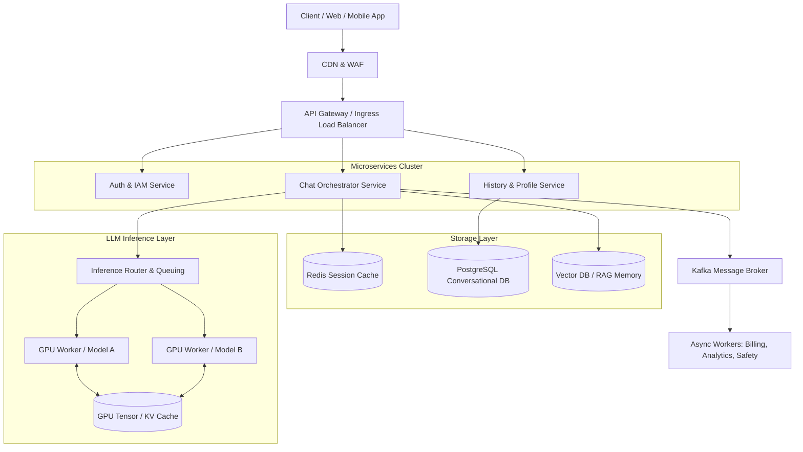

# ChatGPT Enterprise Architecture Design

## 1. Architecture Overview
The proposed solution for a ChatGPT-like application utilizes a cloud-agnostic, microservices-based architecture designed for massive scale, low latency, and high availability. At its core, the system separates the stateful user management and conversation persistence layers from the heavily computational, stateless Model Inference layer. By leveraging an API Gateway for routing, asynchronous message brokers for decoupled processing, and Server-Sent Events (SSE) for real-time token streaming, the architecture ensures a highly responsive user experience while efficiently managing expensive GPU compute resources.

## 2. Architecture Diagram

## 3. End-to-End System Flow
1. **Authentication:** The user logs in via the Client application. The request hits the API Gateway, routes to the Auth Service, and returns a secure JWT (JSON Web Token).
2. **Connection Initialization:** The client establishes a persistent connection with the Chat Orchestrator Service via the API Gateway using Server-Sent Events (SSE) or WebSockets to handle real-time streaming.
3. **Prompt Submission:** The user submits a prompt. The CDN/WAF inspects the payload for malicious patterns (e.g. prompt injection or DDoS attempts) before forwarding it.
4. **Context Hydration:** The Chat Orchestrator queries the Redis Cache and Vector DB for recent conversation history and semantic memory, packing this context alongside the user's prompt and the system instruction.
5. **Inference Routing:** The assembled payload is sent to the Inference Router, which assesses GPU cluster availability and routes the request to an available GPU Worker running the appropriate LLM version. 
6. **Token Generation & Streaming:** The GPU Worker begins inference, utilizing KV Cache to avoid recomputing previous tokens. As each new token is generated, it is instantly streamed back through the Chat Orchestrator to the Client via the SSE connection.
7. **Asynchronous Persistence:** Concurrently, the completed message pair (prompt and generated response) is dispatched to a Kafka message queue. 
8. **Finalization:** Background workers consume the Kafka event to securely store the conversation in the PostgreSQL database, update billing metrics, and log telemetry without blocking the user's critical path.

## 4. Well-Architected Framework Analysis

* **Operational Excellence:** 
  Deployment is managed via Infrastructure as Code (Terraform) and CI/CD pipelines (GitHub Actions/ArgoCD). System health, GPU utilization, and token-generation latency are monitored using a centralized observability stack (Prometheus, Grafana, and OpenTelemetry), enabling automated rollbacks and alerting.
* **Security:** 
  All traffic is encrypted in transit (TLS 1.3) and at rest (AES-256). A WAF mitigates Layer 7 attacks. An internal Trust & Safety model parses prompts/responses for policy violations. Strict IAM roles limit microservice permissions (Principle of Least Privilege), and PII is redacted before logs are stored.
* **Reliability:** 
  The architecture spans Multiple Availability Zones (Multi-AZ) with active-active redundant deployments for microservices. The Inference Router acts as a circuit breaker, gracefully degrading to smaller/faster models or queuing requests if the primary GPU cluster is saturated. PostgreSQL utilizes read replicas and automated backups.
* **Performance Efficiency:** 
  By utilizing SSE, the user perceives zero latency while the response generates. Redis caches frequent queries and user states to prevent database bottlenecks. Model inference is optimized using continuous batching and KV caching in the GPU memory, maximizing throughput per compute cycle.
* **Cost Optimization:** 
  Compute resources are dynamically auto-scaled based on queue depth. Expensive GPU instances are utilized strictly for inference tasks; all API routing and data orchestration happen on cheaper CPU-based spot instances. Cold conversation history is tiered to cheaper object storage to keep database costs low.
* **Sustainability:** 
  Auto-scaling to zero for non-production environments and efficient prompt-caching mechanisms reduce unnecessary compute cycles. The cloud-agnostic design allows workloads to be routed to data centers powered by higher percentages of renewable energy grids based on geographic load balancing.

## 5. Technical Glossary
* **API Gateway:** A management tool that sits between a client and a collection of backend services, acting as a reverse proxy to route requests, enforce rate limits, and handle TLS termination.
* **CDN (Content Delivery Network):** A geographically distributed group of servers that caches static assets closer to users to reduce latency.
* **Continuous Batching:** An LLM inference optimization technique that groups incoming requests dynamically, reducing GPU idle time and increasing token throughput.
* **GPU Worker:** A compute node equipped with graphical processing units (e.g. NVIDIA H100s) optimized for matrix multiplication, essential for running neural network models.
* **JWT (JSON Web Token):** A compact, URL-safe means of representing claims to be transferred between two parties, commonly used for authentication.
* **Kafka:** A distributed event streaming platform used for high-performance data pipelines, streaming analytics, and data integration.
* **KV Cache (Key-Value Cache):** A memory optimization in transformer models that stores previously computed attention keys and values, preventing redundant calculations for past tokens in a sequence.
* **Multi-AZ (Multiple Availability Zones):** Deploying infrastructure across multiple isolated data centers within a region to ensure high availability and fault tolerance.
* **RAG (Retrieval-Augmented Generation):** A framework that improves LLM responses by fetching factual, external data (often from a Vector DB) and grounding the model's response in that context.
* **SSE (Server-Sent Events):** A standard allowing a web server to push real-time updates (like generated text tokens) to a client over a single HTTP connection.
* **Vector DB:** A database designed to store and query high-dimensional vectors (mathematical representations of text), enabling fast similarity searches for memory and context retrieval.
* **WAF (Web Application Firewall):** A security layer that filters, monitors, and blocks malicious HTTP traffic to and from a web application.
