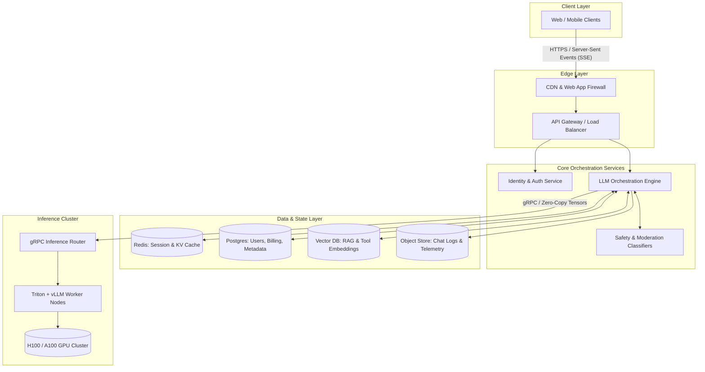

# ChatGPT High-Scale LLM System Architecture

## 1. Architecture Overview
Designing a conversational AI platform at the scale of billions of daily prompts requires moving far beyond basic CRUD API wrappers, into high-performance distributed systems engineering. This cloud-agnostic microservices architecture focuses on high-throughput, low-latency Large Language Model (LLM) serving. It leverages a resilient edge network for real-time streaming, a stateful orchestration layer for context management, multi-tiered database sharding for chat history, and a robust GPU inference cluster. By combining NVIDIA's Triton Inference Server with vLLM's execution engine, the system maximizes GPU utilization through continuous in-flight batching and advanced memory management techniques. 

## 2. Architecture Diagram

```mermaid
graph TD
    subgraph Client Layer
        Client[Web / Mobile Clients]
    end

    subgraph Edge Layer
        WAF[CDN & Web App Firewall]
        Gateway[API Gateway / Load Balancer]
    end

    subgraph Core Orchestration Services
        Auth[Identity & Auth Service]
        Orchestrator[LLM Orchestration Engine]
        Moderation[Safety & Moderation Classifiers]
    end

    subgraph Data & State Layer
        Redis[(Redis: Session & KV Cache)]
        Postgres[(Postgres: Users, Billing, Metadata)]
        VectorDB[(Vector DB: RAG & Tool Embeddings)]
        S3[(Object Store: Chat Logs & Telemetry)]
    end

    subgraph Inference Cluster
        Router[gRPC Inference Router]
        Triton_vLLM[Triton + vLLM Worker Nodes]
        GPU[(H100 / A100 GPU Cluster)]
    end

    Client -- "HTTPS / Server-Sent Events (SSE)" --> WAF
    WAF --> Gateway
    Gateway --> Auth
    Gateway --> Orchestrator
    
    Orchestrator <--> Moderation
    Orchestrator <--> Redis
    Orchestrator <--> Postgres
    Orchestrator <--> VectorDB
    Orchestrator --> S3
    
    Orchestrator -- "gRPC / Zero-Copy Tensors" --> Router
    Router --> Triton_vLLM
    Triton_vLLM --> GPU
```

## 3. End-to-End System Flow
1. **Request Ingress & Edge Protection:** The user submits a prompt via the frontend. The request passes through a WAF for threat detection and an API Gateway that enforces rate-limiting using a token-bucket algorithm. 
2. **Context Hydration:** The LLM Orchestration Engine authenticates the request and queries Redis to retrieve the user's active session and recent conversation history, as LLMs themselves are inherently stateless. If advanced tool calling or Retrieval-Augmented Generation (RAG) is enabled, the prompt is vectorized and queried against a Vector Database (e.g. Milvus, Qdrant) to pull relevant external knowledge.
3. **Safety & Moderation (Pre-Inference):** The compiled prompt (System Message + History + RAG Context + User Prompt) is sent to a low-latency moderation classifier (e.g. a lightweight distilled BERT model) to detect prompt injection or policy violations in sub-milliseconds.
4. **Inference Routing & Execution:** The Orchestrator forwards the safe prompt via gRPC to the Inference Router. The router schedules the task on an available GPU worker node running Triton Inference Server with a vLLM backend. The prompt is tokenized using Byte-Pair Encoding (BPE). vLLM uses Paged KV Caching and continuous in-flight batching to optimize GPU memory and process multiple concurrent requests. 
5. **Real-Time Streaming:** As the GPU generates tokens, they are immediately streamed back to the Orchestrator over the gRPC channel, which in turn pushes them to the client utilizing Server-Sent Events (SSE) or WebSockets. This minimizes Time-To-First-Token (TTFT) and creates a highly responsive user experience.
6. **Post-Processing & Asynchronous Storage:** Generated tokens pass through a secondary output moderation filter. Once the stream completes, the entire interaction is asynchronously committed to PostgreSQL (structured data) and Object Storage (raw logs for fine-tuning), while Redis updates the recent cache.

## 4. Well-Architected Framework Analysis

### 4.1 Operational Excellence
* **Decoupled Architecture:** Using an orchestration layer independent of the inference backend enables the model serving environment to evolve (e.g. swapping model versions) without breaking frontend contracts.
* **Observability at Scale:** The framework exposes Prometheus metrics and OpenTelemetry tracing across all layers. Crucial telemetry includes GPU utilization, KV cache depth, token generation latency (Tokens/Sec), and queue depths.

### 4.2 Security
* **Defense-in-Depth Moderation:** Implementing a "safety sandwich" approach checks both input prompts and output generations against lightweight safety classifiers to prevent hallucinations, PII leakage, and jailbreaking.
* **Data Isolation & Encryption:** Multi-tenant architecture ensures strict logical separation of user data. All data is encrypted in transit via TLS 1.3 and at rest using AES-256.

### 4.3 Reliability
* **Stateless Inference & Stateful Caching:** Decoupling session state (managed by Redis) from the inference workers means GPU node failures do not corrupt or lose active conversation histories. 
* **Graceful Degradation:** During heavy traffic spikes, the system can fallback to returning slightly truncated context windows, skipping heavy RAG queries, or routing to smaller, faster model variants to prevent widespread system crashes.

### 4.4 Performance Efficiency
* **Paged KV Caching:** Traditional LLM serving suffers from memory fragmentation. Paged KV caching (PagedAttention) treats LLM memory like an operating system treats virtual memory, eliminating waste and significantly increasing the maximum batch size on shared GPUs.
* **Zero-Copy Pipelines:** Network overhead is minimized by utilizing gRPC to pass tensor data and embeddings between the orchestration and inference stages without heavy JSON serialization costs.

### 4.5 Cost Optimization
* **Tiered Storage Strategy:** To manage petabytes of data, only recent, active conversations remain in expensive low-latency memory (Redis). Older histories are pushed to relational databases, while massive unstructured logs sit in cost-effective Object Storage.
* **Hardware-Agnostic Scaling:** Using an orchestration framework like Triton allows the platform to intelligently route simpler tasks to cheaper CPU nodes while reserving scarce GPU resources (H100/A100 clusters connected via NVLink/InfiniBand) exclusively for dense LLM inference.

### 4.6 Sustainability
* **Continuous In-Flight Batching:** Instead of waiting for an entire batch of sequences to finish generating, this technique injects new requests into the GPU execution stream the moment an older request finishes. This minimizes idle compute cycles, greatly improving tokens-per-watt efficiency and maximizing carbon ROI per server.

## 5. Technical Glossary
* **SSE (Server-Sent Events):** A lightweight protocol enabling servers to push real-time updates (like generated text tokens) directly to the client over a single, long-lived HTTP connection.
* **WAF (Web Application Firewall):** An edge security barrier that inspects incoming HTTP traffic to block malicious exploits like DDoS attacks or SQL injections.
* **Token Bucket Algorithm:** A rate-limiting design where a user is granted a "bucket" of tokens representing allowed API calls; tokens are consumed on use and refilled at a constant rate.
* **RAG (Retrieval-Augmented Generation):** An architectural pattern that retrieves relevant facts from a custom knowledge base (often a Vector DB) and injects them into the prompt to ensure the LLM's answers are factually grounded.
* **Vector DB:** A specialized database (e.g. Pinecone, Weaviate, Qdrant) designed to store and query high-dimensional data (embeddings), enabling rapid similarity searches.
* **Triton Inference Server:** NVIDIA's open-source model serving software that acts as an orchestration layer, allowing multiple AI frameworks to run efficiently on unified infrastructure.
* **vLLM:** A highly optimized LLM inference engine developed at UC Berkeley, renowned for its speed and efficient memory management.
* **Paged KV Caching (PagedAttention):** An algorithm that partitions the key and value matrices of an LLM's attention mechanism into non-contiguous blocks of memory, drastically reducing out-of-memory errors and fragmentation.
* **In-Flight Batching (Continuous Batching):** The process of dynamically grouping incoming requests on the GPU on a per-token basis rather than a per-prompt basis, maximizing hardware throughput.
* **gRPC:** A high-performance Remote Procedure Call framework created by Google that uses protocol buffers (Protobuf) to serialize structured data, offering lower latency than REST/JSON.
