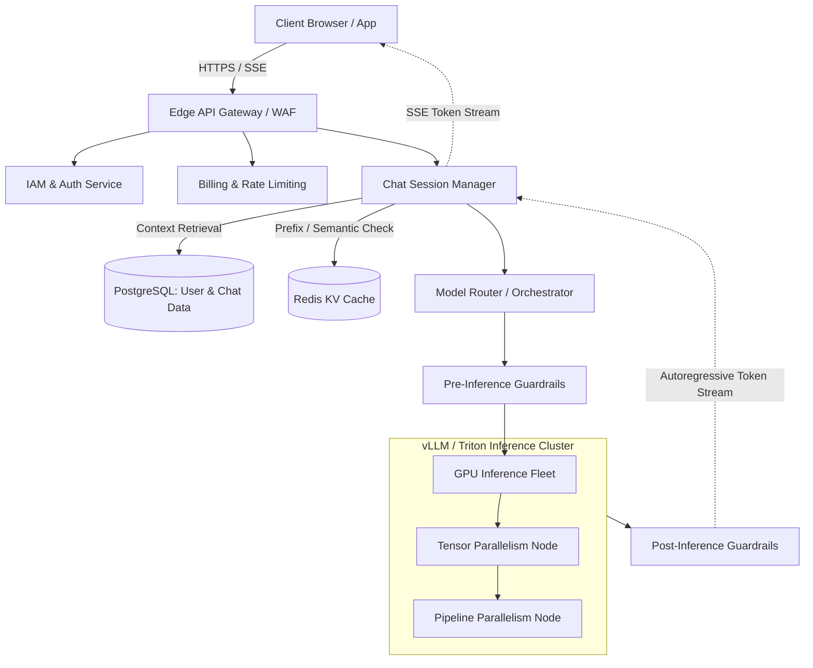

# ChatGPT High-Scale System Architecture

## 1. Architecture Overview
The proposed architecture abstracts the complexities of stateful Large Language Model (LLM) inference, scaling to support millions of concurrent users. It utilizes a modular, distributed microservices pattern encompassing a resilient Edge network, an Orchestration & Stateful Logic Tier, a Pre/Post Safety Guardrail Layer, and an optimized GPU Inference Fleet. The system handles autoregressive generation bottlenecks using Server-Sent Events (SSE) for perceived zero-latency streaming and leverages advanced infrastructure techniques, such as Continuous Batching, PagedAttention, and Speculative Decoding, to maximize GPU cluster utilization and throughput. 

## 2. Architecture Diagram

```mermaid
graph TD
    %% Client & Edge Layer
    Client[Client Browser / App] -->|HTTPS / SSE| API_Gateway[Edge API Gateway / WAF]
    
    %% API & Core Orchestration
    API_Gateway --> Auth[IAM & Auth Service]
    API_Gateway --> RateLimit[Billing & Rate Limiting]
    API_Gateway --> SessionMgr[Chat Session Manager]
    
    %% Data & State Layer
    SessionMgr -->|Context Retrieval| DB[(PostgreSQL: User & Chat Data)]
    SessionMgr -->|Prefix / Semantic Check| Redis[(Redis KV Cache)]
    
    %% Routing & Safety 
    SessionMgr --> Router[Model Router / Orchestrator]
    Router --> PreSafety[Pre-Inference Guardrails]
    
    %% Inference Fleet
    PreSafety --> GPU_Fleet[GPU Inference Fleet]
    
    subgraph GPU_Cluster [vLLM / Triton Inference Cluster]
        GPU_Fleet --> TP[Tensor Parallelism Node]
        TP --> PP[Pipeline Parallelism Node]
    end
    
    %% Post Safety & Egress
    GPU_Cluster --> PostSafety[Post-Inference Guardrails]
    PostSafety -.->|Autoregressive Token Stream| SessionMgr
    SessionMgr -.->|SSE Token Stream| Client
```

## 3. End-to-End System Flow
1. **Client Request & Edge Routing**: The user submits a natural language prompt via the client. The request hits a global API Gateway which establishes a persistent Server-Sent Events (SSE) connection to stream generated tokens back asynchronously.
2. **Authentication & Rate Limiting**: The payload passes through an Identity Provider (IdP) for credential verification, followed by a Billing & Rate Limiting Service to enforce strict per-user token quotas.
3. **Session & Context Management**: The Chat Session Manager retrieves the user's conversational history from a sharded PostgreSQL database. It dynamically rebuilds the context window, optimizing for the model's strict token limits.
4. **Caching & Guardrails**: The assembled context is checked against a Redis-backed Semantic/Prefix Cache. If a semantic match exists, cached tokens are returned instantly. Otherwise, the payload passes through Pre-Inference Guardrails—specialized lightweight classifiers that detect prompt injection, toxicity, and PII.
5. **Model Routing**: A dynamic Model Router assesses query complexity. It routes standard conversational tasks to smaller, highly optimized models and directs complex reasoning tasks to larger frontier models to balance cost and latency.
6. **Inference Execution**: The prompt enters the GPU Inference Fleet managed by serving engines like vLLM. It utilizes Tensor Parallelism across GPUs within the same node, and Pipeline Parallelism across disparate nodes. PagedAttention prevents Key-Value (KV) memory fragmentation, while Speculative Decoding accelerates token generation.
7. **Streaming & Post-Safety**: As tokens are generated, they stream through Post-Inference Guardrails to filter any hallucinated sensitive data. Safe tokens are pushed instantly to the client via the open SSE connection, dynamically rendering the response.

## 4. Well-Architected Framework Analysis

### 4.1 Operational Excellence
Distributed tracing and AI-specific observability platforms are embedded across the stack to monitor non-traditional telemetry such as Time To First Token (TTFT), Inter-Token Latency, GPU memory fragmentation, and KV cache hit rates. CI/CD pipelines automate shadow-model deployments and canary rollouts of new weights without incurring downtime.

### 4.2 Security
The system embraces a Zero-Trust architecture, enforcing mutual TLS (mTLS) for internal microservices, including retrieval databases and agent endpoints. Robust Pre- and Post-Inference Guardrails act as a protective moat to sanitize inputs against adversarial prompt injections and prevent data exfiltration. Unique, short-lived service accounts isolate distinct AI agents dynamically.

### 4.3 Reliability
Deployed in a multi-region, active-active topology, the architecture isolates fault domains. To handle unforeseen spikes in GPU capacity limits, the system implements graceful degradation—temporarily bypassing complex frontier models in favor of smaller, faster models—and utilizes smart request queueing or load-shedding to prevent cascading fleet failures.

### 4.4 Performance Efficiency
Traditional REST responses are unsuitable for LLMs; Server-Sent Events (SSE) drastically reduce perceived latency by delivering partial data sequentially. At the inference layer, moving from static batching to Continuous Batching eliminates pipeline bubbles. KV Prefix Caching accelerates system prompts common to millions of requests daily, eliminating redundant computation.

### 4.5 Cost Optimization
By utilizing an intelligent Model Router, standard queries bypass expensive 70B+ parameter models in favor of smaller local variants, heavily optimizing compute spend. Furthermore, Semantic Caching minimizes unnecessary GPU cycles, and Spot/Preemptible GPU instances are utilized for offline, async tasks such as RAG (Retrieval-Augmented Generation) index processing.

### 4.6 Sustainability
Operating GPUs efficiently dictates the system's carbon footprint. PagedAttention memory management ensures high concurrency per GPU, minimizing idle computational cycles. Speculative Decoding produces multiple tokens per single large-model forward-pass, significantly decreasing the energy consumed per word generated.

## 5. Technical Glossary
*   **Server-Sent Events (SSE)**: A unidirectional transport protocol allowing the server to push real-time updates (tokens) to the client over a standard HTTP connection.
*   **vLLM / Triton Inference Server**: Specialized, high-throughput runtime engines designed to serve and orchestrate Large Language Models over distributed hardware.
*   **Continuous Batching**: An inference scheduling technique that dynamically injects new requests into the GPU batch at the individual token iteration level, maximizing cluster utilization.
*   **PagedAttention**: An algorithm that stores the model's KV Cache in non-contiguous blocks of GPU memory, effectively eliminating memory fragmentation and enabling higher concurrent batch sizes.
*   **KV Cache (Key-Value Cache)**: A mechanism that stores the intermediate tensor states of past tokens, negating the need for the LLM to recalculate previous context for every new word.
*   **Speculative Decoding**: An optimization leveraging a smaller "draft" model to predict multiple future tokens cheaply, which are then verified simultaneously by a larger "target" model to accelerate generation.
*   **Tensor / Pipeline Parallelism**: Distributed computing paradigms. Tensor Parallelism splits matrix multiplications across GPUs within the same server; Pipeline Parallelism partitions the neural network's structural layers across multiple separate servers.
*   **Semantic Caching**: A caching layer that evaluates the *meaning* (vector embedding) of a prompt rather than strict string matching, returning pre-computed responses for functionally identical questions.
*   **TTFT (Time To First Token)**: A vital latency metric measuring the duration between user submission and the appearance of the first output token on their screen.
