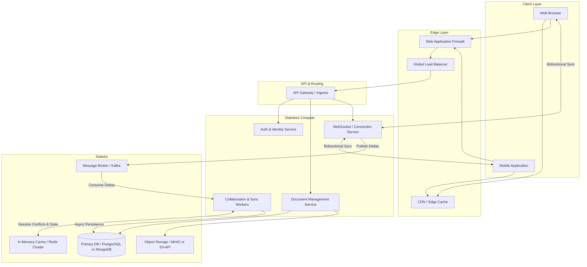

# Distributed Real-Time Collaborative Document Editing Architecture

## 1. Architecture Overview
This solution proposes a cloud-agnostic, microservices-based architecture to support a real-time collaborative document editing platform similar to Google Docs. The architecture utilizes WebSockets for low-latency, bidirectional communication between clients and the server. To handle concurrent edits without conflicts, it employs Operational Transformation (OT) or Conflict-free Replicated Data Types (CRDTs) managed by dedicated backend workers. State is decoupled from the connection layer using a high-throughput message broker, ensuring horizontal scalability. Persistent storage relies on a combination of a fast in-memory cache for active document sessions, a document-oriented or relational database for historical data and metadata, and an object storage system for media attachments. The entire workload is containerized and orchestrated via Kubernetes.

## 2. Architecture Diagram

## 3. Well-Architected Framework Analysis

*   **Operational Excellence:**
    *   **Observability:** The system uses a centralized observability stack (e.g. Prometheus for metrics, Grafana for visualization, Jaeger for distributed tracing, and ELK/Fluentd for log aggregation) to monitor WebSocket connection drops, API latency, and OT/CRDT resolution times.
    *   **Deployment:** Infrastructure as Code (IaC) via Terraform and GitOps practices (using ArgoCD or Flux) ensure repeatable, automated, and safe Kubernetes deployments. 

*   **Security:**
    *   **Identity & Access Management:** User authentication is handled via OIDC/OAuth2 protocols. A Role-Based Access Control (RBAC) model enforces permissions (Viewer, Commenter, Editor, Owner) at the API Gateway level before requests reach the Document Management Service.
    *   **Data Protection:** Data is encrypted in transit using TLS 1.3. Data at rest (in the Primary DB and Object Storage) is encrypted using AES-256 with rotation-managed keys (e.g. HashiCorp Vault). A WAF protects against DDoS and OWASP top 10 threats.

*   **Reliability:**
    *   **Resiliency:** The WebSocket Service is stateless regarding document data; it solely manages connections. If a node fails, clients seamlessly reconnect to another node. 
    *   **High Availability:** Active-Active multi-zone Kubernetes clusters ensure fault tolerance. The Primary DB uses read replicas for high-availability reads, and Kafka ensures no dropped edits (deltas) during sudden traffic spikes or worker node failures.

*   **Performance Efficiency:**
    *   **Latency Minimization:** Static assets (UI, fonts) are cached at the Edge via CDN. Real-time document updates bypass HTTP polling in favor of WebSockets. 
    *   **State Management:** Active documents are loaded into Redis. Collaboration Workers apply deltas in-memory to provide sub-millisecond response times, subsequently batch-flushing changes to the persistent Primary DB asynchronously.

*   **Cost Optimization:**
    *   **Elasticity:** Using Horizontal Pod Autoscalers (HPA) in Kubernetes allows the WebSocket and Collaboration services to scale up during peak working hours and scale down to near-zero during off-peak times.
    *   **Storage Tiering:** Object storage lifecycle policies automatically transition inactive media attachments and older document revisions to cold storage, significantly reducing long-term storage costs.

*   **Sustainability:**
    *   **Compute Efficiency:** By utilizing lightweight container orchestration and binary communication protocols (like Protobuf or MessagePack) over WebSockets, the architecture minimizes network payload sizes and CPU cycles compared to verbose JSON polling.
    *   **Resource Packing:** Kubernetes auto-scaling optimizes node density, ensuring compute resources are not over-provisioned and sitting idle, thereby reducing the overall carbon footprint of the cluster.

## 4. Technical Glossary

*   **CRDT (Conflict-free Replicated Data Type):** A data structure that allows multiple users to make changes locally and merge them over a network independently, guaranteeing eventual consistency without needing a centralized conflict-resolution server.
*   **OT (Operational Transformation):** An algorithm used in collaborative systems (originally in Google Docs) to resolve conflicts when multiple users edit the same text simultaneously, transforming operations based on the state of the document so intentions are preserved.
*   **WebSocket:** A computer communications protocol providing full-duplex, persistent communication channels over a single TCP connection, ideal for real-time collaboration.
*   **API Gateway:** A server that acts as an API front-end, receiving API requests, enforcing throttling and security policies, passing requests to the back-end service, and then passing the response back to the requester.
*   **Message Broker (e.g., Kafka):** An intermediary computer program that translates a message from the formal messaging protocol of the sender to the formal messaging protocol of the receiver; used here to decouple fast incoming keystrokes from backend processing.
*   **OIDC (OpenID Connect):** An identity layer on top of the OAuth 2.0 protocol that allows clients to verify the identity of the end-user based on the authentication performed by an authorization server.
*   **Deltas:** A generic term for the incremental changes or operations applied to a document (e.g., "insert 'a' at index 5"), rather than sending the entire document state back and forth.
