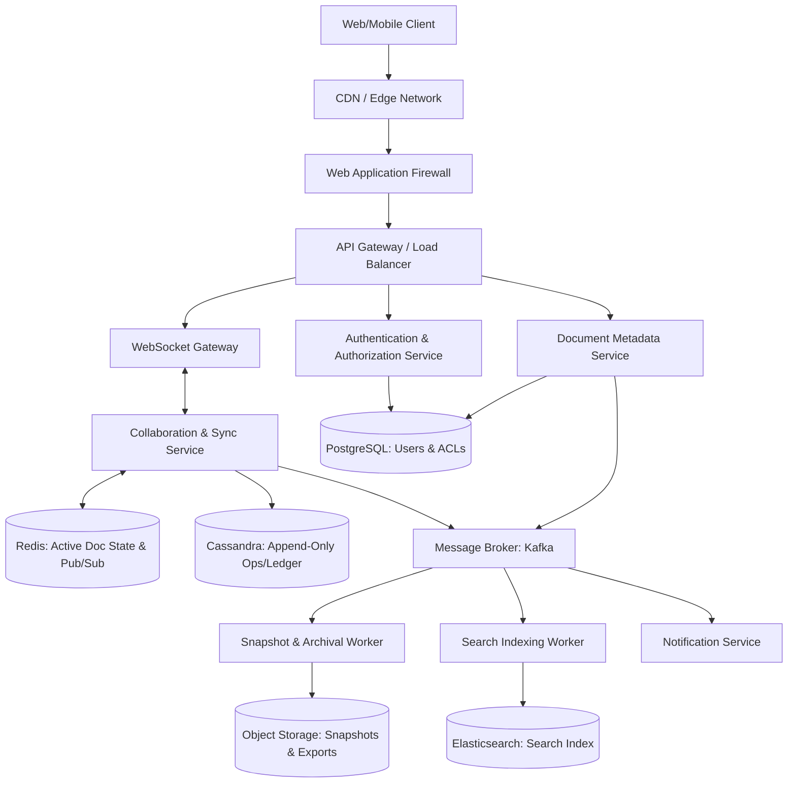

# Real-Time Collaborative Document Editor Architecture

## 1. Architecture Overview
The proposed solution is a cloud-agnostic, microservices-based architecture designed to support high-concurrency, real-time document collaboration. The system leverages Operational Transformation (OT) or Conflict-free Replicated Data Types (CRDTs) to resolve concurrent edits. It employs a polyglot persistence strategy: a Relational Database for rigid transactional data (users, document metadata, permissions), an in-memory datastore for active real-time sessions, an append-only NoSQL database for the document event ledger (keystrokes/operations), and Object Storage for compiled document snapshots. Real-time communication is facilitated by WebSockets, with an event-driven message broker decoupling heavy background tasks like search indexing and periodic snapshotting.

## 2. Architecture Diagram

```mermaid
graph TD
    %% User Edge
    Client[Web/Mobile Client] --> CDN[CDN / Edge Network]
    CDN --> WAF[Web Application Firewall]
    WAF --> APIGW[API Gateway / Load Balancer]

    %% Synchronous Services
    APIGW --> Auth[Authentication & Authorization Service]
    APIGW --> DocAPI[Document Metadata Service]
    APIGW --> WSG[WebSocket Gateway]

    %% Real-time Collaboration Core
    WSG <--> Collab[Collaboration & Sync Service]
    Collab <--> Redis[(Redis: Active Doc State & Pub/Sub)]
    Collab --> OpsDB[(Cassandra: Append-Only Ops/Ledger)]
    
    %% Async Event Driven Core
    Collab --> Kafka[Message Broker: Kafka]
    DocAPI --> Kafka

    %% Background Workers
    Kafka --> SnapshotWorker[Snapshot & Archival Worker]
    Kafka --> SearchIndexer[Search Indexing Worker]
    Kafka --> NotificationWorker[Notification Service]

    %% Persistence Layer
    Auth --> RDBMS[(PostgreSQL: Users & ACLs)]
    DocAPI --> RDBMS
    SearchIndexer --> Elastic[(Elasticsearch: Search Index)]
    SnapshotWorker --> Blob[(Object Storage: Snapshots & Exports)]
```

## 3. End-to-End System Flow

1. **Authentication and Access**: The user authenticates via the API Gateway to the Auth Service. Upon success, a JWT is returned. When the user requests a document, the Document Metadata Service checks Role-Based Access Control (RBAC) in PostgreSQL to ensure the user has read/write permissions.
2. **Document Initialization**: The client fetches the latest compiled document snapshot from Object Storage and the trailing uncompiled operations from the NoSQL ledger (Cassandra). The local editor renders the document.
3. **Establishing Real-Time Connection**: The client upgrades its connection to a WebSocket via the WebSocket Gateway, which routes the connection to the specific Collaboration Service node handling that document's active session (tracked via Redis).
4. **Collaborative Editing**: As the user types, lightweight operation payloads (OT/CRDT) are sent over the WebSocket. The Collaboration Service applies conflict resolution, updates the active document state in Redis, and broadcasts the accepted operations to all other connected clients viewing the same document via Redis Pub/Sub.
5. **Persistence and Ledgering**: Accepted operations are asynchronously flushed to the append-only Cassandra datastore, creating an immutable history of edits.
6. **Background Processing**: Operations and document metadata updates are published to Kafka. 
   - The **Snapshot Worker** consumes these events, periodically collapsing operations into a new static snapshot stored in Object Storage to speed up future loading times.
   - The **Search Indexer** updates Elasticsearch to ensure document text is immediately searchable.
   - The **Notification Service** alerts offline users if they are tagged in a comment.

## 4. Well-Architected Framework Analysis

### 4.1 Operational Excellence
- **Infrastructure as Code (IaC)**: Use Terraform/Pulumi for reproducible, version-controlled infrastructure provisioning.
- **Observability**: Implement distributed tracing (OpenTelemetry) across the API Gateway, WebSocket connections, and microservices. Aggregate logs into an ELK stack or similar (Fluentd, Elasticsearch, Kibana) and metrics into Prometheus/Grafana.
- **CI/CD**: Fully automated deployment pipelines with blue-green or canary deployments to ensure zero-downtime updates, particularly crucial for persistent WebSocket connections.

### 4.2 Security
- **Edge Security**: WAF to mitigate DDoS attacks, SQL injection, and XSS. Terminate TLS 1.3 at the API Gateway.
- **Data Protection**: AES-256 encryption at rest for all databases and object storage. TLS for all data in transit (internally and externally).
- **Identity & Access**: Stateless JWT authentication with strict expiration. Granular, row-level RBAC for document access enforcement within the Metadata Service.
- **Input Validation**: Strict sanitization of WebSocket payloads to prevent malicious code execution within the collaborative environment.

### 4.3 Reliability
- **Fault Tolerance**: Multi-AZ deployments for all services. If a Collaboration Service node fails, clients seamlessly reconnect to a new node, which restores the active session state from Redis and Cassandra.
- **Circuit Breakers**: Implement circuit breakers (e.g. via Istio or application-level libraries) to prevent cascading failures if secondary systems (like the search indexer) go offline.
- **Event-Driven Resilience**: Kafka ensures that bursts of edits are safely queued, preventing downstream databases from being overwhelmed during peak traffic.

### 4.4 Performance Efficiency
- **Low Latency Transport**: WebSockets provide a persistent, low-overhead bidirectional channel essential for feeling "real-time."
- **In-Memory State**: Redis is utilized as a high-speed data structure store to maintain active document states and route messages, completely bypassing disk I/O for real-time keystroke replication.
- **Geographic Proximity**: A CDN caches static assets. Edge-optimized routing directs users to the nearest regional API/WebSocket Gateway.

### 4.5 Cost Optimization
- **Tiered Storage**: Automatically transition older document snapshots in Object Storage to colder, cheaper storage tiers (e.g. Glacier equivalents).
- **Compute Sizing**: Utilize Spot Instances or preemptible VMs for stateless, asynchronous background workers (Snapshot, Search, Notification) since they handle fault-tolerant Kafka workloads.
- **Right-Sizing Persistence**: Using Cassandra for append-only operations and Object Storage for bulk text is significantly cheaper at scale than storing millions of edits in a traditional Relational Database.

### 4.6 Sustainability
- **Elastic Auto-Scaling**: Aggressively scale down WebSocket and Collaboration nodes during off-peak hours based on active connection counts.
- **Efficient Architecture**: Polyglot persistence avoids taxing a monolithic database with the wrong type of workload. By coalescing keystrokes in memory before writing to disk, we drastically reduce I/O power consumption.
- **Processor Choice**: Where supported by the cloud provider, deploy workloads on ARM-based processors to improve performance-per-watt efficiency.

## 5. Technical Glossary

- **Operational Transformation (OT) / Conflict-free Replicated Data Type (CRDT)**: Algorithms used to handle and resolve concurrent modifications to a shared document by multiple users without locking the document.
- **WebSocket**: A communications protocol providing full-duplex communication channels over a single TCP connection, ideal for real-time applications.
- **Polyglot Persistence**: The practice of using different database technologies to handle different data storage needs within a single software application (e.g. SQL for relational data, NoSQL for high-velocity logs, Redis for caching).
- **JWT (JSON Web Token)**: A compact, URL-safe means of representing claims to be transferred between two parties, commonly used for stateless authentication.
- **API Gateway**: A server that acts as an API front-end, receiving API requests, enforcing throttling and security policies, passing requests to the back-end service, and then passing the response back to the requester.
- **Pub/Sub (Publish/Subscribe)**: A messaging pattern where senders (publishers) categorize messages into classes without knowledge of which subscribers will receive them.
- **Message Broker (Kafka)**: A distributed event streaming platform used to handle high-throughput, asynchronous data pipelines and decoupled service communication.
- **CDN (Content Delivery Network)**: A geographically distributed network of proxy servers and their data centers, providing high availability and performance by distributing the service spatially relative to end-users.
- **RBAC (Role-Based Access Control)**: An approach to restricting system access to authorized users based on their assigned roles (e.g. Viewer, Commenter, Editor, Owner).
- **WAF (Web Application Firewall)**: A specific form of application firewall that filters, monitors, and blocks HTTP traffic to and from a web application, protecting against common web exploits.
