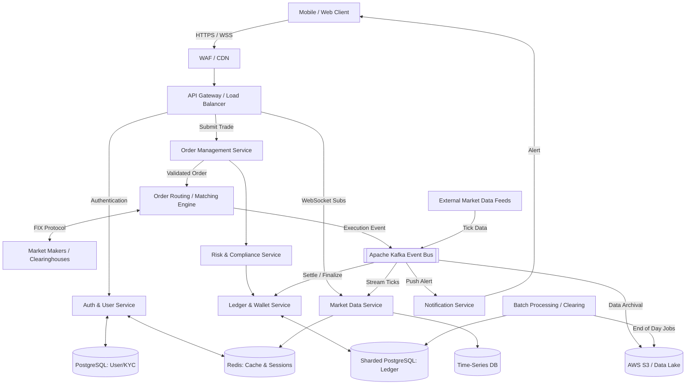

# Trading Platform Architecture (Robinhood Clone)

## 1. Architecture Overview
This solution represents a highly scalable, event-driven, cloud-agnostic microservices architecture designed to support a zero-commission trading platform like Robinhood. The system is built to handle massive concurrency, extreme market volatility, and stringent regulatory requirements. Transitioning away from early monolithic designs, this architecture leverages containerized microservices managed by Kubernetes, utilizing event streaming (Apache Kafka) for real-time market data and asynchronous trade processing. State management is decentralized, relying on a sharded PostgreSQL strategy for the core financial ledger to ensure ACID compliance while achieving horizontal scalability. Core trading components are built using high-performance languages like Go and Rust to minimize latency, while big data operations utilize a robust Data Lake and Spark on Kubernetes for end-of-day clearing and analytics.

## 2. Architecture Diagram

## 3. End-to-End System Flow

1. **Market Data Ingestion**: External market data feeds (e.g. NASDAQ, NYSE) continuously stream tick data into the system. This data is ingested into Apache Kafka. The **Market Data Service** consumes these streams, caching the latest prices in Redis, persisting historical data to a Time-Series Database (TSDB), and pushing real-time updates to connected client apps via WebSockets.
2. **Order Placement**: A user submits a buy/sell order via the mobile app. The request passes through the WAF/CDN to the **API Gateway**, which routes it to the **Order Management Service (OMS)**. 
3. **Risk & Ledger Validation**: The OMS immediately queries the **Risk & Compliance Service** to verify trading rules (e.g. Pattern Day Trader limits, margin requirements). Simultaneously, it calls the **Ledger Service** to lock the required funds or shares. The Ledger utilizes a sharded PostgreSQL database to handle high throughput while maintaining strict transactional integrity.
4. **Execution & Routing**: Once validated, the order flows to the **Order Routing Engine**. 
    * *For Equities:* The engine routes the order to external Market Makers via the FIX protocol for execution (often utilizing Payment for Order Flow models). 
    * *For Crypto/Fractional Shares:* The order is routed to an internal **Matching Engine** that pairs buyers and sellers using Price-Time Priority algorithms. 
    * These critical execution services are built in Go or Rust to guarantee predictable, ultra-low latency.
5. **Post-Trade Processing**: Upon execution, the Routing Engine publishes an `OrderExecuted` event to Kafka. The Ledger Service consumes this event to finalize the balance transfer, releasing the hold and permanently recording the trade. The **Notification Service** also consumes this event to push a real-time trade confirmation to the user's device.
6. **Clearing & Settlement**: After market hours, **Batch Processing** jobs run. Leveraging Apache Spark on Kubernetes orchestrated by Airflow, the system digests the daily trade logs from the S3 Data Lake, reconciles discrepancies, and generates files for external clearinghouses (T+1 settlement).

## 4. Well-Architected Framework Analysis

* **Operational Excellence**: Deployment complexity is managed by utilizing Kubernetes Custom Resource Definitions (CRDs) to create standardized application templates (archetypes) across all engineering teams. Infrastructure as Code (IaC) via Terraform, paired with continuous integration pipelines, ensures repeatable and safe rollouts. Apache Airflow orchestrates complex, multi-stage ETL and batch jobs.
* **Security**: Network traffic is protected by a Web Application Firewall (WAF) to mitigate DDoS attacks. All internal microservice communication is secured via mutual TLS (mTLS). User authentication requires OAuth2 and mandatory two-factor authentication (2FA). Sensitive PII and financial data are encrypted at rest using AES-256. 
* **Reliability**: The system relies heavily on multi-AZ deployments and stateless microservices to survive node failures. By sharding the PostgreSQL databases, distributing user data across multiple independent clusters, the architecture drastically reduces the "blast radius" of any single database failure. Kafka provides fault-tolerant message durability, ensuring no trade events are lost during sudden traffic spikes.
* **Performance Efficiency**: To maintain microsecond latency during market open, core trading logic is written in Go and Rust. Heavy read operations for market charts are served via Redis and specialized Time-Series Databases. WebSockets replace standard HTTP polling, drastically reducing network overhead and delivering true real-time experiences to users.
* **Cost Optimization**: The platform capitalizes on the cyclical nature of financial markets. Kubernetes clusters automatically scale down web and matching pods after market hours. The resulting spare compute capacity is then repurposed at night to run heavy Spark batch processing jobs, maximizing resource utilization without provisioning expensive dedicated big-data clusters.
* **Sustainability**: Adopting modern, compiled languages (Go/Rust) for intensive workloads reduces CPU cycle waste and energy consumption compared to older interpreted language monoliths. Right-sizing auto-scaling groups ensures cloud instances are only powered when actively necessary.

## 5. Technical Glossary

* **API Gateway**: A server that acts as an API front-end, receiving API requests, enforcing rate limits, authenticating traffic, and routing them to the appropriate backend microservices.
* **CRD (Custom Resource Definition)**: An extension of the Kubernetes API that allows users to define custom resources and orchestration logic tailored to their specific applications.
* **FIX Protocol (Financial Information eXchange)**: An electronic communications protocol heavily used in the global financial markets for real-time exchange of securities transactions and market data.
* **Kafka (Apache Kafka)**: A distributed event streaming platform used as the central nervous system of the architecture, handling trillions of events a day with high throughput and low latency.
* **Market Maker**: A firm or individual that actively quotes two-sided markets in a security, providing bids and offers along with the market size of each, ensuring liquidity in the market.
* **Matching Engine**: The core software and hardware mechanism of a trading exchange that pairs compatible buy and sell orders. 
* **OMS (Order Management System)**: A centralized software system that facilitates and manages the execution of trade orders, acting as the gateway between the user and the market.
* **PFOF (Payment for Order Flow)**: The compensation a broker (like Robinhood) receives for routing its clients' trades to a specific market maker for execution.
* **Sharding**: A database architecture pattern that partitions a single massive database into smaller, faster, and more easily managed parts called data shards.
* **TSDB (Time-Series Database)**: A database optimized for storing and serving time-stamped or time-series data, ideal for financial charts (e.g. InfluxDB).
* **WSS (WebSocket Secure)**: A communications protocol providing full-duplex communication channels over a single, secure TCP connection, used to push live stock prices to user apps.
