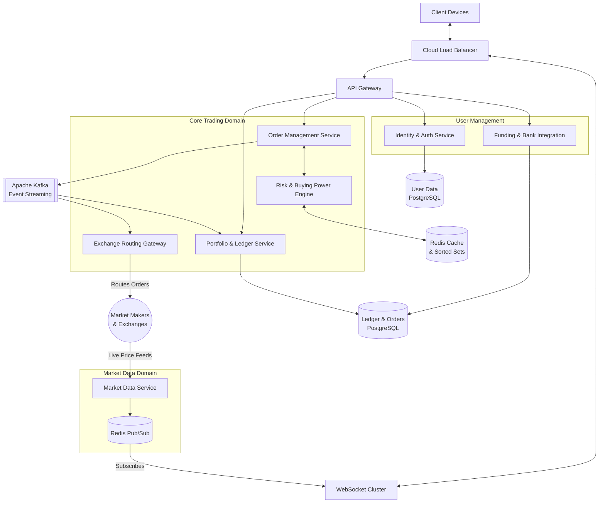

# Cloud-Native Stock Trading Platform Architecture (Robinhood Clone)

## 1. Architecture Overview
The proposed solution is a highly scalable, cloud-agnostic microservices architecture designed to replicate the core functionalities of a modern commission-free retail brokerage. Rather than acting as an exchange itself, the system routes trades through external market makers and exchanges. The architecture focuses heavily on decoupling read-heavy informational flows from write-heavy transactional operations.

To handle massive concurrency during market hours and bursty traffic driven by market volatility, the system is decomposed into isolated domain services. Real-time market data leverages a WebSocket cluster backed by Redis Pub/Sub to push live price updates to clients with minimal latency and network bandwidth. Concurrently, the core trading engine rigorously enforces financial correctness. It utilizes a Risk Engine to continuously evaluate buying power in real-time and relies on ACID-compliant relational databases (like PostgreSQL) to prevent double-spending and guarantee atomic state changes. Limit orders are efficiently tracked and triggered using Redis Sorted Sets, which allow logarithmic time lookups against streaming market prices. Heavy asynchronous processes—such as clearing, reporting, and portfolio aggregation—are decoupled via an Apache Kafka event streaming layer to ensure strict ordering and high fault tolerance.

## 2. Architecture Diagram

## 3. Well-Architected Framework Analysis

### Operational Excellence
- **Infrastructure as Code (IaC):** Provision underlying infrastructure (Kubernetes, databases, brokers) via tools like Terraform to maintain consistency across staging and production.
- **End-to-End Observability:** Centralized logging and distributed tracing (e.g. OpenTelemetry) are critical to track the complete lifecycle of a trading order as it traverses multiple microservices.
- **Safe Deployments:** Blue/Green or Canary deployments ensure that system updates can be rolled back instantly without disrupting active market sessions.

### Security
- **Data Protection:** To comply with frameworks like PCI-DSS and SOC 2, all financial data and Personally Identifiable Information (PII) is encrypted at rest and in transit.
- **Audit Trails:** Immutable, append-only logs record all state changes for orders, transactions, and account funding to satisfy strict regulatory oversight.
- **Zero Trust Authentication:** Strict API authentication (OAuth2 / OIDC) and internal mutual TLS (mTLS) are utilized across all microservice communication.

### Reliability
- **Domain Isolation:** Microservice decomposition ensures that a failure in market data feeds will not prevent a user from managing their existing portfolio or withdrawing funds.
- **Idempotent Operations:** The order execution and routing workflows are strictly idempotent to prevent duplicate trade executions or lost acknowledgments from causing unrecoverable financial discrepancies.
- **Graceful Degradation:** If the WebSocket layer experiences connection drops, clients automatically failover to HTTP polling to maintain functionality.

### Performance Efficiency
- **Push-based Messaging:** Using Redis Pub/Sub in conjunction with WebSockets allows the system to efficiently push data only when prices change, avoiding the overhead of millions of simultaneous polling requests.
- **In-Memory Order Matching:** Storing active limit orders in Redis Sorted Sets enables extremely fast, O(log N) time complexity searches to trigger trades immediately when market conditions are met.
- **Asynchronous Offloading:** Event-driven architecture via Kafka ensures that high-latency tasks (like generating user statements or settlement clearing) do not block the critical, low-latency path of placing a trade.

### Cost Optimization
- **Elastic Scalability:** Kubernetes Horizontal Pod Autoscalers dynamically scale out API and WebSocket compute resources during massive traffic surges (e.g. market open, meme stock rallies) and scale them down to save costs during off-hours or weekends.
- **Data Tiering:** Active ledger data is kept on high-performance block storage, while historical trades and settled orders are periodically archived to cost-effective object storage.
- **Managed PaaS:** Utilizing managed Kafka and Database services shifts maintenance overhead from engineering to the cloud provider, optimizing total cost of ownership.

### Sustainability
- **Compute Efficiency:** Persistent WebSocket connections drastically reduce the repeated HTTP header overhead and compute cycles associated with standard client-side polling architectures.
- **Rightsized Workloads:** By actively tearing down unneeded pods and containers outside of market hours, the platform minimizes idle power draw and reduces its overall carbon footprint.

## 4. Technical Glossary
- **ACID (Atomicity, Consistency, Isolation, Durability):** A set of database properties intended to guarantee data validity despite errors or power failures. It is essential for avoiding double-spend scenarios in financial ledgers.
- **Idempotency:** A system property where applying an operation multiple times yields the same result as applying it once. This is vital in trading to retry failed requests securely without executing duplicate orders.
- **Market Order:** A request to immediately buy or sell a stock at the current prevailing market price.
- **Limit Order:** A request to buy or sell a stock only if the market price reaches a specified target.
- **Market Maker:** External financial institutions that provide market liquidity. Brokerages route client orders to these entities for execution.
- **Redis Pub/Sub:** A real-time messaging paradigm where publishers push data to specific channels, and subscribers receive it instantly, ideal for broadcasting live stock prices.
- **Redis Sorted Sets (ZSET):** A data structure that stores members mapped to a floating-point score. Used in this architecture to index limit orders by their target price for lightning-fast retrieval.
- **Thundering Herd Problem:** A scenario where a massive number of limit orders are simultaneously triggered by a single stock price movement, potentially causing system bottlenecks if not handled by efficient data structures.
