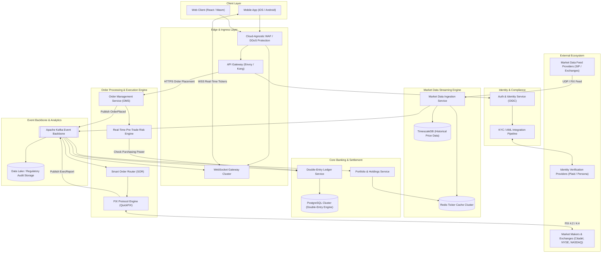

# Trading Platform Architecture (Robinhood-Scale)

## 1. Architecture Overview

This architecture specifies a high-performance, cloud-agnostic, microservices-based financial trading platform capable of handling real-time market data ingestion, low-latency stock and cryptocurrency order execution, zero-loss double-entry transaction ledgering, and strict regulatory compliance (SEC/FINRA/KYC/AML).

### Core Architectural Principles
* **Event-Driven Architecture (EDA):** Uses Apache Kafka as an immutable, fault-tolerant event backbone to decouple order placement, risk checks, matching, ledger updates, and notification services.
* **Low-Latency Order Execution:** Utilizes memory-optimized execution pathways, asynchronous outbox pattern processing, and specialized Smart Order Routing (SOR) communicating via the FIX (Financial Information eXchange) protocol to market makers and exchanges.
* **ACID-Compliant Double-Entry Ledger:** Guarantees absolute financial integrity by enforcing double-entry bookkeeping rules across PostgreSQL clusters using strict isolation levels and event-sourced auditing.
* **Sub-Millisecond Real-Time Streaming:** Combines direct exchange feeds, time-series data storage, Redis caching, and horizontally scalable WebSocket gateway layers to stream ticker quotes to millions of concurrent client connections.
* **Zero-Trust Security & Compliance:** Integrates mutual TLS (mTLS), hardware security modules (HSM) for cryptographic keys, OAuth2/OIDC, continuous automated audit logging, and automated KYC/AML ingestion pipelines.

## 2. Architecture Diagram

```mermaid
flowchart TD
    subgraph ClientLayer ["Client Layer"]
        App["Mobile App (iOS / Android)"]
        Web["Web Client (React / Wasm)"]
    end

    subgraph EdgeLayer ["Edge & Ingress Layer"]
        WAF["Cloud-Agnostic WAF / DDoS Protection"]
        APIGW["API Gateway (Envoy / Kong)"]
        WSGW["WebSocket Gateway Cluster"]
    end

    subgraph AuthLayer ["Identity & Compliance"]
        AuthSvc["Auth & Identity Service (OIDC)"]
        KYCSvc["KYC / AML Integration Pipeline"]
    end

    subgraph MarketDataLayer ["Market Data Streaming Engine"]
        MDIngest["Market Data Ingestion Service"]
        TickerCache[("Redis Ticker Cache Cluster")]
        TSDB[("TimescaleDB (Historical Price Data)")]
    end

    subgraph OrderLayer ["Order Processing & Execution Engine"]
        OrderSvc["Order Management Service (OMS)"]
        RiskEngine["Real-Time Pre-Trade Risk Engine"]
        SOR["Smart Order Router (SOR)"]
        FIXEngine["FIX Protocol Engine (QuickFIX)"]
    end

    subgraph LedgerLayer ["Core Banking & Settlement"]
        LedgerSvc["Double-Entry Ledger Service"]
        PortfolioSvc["Portfolio & Holdings Service"]
        DBLedger[("PostgreSQL Cluster (Double-Entry Engine)")]
    end

    subgraph EventBus ["Event Backbone & Analytics"]
        Kafka[["Apache Kafka Event Backbone"]]
        DataLake[("Data Lake / Regulatory Audit Storage")]
    end

    subgraph ExternalServices ["External Ecosystem"]
        ExtMarketData["Market Data Feed Providers (SIP / Exchanges)"]
        MarketMakers["Market Makers & Exchanges (Citadel, NYSE, NASDAQ)"]
        ExtKYC["Identity Verification Providers (Plaid / Persona)"]
    end

    %% Client Ingress Flow
    App --> WAF
    Web --> WAF
    WAF --> APIGW
    WAF --> WSGW

    %% Identity & Gateway Interactions
    APIGW --> AuthSvc
    AuthSvc --> KYCSvc
    KYCSvc <--> ExtKYC

    %% Market Data Ingestion Flow
    ExtMarketData -->|UDP / FIX Feed| MDIngest
    MDIngest --> TickerCache
    MDIngest --> TSDB
    MDIngest --> Kafka
    Kafka --> WSGW
    WSGW <-->|WSS Real-Time Tickers| App

    %% Order Execution Flow
    APIGW -->|HTTPS Order Placement| OrderSvc
    OrderSvc --> RiskEngine
    RiskEngine -->|Check Purchasing Power| LedgerSvc
    LedgerSvc --> DBLedger
    OrderSvc -->|Publish OrderPlaced| Kafka
    Kafka --> SOR
    SOR --> FIXEngine
    FIXEngine <-->|FIX 4.2 / 4.4| MarketMakers

    %% Execution Settlement & Portfolio Updates
    FIXEngine -->|Publish ExecReport| Kafka
    Kafka --> LedgerSvc
    Kafka --> PortfolioSvc
    Kafka --> DataLake
    PortfolioSvc --> TickerCache
```

## 3. End-to-End System Flow

### Phase 1: Real-Time Market Data Ingestion & Distribution
1. **Ingestion:** The `Market Data Ingestion Service` establishes high-bandwidth, direct UDP/FIX feed connections with external SIP/Exchange market data providers.
2. **Caching & Historical Logging:** Incoming tick data is concurrently cached in the in-memory `Redis Ticker Cache Cluster` for low-latency retrieval and written to `TimescaleDB` for historical candlestick aggregation.
3. **Event Broadcast:** Ticker updates are published to the `Apache Kafka Event Backbone` under dedicated high-partition topics.
4. **Client Fan-Out:** The `WebSocket Gateway Cluster` consumes ticker streams from Kafka and broadcasts low-latency price updates via WebSockets over TLS (WSS) to connected mobile and web clients.

### Phase 2: Order Placement & Pre-Trade Risk Validation
1. **Request Ingress:** The user submits a buy/sell market or limit order via the mobile/web client. The request enters through the `WAF` and `API Gateway`, where OAuth2/JWT tokens are validated.
2. **Order Management System (OMS):** The `Order Management Service` validates order payloads and routes them to the `Real-Time Pre-Trade Risk Engine`.
3. **Pre-Trade Risk & Buying Power Check:** The Risk Engine queries the `Ledger Service` to verify available margin/cash balances and pending liabilities.
4. **Funds Reservation:** If cleared, the `Ledger Service` locks the required funds via a pending hold entry in the `PostgreSQL Cluster`. The order is marked as `PENDING_ROUTING`.

### Phase 3: Smart Order Routing & Execution
1. **Event Dispatch:** The OMS writes the validated order to Kafka via the Transactional Outbox Pattern.
2. **Smart Order Routing:** The `Smart Order Router (SOR)` consumes the event, evaluates price improvement metrics, liquidity depth, and execution fees across multiple venues, selecting the optimal destination.
3. **FIX Processing:** The `FIX Protocol Engine` translates the internal order payload into standard FIX protocol format (e.g. `NewOrderSingle [MsgType D]`) and sends it over an encrypted session to the selected exchange or market maker.

### Phase 4: Execution Settlement & Ledger Commit
1. **Execution Report:** The market maker executes the trade and returns a FIX `ExecutionReport [MsgType 8]`.
2. **Event Settlement:** The `FIX Protocol Engine` converts the report into an internal `OrderExecuted` event and pushes it to Kafka.
3. **Immutable Ledger Commit:** The `Ledger Service` consumes the event and executes a atomic PostgreSQL transaction:
   * Releases the pending funds hold.
   * Debits/Credits the user's cash balance.
   * Debits/Credits the user's security position in the `Portfolio Service`.
   * Inserts debit/credit balancing rows into the double-entry accounting ledger.
4. **Client Notification:** A settlement notification is emitted via WebSocket to update the user's UI with the updated portfolio balance and execution receipt.
5. **Audit Archiving:** The event is asynchronously stored in the `Data Lake` for end-of-day reconciliation and regulatory compliance reporting (e.g. CAT/OATS reporting).

## 4. Well-Architected Framework Analysis

### 4.1 Operational Excellence
* **Infrastructure as Code (IaC):** Entire infrastructure (Kubernetes clusters, Kafka brokers, databases, networking) is provisioned declaratively using Terraform and Helm.
* **GitOps Continuous Delivery:** Uses ArgoCD/Flux to drive declarative deployments to Kubernetes, enforcing zero-downtime rolling updates and automated canary rollbacks.
* **Observability & Distributed Tracing:** Integrated OpenTelemetry instrumentation across all microservices, exporting metrics to Prometheus, logs to OpenSearch, and traces to Jaeger to track end-to-end request latency across service boundaries.
* **Chaos Engineering:** Automated fault injection (using Chaos Mesh) simulates broker failures, network partitions, and database failovers to validate auto-healing capabilities.

### 4.2 Security
* **Zero-Trust Network Architecture:** All service-to-service communication is secured via mutual TLS (mTLS) enforced by an Istio Service Mesh.
* **Data Encryption:** Enforces AES-256 encryption at rest for all database volumes and object stores. TLS 1.3 is enforced for all in-transit traffic.
* **Key Management & HSM:** Sensitive cryptographic keys, API tokens, and internal platform certificates are managed through HashiCorp Vault backed by Hardware Security Modules (HSMs).
* **Compliance & Audit Trails:** Every financial operation generates an immutable, cryptographically chained audit record. Continuous automated scanning enforces SOC 2 Type II, PCI-DSS, and SEC Rule 17a-4 compliance.

### 4.3 Reliability
* **Multi-Region Active-Passive / Active-Active Strategy:** Core API and event ingress operate in Active-Active across availability zones, while stateful databases use multi-region synchronous replication with automatic failover orchestration.
* **Resilience Patterns:** Implements Hystrix/Resilience4j circuit breakers, automated retry mechanisms with exponential backoff and jitter, and rate-limiting at the API Gateway layer to prevent cascading service degradation.
* **Data Consistency Models:** Uses the Saga Pattern with compensation transactions for multi-microservice state orchestration, ensuring overall eventual consistency while maintaining strict isolation for ledger transactions.

### 4.4 Performance Efficiency
* **Low-Latency In-Memory Processing:** Pre-trade risk checks and matching operations utilize memory-optimized microservices leverage non-blocking thread architectures (e.g. Netty / LMAX Disruptor pattern) to achieve sub-millisecond local execution latency.
* **Read/Write Segregation (CQRS):** Separates trade placement (write path) from portfolio viewing and stock historical lookup (read path), utilizing Redis and time-series read replicas to scale read traffic independently.
* **Connection Multiplexing:** WebSocket gateways pool downstream connections to Kafka, minimizing memory footprint and enabling support for millions of simultaneous client streaming sockets.

### 4.5 Cost Optimization
* **Auto-Scaling Strategy:** Kubernetes Horizontal Pod Autoscalers (HPA) scale processing capacity dynamically based on custom metrics (e.g. Kafka consumer group lag, CPU utilization) to align compute costs with trading hour volume peaks.
* **Multi-Tiered Storage Lifecycle:** Time-series tick data is tiered automatically: hot data remains in Redis/TimescaleDB (0-7 days), warm data moves to columnar Parquet files on cloud object storage (8-90 days), and cold data archives to glacier-tier storage.
* **Spot Instance Utilization:** Stateless event processors and batch analytics workloads run on Spot/Preemptible compute nodes with automated graceful drain handlers.

### 4.6 Sustainability
* **ARM-Based Compute Workloads:** Microservices and database nodes are deployed on ARM64-based processors (e.g. AWS Graviton, Ampere Altra), offering up to 40% better performance per watt compared to legacy x86 architectures.
* **Resource Minimization:** Compiled runtime environments (Go, Rust, C++) are utilized for high-throughput components (FIX engine, market data ingestion) to maximize CPU cycle efficiency and decrease carbon footprint.

## 5. Technical Glossary

* **FIX Protocol (Financial Information eXchange):** An international electronic communication protocol for real-time exchange of securities transactions and market data.
* **Double-Entry Ledger:** An accounting system where every financial transaction requires an equal and opposite entry in at least two different accounts (debit and credit), guaranteeing that assets always equal liabilities plus equity.
* **Smart Order Router (SOR):** An automated algorithmic engine that analyzes market liquidity, execution costs, and speed across various exchanges to route orders to the optimal execution venue.
* **Saga Pattern:** A design pattern that manages data consistency across microservices in distributed transaction scenarios through a sequence of local transactions and compensating actions.
* **Transaction Outbox Pattern:** A reliability pattern that writes events to an enterprise database table in the same transaction as the business entity changes, ensuring message publishing reliably succeeds even if the network fails.
* **LMAX Disruptor:** A high-performance inter-thread messaging library designed for ultra-low latency transaction processing using lock-free ring buffers.
* **TimescaleDB:** An open-source time-series database optimized for fast ingest and complex queries using standard SQL, ideal for financial tick and candlestick data.
* **Mutual TLS (mTLS):** A process where both client and server authenticate each other's cryptographic X.509 certificates before establishing an encrypted channel.
* **CQRS (Command Query Responsibility Segregation):** An architectural pattern that separates read operations (queries) from write operations (commands) to optimize performance, scalability, and security.
* **SIP (Securities Information Processor):** A centralized system that consolidates and distributes real-time trade and quote information for equities listed on US exchanges.
* **OIDC (OpenID Connect):** An identity layer built on top of the OAuth 2.0 framework that allows clients to verify the identity of an end-user based on authentication performed by an authorization server.
