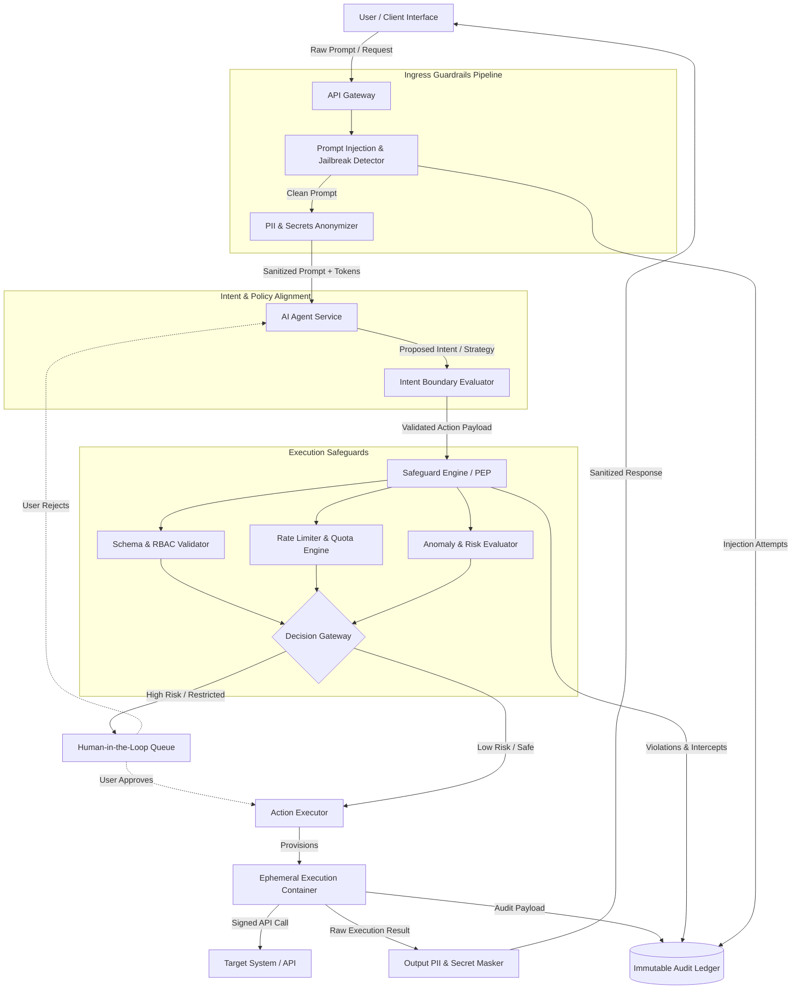

# AI Action Safeguard Architecture: End-to-End Governance & Defense-in-Depth

## 1. Architecture Overview
This solution defines a cloud-agnostic, microservices-based architecture designed to securely govern, evaluate, and execute actions proposed by autonomous or semi-autonomous AI agents. As AI systems shift from generative (providing information) to agentic (taking real-world actions), the blast radius of potential errors, prompt injections, and data leaks expands significantly.

To mitigate these risks, this architecture enforces a strict **Defense-in-Depth** strategy split into three core phases:
1. **Input & Data Protection Guardrails**: Intercepts user inputs at the ingress layer to neutralize Direct/Indirect Prompt Injections and mask Personally Identifiable Information (PII) or API secrets before payloads hit the LLM.
2. **Intent & Policy Boundary Validation**: Validates the AI’s generated intent against semantic alignment boundaries to ensure it stays within its authorized functional domain.
3. **Action Safeguards & Isolated Execution**: Decouples the "Brain" (AI Agent) from the "Hands" (Action Executor). A Policy Enforcement Point (PEP) evaluates proposed actions against deterministic rules, risk scores, and rate limits, routing high-risk actions through a Human-in-the-Loop (HITL) gateway and executing approved actions inside isolated, ephemeral sandboxes.

## 2. Architecture Diagram

## 3. End-to-End System Flow

1. **Ingress & Input Defense**: 
   - The user submits a prompt or task request via the Client Interface.
   - The **Prompt Injection & Jailbreak Detector** inspects the input using lightweight semantic classifiers to catch direct prompt injections or system prompt overrides.
   - The **PII & Secrets Anonymizer** scans for credit card numbers, SSNs, token strings, and credentials, swapping sensitive values with cryptographic surrogate tokens (e.g. `[PII_EMAIL_1]`) before reaching the LLM context window.
2. **AI Reasoning & Intent Synthesis**: The AI Agent Service processes the sanitized prompt and formulates a plan, generating a structured action proposal.
3. **Intent Boundary Validation**: The **Intent Boundary Evaluator** evaluates whether the proposed action semantically matches the user's explicit request and fits within the agent's system mandate (preventing goal hijacking or indirect prompt injection via untrusted external data sources).
4. **Action Policy Enforcement**: The structured Action Payload is passed to the **Safeguard Engine (PEP)**:
   - **Schema & RBAC Validator**: Ensures the user has the explicit permissions required to execute the target action.
   - **Rate Limiter & Quota Engine**: Prevents AI infinite loops or runaway API consumption.
   - **Anomaly & Risk Evaluator**: Calculates a composite risk score based on blast radius, historical action patterns, and target system sensitivity.
5. **Decision & Human-in-the-Loop (HITL) Routing**:
   - *Low-Risk Actions* (e.g. read-only data, non-destructive state changes) proceed automatically.
   - *High-Risk Actions* (e.g. financial transactions, bulk deletions) pause execution and enter the HITL Queue, sending a confirmation request to the user with the detokenized details of the action.
6. **Isolated Sandbox Execution**: Upon authorization, the **Action Executor** spins up a short-lived, isolated container (e.g. Kubernetes Job/MicroVM). It detokenizes any required parameters using a secure secrets manager, executes the API call against the Target System, and tears down the environment.
7. **Egress Masking & Auditing**: The response from the target system passes through an **Output PII & Secret Masker** to ensure zero downstream leak of sensitive internal data back to the user or agent context. All steps are immutably logged to an Audit Ledger.

## 4. Well-Architected Framework Analysis

### 4.1 Operational Excellence
- **Centralized Guardrail Rulesets**: Input detection models, PII regex maps, and intent boundary schemas are decoupled from core application code, allowing updates via Policy as Code (PaC) without redeploying the AI agent service.
- **Traceability & Detokenization Vaults**: Audit logs maintain a clear line of lineage linking user prompts, detokenization maps, policy checks, and sandbox outputs using unified correlation IDs.

### 4.2 Security
- **Defense-in-Depth**: Security is enforced at every layer: input filtering (Injection/PII), semantic intent validation, deterministic authorization (RBAC), and physical isolation (Sandboxes).
- **Data Privacy & Zero Trust**: PII and credentials are masked before hitting third-party LLM providers, ensuring sensitive user data never trains or resides in external model contexts.
- **Indirect Injection Mitigation**: Untrusted data retrieved by agents (e.g. web scraping, email body parsing) passes through the same intent and input filter pipeline to prevent data-triggered instruction overrides.

### 4.3 Reliability
- **Graceful Fail-Safe Decoupling**: If the Prompt Injection or Intent Validation service fails or experiences high latency, the system defaults to a fail-closed posture or degrades to compulsory Human-in-the-Loop approval.
- **Loop Circuit Breakers**: The rate limiter tracks agent execution depth and terminates recursive sub-task calls before exhaustion of system resources.

### 4.4 Performance Efficiency
- **Tiered Filtering Architecture**: Low-latency regex and fast ONNX-based micro-models process input filtering (Prompt Injection/PII) in under 15ms, preventing LLM invocation costs for malicious inputs.
- **Asynchronous Tokenization**: PII substitution maps are cached locally per session to minimize database roundtrips during token swapping.

### 4.5 Cost Optimization
- **Short-Circuiting Malicious Prompts**: Blocking prompt injections and out-of-scope intents at the API Gateway layer avoids costly LLM inference overhead and token wastage.
- **Serverless Sandboxing**: Compute for execution containers scales to zero when no actions are actively running.

### 4.6 Sustainability
- **Right-Sized Model Routing**: Small, specialized models are used for guardrail classification tasks (PII, injection detection, intent classification) rather than passing administrative guardrail checks through high-parameter, energy-intensive LLMs.

## 5. Technical Glossary

- **Agentic AI**: AI systems capable of planning, reasoning, and executing multi-step workflows across external APIs on behalf of a user.
- **Direct Prompt Injection**: An attack where a user inputs crafted instructions to bypass safety system prompts and hijack the AI’s behavior.
- **Indirect Prompt Injection**: An attack where an AI processes untrusted external content (e.g. a malicious email or webpage) containing hidden instructions that hijack the AI's execution plan.
- **Ephemeral Sandbox**: A temporary, isolated computing environment (e.g. container or microVM) provisioned strictly to execute a single action and self-destruct immediately after.
- **Human-in-the-Loop (HITL)**: A safeguard pattern requiring explicit human authorization before executing actions classified as high-risk or irreversible.
- **Intent Boundary Evaluator**: A semantic check verifying that the AI's formulated execution plan strictly aligns with the user's original request scope and authorized tasks.
- **PII & Secrets Anonymization**: The process of detecting, redacting, or replacing Personally Identifiable Information and sensitive keys with non-sensitive surrogate tokens before sending payloads to LLM providers.
- **Policy Enforcement Point (PEP)**: A central gateway component in Zero Trust systems that intercepts action payloads and evaluates them against authorization rules and risk metrics before granting execution access.
- **Surrogate Tokenization**: Replacing sensitive data strings with unique, non-sensitive identifiers mapped securely in an isolated, encrypted token vault for later detokenization during execution.
