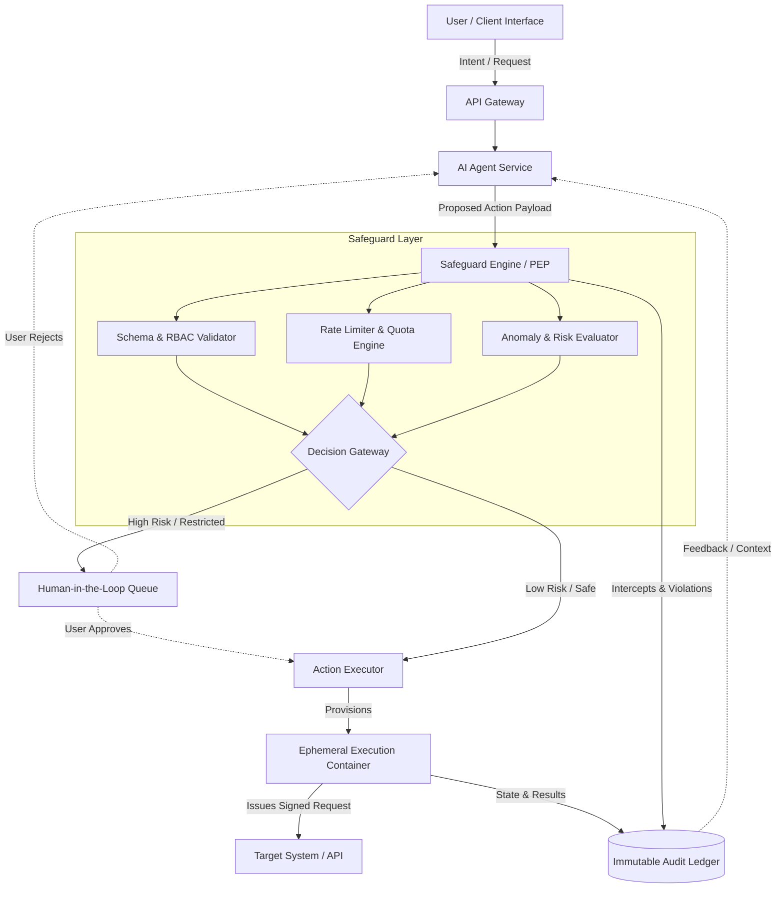

# AI Action Safeguard Architecture: A Defense-in-Depth Approach

## 1. Architecture Overview
This solution defines a cloud-agnostic, microservices-based architecture designed to securely govern, evaluate, and execute actions proposed by autonomous or semi-autonomous AI agents. As AI systems shift from generative (providing information) to agentic (taking actions), the blast radius of potential errors or malicious prompt injections expands significantly. 

To mitigate these risks, this architecture decouples the "Brain" (the AI Agent Service) from the "Hands" (the Action Executor) using a robust Safeguard Engine. It acts as a Policy Enforcement Point (PEP) that evaluates every action against deterministic rules, historical behavior, and risk thresholds. By introducing Ephemeral Execution Environments and a Human-in-the-Loop (HITL) gateway, the system ensures that high-risk actions are explicitly authorized and contained, preventing runaway loops and unauthorized state changes.

## 2. Architecture Diagram

## 3. End-to-End System Flow

1. **Intent Generation**: The User interacts with the system via the Client Interface, triggering an intent. The API Gateway routes this to the AI Agent Service.
2. **Action Proposal**: The AI Agent Service synthesizes the request and generates a standardized, machine-readable "Action Payload" (e.g. JSON indicating target system, desired state change, and parameters). *Crucially, the AI has no direct access to target APIs.*
3. **Safeguard Interception**: The Action Payload is intercepted by the Safeguard Engine (Policy Enforcement Point).
4. **Deterministic Validation**: The payload undergoes schema validation and Role-Based Access Control (RBAC) checks to ensure the user actually has the permissions the AI is trying to exercise on their behalf.
5. **Heuristic & Risk Evaluation**: The Anomaly & Risk Evaluator inspects the payload for unusual patterns (e.g. deleting 1,000 files when the user typically deletes 5) and assesses the "Blast Radius." The Rate Limiter ensures the AI is not caught in an infinite retry loop (e.g. max 10 actions per minute).
6. **Decision Routing**:
   - *Low Risk*: Routine, reversible actions proceed directly to the Action Executor.
   - *High Risk*: Destructive, expensive, or highly sensitive actions are routed to a Human-in-the-Loop (HITL) Queue (e.g. Kafka or RabbitMQ). The system suspends execution and alerts the user for explicit approval via push notification or dashboard.
7. **Isolated Execution**: Once approved (automatically or manually), the Action Executor provisions a just-in-time, ephemeral container (e.g. Kubernetes Job). This sandbox is injected with short-lived, scoped credentials to execute the specific task.
8. **Audit & Teardown**: The sandbox executes the API call to the Target System, logs the response to the Immutable Audit Ledger, and immediately self-destructs to prevent credential leakage or lateral movement.

## 4. Well-Architected Framework Analysis

### 4.1 Operational Excellence
- **Centralized Observability**: All proposed actions, safeguard rejections, and execution results are streamed to a central logging platform (e.g. ELK stack, Datadog). 
- **Policy as Code (PaC)**: Safeguard rules are managed via CI/CD pipelines, allowing infrastructure teams to deploy or rollback safety thresholds without modifying the core AI agent logic.
- **Traceability**: Every action carries a unique correlation ID linking the final API call back to the exact user prompt and AI generation trace.

### 4.2 Security
- **Defense in Depth**: The AI is completely segmented from the network where actual API execution happens. 
- **Zero Trust & Least Privilege**: The Action Executor relies on Ephemeral Sandboxes with short-lived tokens. The environment only possesses the exact permissions needed for that single action.
- **Immutable Auditing**: Logs are stored in a write-once-read-many (WORM) database, ensuring non-repudiation if an action needs to be forensically investigated.

### 4.3 Reliability
- **Circuit Breakers**: If the AI begins generating high volumes of erroneous or failing actions (hallucination loop), the Safeguard Engine trips a circuit breaker, automatically degrading to a "manual approval only" state.
- **Asynchronous Decoupling**: The HITL Queue ensures that the AI Agent does not block or timeout while waiting for human authorization.
- **Idempotency**: The Action Executor is designed to ensure that if a network failure occurs during execution, retries do not result in duplicated side effects.

### 4.4 Performance Efficiency
- **Just-in-Time Provisioning**: Using serverless containers or K8s Jobs ensures that execution environments are only spun up when an action passes all gateways, avoiding idle resource drain.
- **Fast-Path Routing**: Deterministic policy checks (RBAC, Rate Limits) are cached in memory (e.g. Redis) allowing sub-millisecond validation for standard actions.

### 4.5 Cost Optimization
- **Preventative Cost Controls**: By evaluating the payload *before* execution, the Safeguard Engine can block actions that would incur massive cloud or API costs (e.g. an AI accidentally spinning up 100 high-tier GPU instances).
- **Serverless Compute**: Leveraging serverless components for the Ephemeral Sandbox scales to zero during idle periods, ensuring you only pay for executed actions.

### 4.6 Sustainability
- **Compute Right-Sizing**: Sandbox environments are tailored with specific memory and CPU limits based on the payload (e.g. a simple API POST gets minimal resources), reducing energy waste.
- **Batch Processing**: Non-urgent HITL approvals can be grouped and executed in batches during off-peak hours when the energy grid is operating at lower carbon intensity.

## 5. Technical Glossary

- **Agentic AI**: Artificial Intelligence systems capable of not just answering questions, but planning and executing sequences of actions to achieve a goal.
- **Blast Radius**: The maximum potential impact or damage that could occur if a specific component fails or if an action is executed maliciously/incorrectly.
- **Circuit Breaker**: A design pattern that detects system failures and encapsulates the logic of preventing a failure from constantly recurring, during maintenance, temporary external system failure or unexpected system difficulties.
- **Ephemeral Sandbox**: A temporary, isolated computing environment created specifically to execute a single task and then immediately destroyed, minimizing the attack surface.
- **Human-in-the-Loop (HITL)**: A system design pattern that requires human interaction/approval before a process can proceed to the next step, acting as a manual fail-safe.
- **Idempotency**: A property of an operation where applying it multiple times yields the same result as applying it once, crucial for safely retrying failed network requests.
- **Policy Enforcement Point (PEP)**: A component in a Zero Trust architecture that intercepts requests to access a resource and makes an allow/deny decision based on evaluated policies.
- **RBAC (Role-Based Access Control)**: A method of restricting network access based on the roles of individual users within an enterprise.
- **WORM (Write-Once-Read-Many)**: A data storage technology that allows data to be written to a storage medium a single time and prevents the data from being erased or modified, heavily used for compliance and audit logging.
