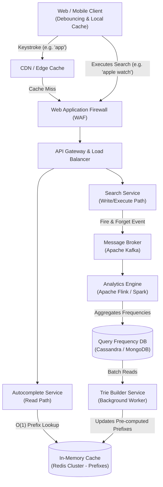

# Typeahead Autocomplete Search System Architecture

## 1. Architecture Overview
This solution provides a cloud-agnostic, microservices-based architecture for a highly scalable, low-latency Typeahead Autocomplete system. To achieve the strict sub-50ms latency requirements of real-time keystroke predictions, the system separates the read path (fetching predictions) from the write path (aggregating search trends). 

The read path utilizes a heavily optimized, distributed in-memory cache storing pre-computed top-K predictions for active prefixes. The write path asynchronously ingests final search queries via a message broker, processes term frequencies using a streaming analytics engine, and orchestrates scheduled updates to the cache via a background Trie Builder Service.

## 2. Architecture Diagram

## 3. End-to-End System Flow

1. **Client Interaction & Edge Routing:** As the user types characters into the search bar, the client application applies a debouncing mechanism (e.g. 200ms delay) to prevent overloading the backend. The request is routed through a CDN (which serves statically popular queries) and a WAF for security validation.
2. **Read Path (Prefix Lookup):** The API Gateway forwards the autocomplete request to the Autocomplete Service. This service queries the distributed Redis Cluster. Instead of traversing a tree in real-time, Redis stores pre-computed key-value pairs where the key is the prefix (e.g. `app`) and the value is a serialized list of the top $K$ autocomplete suggestions. The service retrieves this list in $O(1)$ time and returns it to the user.
3. **Write Path (Query Ingestion):** When the user selects a suggestion or hits "Enter" to execute a final search, the API Gateway routes this to the Search Service. The Search Service executes the actual search but also emits a "search executed" event containing the query string to an Apache Kafka topic.
4. **Data Aggregation:** An analytics engine (like Apache Flink or Spark Streaming) consumes the Kafka topic in real-time. It aggregates query frequencies over defined time windows (e.g. hourly, daily) and persists these aggregated counts into a NoSQL Database (like Cassandra or MongoDB).
5. **Trie Building & Cache Refresh:** Periodically (or continuously via triggers), the Trie Builder Service pulls the updated query frequencies from the NoSQL Database. It builds a distributed Trie data structure in memory to calculate the new top $K$ suggestions for every possible prefix.
6. **Cache Invalidation & Update:** The Trie Builder updates the Redis Cluster with the newly calculated prefix lists. To ensure zero downtime, updates are applied atomically using a blue/green cluster swap or batch pipelining, ensuring users always experience fast, accurate, and up-to-date suggestions.

## 4. Well-Architected Framework Analysis

### 4.1 Operational Excellence
* **Observability:** Distributed tracing (e.g. OpenTelemetry, Jaeger) tracks requests from the API Gateway through the Autocomplete API to Redis, ensuring latency bottlenecks are immediately visible. Centralized logging (ELK stack) captures system errors.
* **Deployment:** CI/CD pipelines automate the deployment of microservices using container orchestration (Kubernetes). The Trie Builder updates cache states without requiring application deployments.

### 4.2 Security
* **Threat Mitigation:** The WAF protects against injection attacks and malicious payloads.
* **Traffic Control:** Strict rate limiting is implemented at the API Gateway to prevent distributed denial-of-service (DDoS) attacks and data scraping by bots.
* **Data Privacy:** Query logs pushed to Kafka are stripped of Personally Identifiable Information (PII) before frequency aggregation occurs.

### 4.3 Reliability
* **Graceful Degradation:** If the Autocomplete Service or Redis cluster fails, the client falls back to local browser caching or simply disables the autocomplete dropdown without breaking the core search functionality.
* **High Availability:** The Redis cache is deployed in a multi-node cluster with read replicas across multiple Availability Zones (AZs) to survive node or zone failures.

### 4.4 Performance Efficiency
* **Pre-computation:** By shifting the computational load of Trie traversal to the background (Trie Builder) and storing flat lists in Redis, the read latency is kept strictly under 50ms.
* **Edge / Client Caching:** Browser-side caching (e.g. LocalStorage or memory) and CDN Edge caching handle repeated backspace/re-type actions, drastically reducing backend hits.
* **Protocol Optimization:** Utilizing HTTP/2 or WebSockets between the client and the API gateway reduces connection overhead for rapid, successive keystroke requests.

### 4.5 Cost Optimization
* **Right-Sizing the Cache:** Caching is limited to prefixes up to a certain length (e.g. 10 characters). Longer queries fall back to suffix matching or are ignored by the autocomplete cache, saving massive amounts of RAM.
* **Spot Instances for Analytics:** The Analytics Engine and Trie Builder Service run asynchronously and are fault-tolerant. They can be hosted on heavily discounted Spot/Preemptible instances to reduce compute costs.

### 4.6 Sustainability
* **Compute Efficiency:** Bypassing real-time database queries in favor of an $O(1)$ cache lookup minimizes CPU cycles per user request.
* **Network Reduction:** Client-side debouncing prevents millions of unnecessary network round-trips for intermediate keystrokes, reducing overall network energy consumption.

## 5. Technical Glossary
* **Debouncing:** A programming practice used to ensure that time-consuming tasks do not fire so often. In this context, waiting until the user stops typing for ~200ms before sending a network request.
* **Trie (Prefix Tree):** A tree-like data structure used to store a dynamic set or associative array where the keys are usually strings. Ideal for autocomplete systems.
* **$O(1)$ Time Complexity:** Denotes an algorithm whose execution time is independent of the size of the input data. Here, looking up a prefix in Redis takes constant time regardless of how many words exist in the dictionary.
* **WAF (Web Application Firewall):** A security filter that monitors, filters, and blocks HTTP traffic to and from a web service based on predefined security rules.
* **CDN (Content Delivery Network):** A geographically distributed network of proxy servers and their data centers, designed to serve content to end-users with high availability and high performance.
* **Message Broker (Kafka):** A distributed event streaming platform used to handle high-throughput, low-latency data feeds (messages/events) between decoupled services.
* **Blue/Green Deployment (Cache Swap):** A technique that reduces downtime and risk by running two identical production environments (Blue and Green). The background worker updates the idle environment, and traffic is instantly switched over.
* **PII (Personally Identifiable Information):** Any data that could potentially identify a specific individual. Must be sanitized from search logs.
