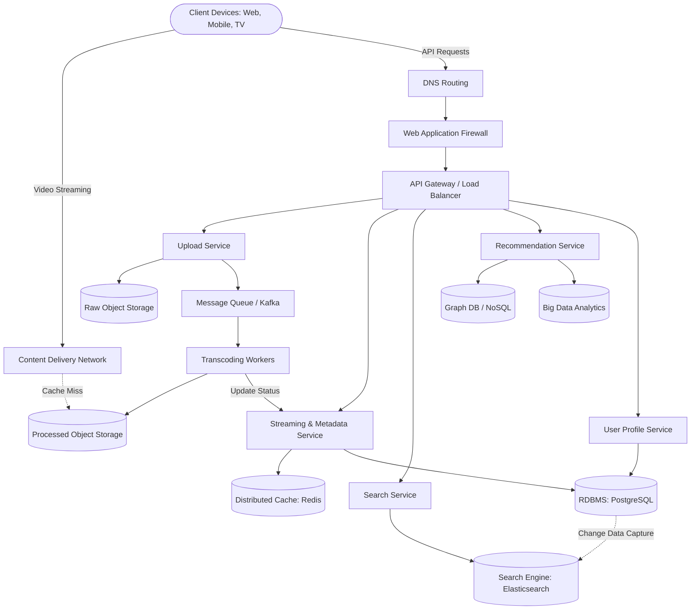

# Global Video Streaming Platform (YouTube) Architecture

## 1. Architecture Overview

This proposed architecture for a large-scale video streaming platform (akin to YouTube) utilizes a cloud-agnostic, microservices-based approach designed for high availability, extreme scalability, and fault tolerance. The system is split into two primary data flows: the **Read/Stream Path** and the **Write/Upload Path**. 

When a user watches a video, the request is served primarily from a globally distributed Content Delivery Network (CDN) to ensure low latency and high throughput. When a user uploads a video, the system uses an asynchronous, event-driven architecture to handle the compute-intensive task of video transcoding. Core microservices manage user data, video metadata, search operations, and recommendations, backed by a polyglot persistence strategy tailored to specific data access patterns.

## 2. Architecture Diagram

## 3. Well-Architected Framework Analysis

### Operational Excellence
*   **Infrastructure as Code (IaC):** All infrastructure is provisioned using cloud-agnostic tools like Terraform, allowing for reproducible and version-controlled environments.
*   **Observability:** Comprehensive logging, metrics, and distributed tracing are implemented using tools like Prometheus, Grafana, and OpenTelemetry. This enables rapid troubleshooting of bottlenecks in video processing or streaming.
*   **CI/CD Pipelines:** Automated testing and deployment pipelines ensure that microservices can be updated independently without platform downtime.

### Security
*   **Edge Protection:** A Web Application Firewall (WAF) and DDoS mitigation strategies protect the API Gateway and underlying services from malicious traffic.
*   **Identity & Access Management:** OAuth2/OIDC protocols handle user authentication and authorization securely.
*   **Data Protection:** All data in transit is encrypted using TLS 1.3. Data at rest (videos in object storage, user data in databases) is encrypted using managed Key Management Services (KMS). Role-Based Access Control (RBAC) enforces principle-of-least-privilege among microservices.

### Reliability
*   **Multi-Region & Auto-Scaling:** The platform spans multiple availability zones and regions to survive localized outages. Services are deployed on a managed Kubernetes cluster with Horizontal Pod Autoscalers (HPA).
*   **Asynchronous Processing:** Video uploads are decoupled from the transcoding process via message queues (Kafka). If a transcoding worker fails, the message remains in the queue and is re-assigned, ensuring no data loss.
*   **Circuit Breakers & Fallbacks:** Microservices utilize circuit breaker patterns to prevent cascading failures. If the recommendation service is down, the system gracefully degrades by showing chronological or trending videos instead.

### Performance Efficiency
*   **Content Delivery Network (CDN):** Heavy video files are cached at edge locations geographically closest to the user, drastically reducing buffering and origin server load.
*   **Adaptive Bitrate Streaming (ABR):** Videos are transcoded into multiple resolutions and bitrates. The client dynamically pulls the best quality stream based on real-time network conditions.
*   **Polyglot Persistence:** Data stores are optimized for their specific tasks (e.g., Elasticsearch for fast text queries, Redis for high-speed metadata caching, RDBMS for ACID transactions on user accounts).

### Cost Optimization
*   **Storage Lifecycle Policies:** Raw video files are transitioned to cheaper, cold-storage tiers (e.g., Glacier equivalents) after successful transcoding. Unpopular transcoded videos are also pushed to lower-cost tiers.
*   **Spot Instances for Transcoding:** Transcoding is compute-intensive but fault-tolerant and asynchronous. Utilizing highly discounted spot/preemptible instances for worker nodes significantly reduces compute costs.
*   **Rightsizing & Serverless:** Resources are continuously monitored to ensure they are appropriately sized. Burst-heavy workloads may leverage serverless functions to scale to zero when idle.

### Sustainability
*   **Efficient Codecs:** The platform prioritizes high-efficiency modern video codecs (like VP9 and AV1), which reduce the bandwidth and storage footprint required per video, directly lowering energy consumption during transmission and storage.
*   **Energy-Efficient Compute:** Transitioning microservices and database instances to ARM-based processors where applicable, which generally offer a better performance-per-watt ratio.
*   **Carbon-Aware Scaling:** Batch processing jobs (like generating weekly recommendation models or deep-archive backups) are scheduled during times when the local grid's carbon intensity is lowest.

## 4. Technical Glossary

*   **API Gateway:** A server that acts as an API front-end, receiving API requests, enforcing throttling and security policies, passing requests to the back-end services, and then passing the response back to the requester.
*   **Adaptive Bitrate Streaming (ABR):** A technique used in streaming multimedia over computer networks where the video quality adjusts dynamically based on the user's available bandwidth and CPU capacity.
*   **CDN (Content Delivery Network):** A geographically distributed network of proxy servers and their data centers. The goal is to provide high availability and performance by distributing the service spatially relative to end-users.
*   **Change Data Capture (CDC):** A set of software design patterns used to determine and track the data that has changed so that action can be taken using the changed data (e.g., syncing a relational database to Elasticsearch).
*   **Horizontal Pod Autoscaler (HPA):** A Kubernetes feature that automatically scales the number of pods in a deployment based on observed CPU utilization or other select metrics.
*   **Message Queue (e.g., Kafka):** An asynchronous service-to-service communication method used in serverless and microservices architectures. Messages are stored on the queue until they are processed and deleted.
*   **Microservices Architecture:** An architectural style that structures an application as a collection of loosely coupled, independently deployable services organized around business capabilities.
*   **Polyglot Persistence:** The practice of using different data storage technologies to handle varying data storage needs within a single software application.
*   **Spot Instances:** Spare compute capacity offered by cloud providers at steep discounts compared to On-Demand prices. They can be interrupted with little notice, making them suitable only for fault-tolerant workloads.
*   **Transcoding:** The direct digital-to-digital conversion of one encoding to another. In video platforms, it involves converting an uploaded raw video into various formats and resolutions (1080p, 720p, 480p) to support different devices and network speeds.
*   **WAF (Web Application Firewall):** A firewall that filters, monitors, and blocks HTTP traffic to and from a web application to protect against malicious attacks like SQL injection or cross-site scripting.
