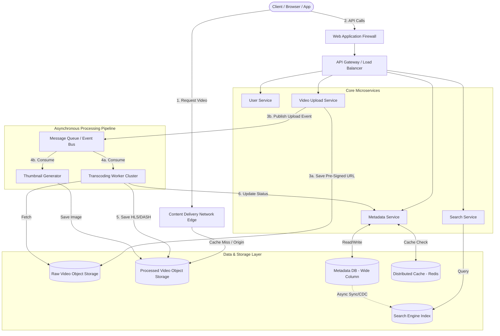

# Global Scale Video Streaming Architecture (YouTube Clone)

## 1. Architecture Overview
This solution presents a highly scalable, cloud-agnostic microservices architecture designed to replicate the core functionalities of a global video streaming platform like YouTube. The design emphasizes high availability, low-latency video delivery, and decoupled asynchronous processing. By separating the read-heavy video streaming path from the write-heavy upload and transcoding path, the system can scale elastically to handle millions of concurrent viewers and thousands of parallel uploads.

## 2. Architecture Diagram

## 3. End-to-End System Flow

### The Upload Pipeline (Write Path)
1. **Initiation:** The user attempts to upload a video. The client requests a secure, pre-signed upload URL from the **Video Upload Service**.
2. **Direct Upload:** The client bypasses the API Gateway and uploads the raw video file directly to **Raw Video Object Storage** using the pre-signed URL (chunked for reliability).
3. **Event Generation:** Upon successful upload, the Object Storage triggers a webhook, or the client notifies the Upload Service, which publishes a `VideoUploaded` event to the **Message Queue**.
4. **Transcoding & Processing:** **Transcoding Workers** consume the event, download the raw video, and process it into multiple resolutions (e.g. 1080p, 720p, 480p) and formats (HLS/DASH) suitable for Adaptive Bitrate Streaming (ABR). Concurrently, **Thumbnail Generators** create preview images.
5. **Storage & Metadata Update:** Processed chunks are saved to **Processed Video Object Storage**. The workers call the **Metadata Service** to update the video state from "Processing" to "Published." 
6. **Search Synchronization:** The Metadata DB utilizes Change Data Capture (CDC) to synchronize the new video metadata to the **Search Engine Index**.

### The Streaming Pipeline (Read Path)
1. **Video Discovery:** The user searches for a video via the **Search Service** or browses their feed via the **Metadata Service** (results are heavily cached in the **Distributed Cache**).
2. **Playback Request:** The user clicks a video. The client retrieves the metadata, including the video's manifest URL (HLS/DASH).
3. **Edge Delivery:** The client requests the video chunks from the nearest **Content Delivery Network (CDN)** edge node. 
4. **Origin Fetch:** If the chunks are not cached at the edge, the CDN fetches them from the **Processed Video Object Storage** (the Origin), caches them, and streams them to the user.

## 4. Well-Architected Framework Analysis

### 4.1 Operational Excellence
* **Infrastructure as Code (IaC):** The entire architecture is provisioned using Terraform or Pulumi, ensuring repeatable and version-controlled environments.
* **Observability:** Distributed tracing (e.g. OpenTelemetry) tracks requests across microservices. Prometheus and Grafana monitor system health, while ELK/EFK stacks aggregate logs.
* **Deployment:** CI/CD pipelines automate testing and deployment using blue-green or canary release strategies to minimize downtime risk.

### 4.2 Security
* **Data Protection:** All data is encrypted in transit using TLS 1.3 and at rest using AES-256. 
* **Edge Security:** A Web Application Firewall (WAF) mitigates DDoS attacks, SQL injection, and XSS.
* **Authentication/Authorization:** OAuth 2.0 and OpenID Connect manage user access. Pre-signed URLs ensure secure, time-bound access to object storage without exposing permanent credentials.
* **Content Protection:** Digital Rights Management (DRM) can be integrated into the transcoding pipeline for premium content.

### 4.3 Reliability
* **Redundancy:** Microservices are deployed across multiple Availability Zones (AZs) behind load balancers. 
* **Resilience:** Circuit breakers (e.g. Resilience4j) prevent cascading failures if a downstream service (like the Metadata DB) degrades. 
* **State Management:** Message Queues (e.g. Kafka or RabbitMQ) ensure zero data loss during the upload/transcoding phase. If a transcoding worker dies, the message returns to the queue for another worker.

### 4.4 Performance Efficiency
* **Edge Caching:** The CDN dramatically reduces latency by serving video chunks geographically close to the user and offloads massive bandwidth requirements from the core infrastructure.
* **Database Strategy:** A Wide-Column NoSQL database (e.g. Cassandra) is used for metadata to handle massive write scales, paired with a Distributed Cache (e.g. Redis) for sub-millisecond read access.
* **Adaptive Bitrate Streaming:** Videos are transcoded into multiple bitrates. The client dynamically switches resolutions based on the user's real-time network conditions to prevent buffering.

### 4.5 Cost Optimization
* **Compute Optimization:** Transcoding is a highly parallel, compute-intensive task. Spot instances (or preemptible VMs) are utilized for worker nodes to reduce compute costs by up to 80%.
* **Storage Lifecycle Policies:** Raw videos are transitioned to cheaper, cold storage (e.g. Glacier/Archive tiers) after transcoding is complete. Rarely accessed processed videos can also be moved to lower-tier storage.
* **Right-Sizing:** Auto-scaling groups dynamically spin up web servers during peak hours and scale them down during off-peak hours.

### 4.6 Sustainability
* **Silicon Efficiency:** Leveraging ARM-based processors (like AWS Graviton or GCP Ampere) for microservices yields higher performance per watt, reducing the system's carbon footprint.
* **Green Regions:** Prioritizing cloud regions powered by 100% renewable energy for the heavy batch-processing jobs (transcoding).
* **Network Efficiency:** Aggressive CDN caching minimizes the energy required to transmit data repeatedly across long-haul internet backbones.

## 5. Technical Glossary

* **ABR (Adaptive Bitrate Streaming):** A technique that dynamically adjusts the quality of a video stream in real-time based on the viewer's available bandwidth and device capabilities.
* **CDC (Change Data Capture):** A software pattern used to determine and track data that has changed so that action can be taken using the changed data (e.g. syncing a DB to a Search Index).
* **CDN (Content Delivery Network):** A geographically distributed network of proxy servers and their data centers designed to provide high availability and performance by distributing service spatially relative to end-users.
* **DASH (Dynamic Adaptive Streaming over HTTP):** An adaptive bitrate video streaming protocol that enables high-quality streaming of media content over the internet delivered from conventional HTTP web servers.
* **HLS (HTTP Live Streaming):** An adaptive bitrate streaming protocol developed by Apple, widely used for delivering video content.
* **IaC (Infrastructure as Code):** The process of managing and provisioning computing infrastructure through machine-readable definition files, rather than physical hardware configuration.
* **Message Queue / Event Bus:** An asynchronous service-to-service communication method used in serverless and microservices architectures (e.g. Apache Kafka, RabbitMQ).
* **Pre-Signed URL:** A URL that grants temporary, restricted access to a specific object in storage, allowing direct uploads/downloads without routing heavy files through an application server.
* **Transcoding:** The process of converting a media file from one format, size, or bitrate to another to support diverse devices and network conditions.
* **Wide-Column NoSQL:** A type of NoSQL database (e.g. Apache Cassandra, ScyllaDB) optimized for massive write volumes and high availability across distributed networks.
