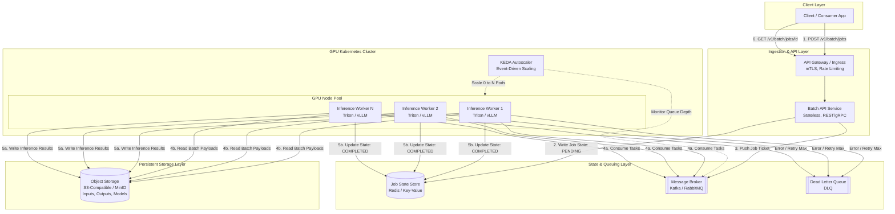

# Production-Ready Batch Inference API for a GPU Cluster

## 1. Architecture Overview

This architecture defines a cloud-agnostic, enterprise-grade Batch Inference API designed to orchestrate asynchronous, high-throughput machine learning inference across a distributed GPU cluster. By decoupling request ingestion from GPU execution using an asynchronous message broker and autoscaling event-driven workers, the platform eliminates GPU idle time, prevents out-of-memory (OOM) bottlenecks, and maximizes throughput for large-scale data workloads (e.g. LLM batch generation, bulk image processing, or offline embeddings).

The system consists of five core layers:
1. **Ingestion & API Layer:** Stateless REST/gRPC API service for authentication, request validation, and job lifecycle management.
2. **State & Queuing Layer:** Highly available message broker for distributed task distribution and a persistent key-value store for job status tracking.
3. **Storage Layer:** High-throughput, S3-compatible object storage for input payloads, model weights, and inference artifacts.
4. **Compute & Orchestration Layer:** Kubernetes-managed GPU worker pods scaled dynamically via event-driven autoscaling (KEDA) based on queue depth.
5. **Inference Runtime Layer:** Optimized inference servers (e.g. Triton Inference Server, vLLM, or TensorRT-LLM) supporting continuous batching, model parallelism, and hardware acceleration.

## 2. Architecture Diagram

## 3. End-to-End System Flow

1. **Job Submission (Ingestion):**
   * The client uploads large input datasets directly to the **Object Storage** bucket via pre-signed URLs (or includes lightweight URIs in the request).
   * The client issues an authenticated `POST /v1/batch/jobs` request containing payload metadata, target model identifier, batch parameters, and an optional webhook callback URL.

2. **Validation & State Initialization:**
   * The **API Service** validates the schema, verifies access tokens via OAuth2/JWT, and creates a new job record in **Redis** with status `PENDING`.
   * A lightweight Job Ticket (containing the job ID, object storage paths, and model configuration) is published to the **Message Broker** topic.
   * The API immediately responds to the client with an HTTP 202 (Accepted) and a tracking `job_id`.

3. **Event-Driven Autoscaling:**
   * **KEDA** continuously monitors the consumer group lag and queue depth of the message broker.
   * When pending jobs exceed predefined thresholds, KEDA dynamically scales the GPU worker deployment from zero (or a warm baseline) up to the maximum provisioned GPU node capacity.

4. **Batch Processing & Inference Execution:**
   * **GPU Workers** consume Job Tickets independently from the message broker.
   * Upon dequeuing a ticket, the worker transitions the job state in Redis to `RUNNING`.
   * The worker streams the batch input payload from **Object Storage**, applies dynamic/continuous batching to saturate the GPU tensor cores, and executes inference through the **Inference Server runtime** (e.g. vLLM or Triton).

5. **Result Persisting & Lifecycle Completion:**
   * Generated predictions and structured logs are streamed directly to **Object Storage** under a designated `/outputs/job_id/` prefix.
   * Once write operations succeed, the worker updates the job status in Redis to `COMPLETED` along with the storage URI of the results.
   * If an unrecoverable error occurs (e.g. corrupted tensor input or repeated CUDA OOM after exponential backoff), the ticket is routed to a **Dead Letter Queue (DLQ)**, and the job status is marked `FAILED`.

6. **Result Retrieval:**
   * The client polls `GET /v1/batch/jobs/{id}` to inspect status or receives an asynchronous HTTP POST webhook notification containing the pre-signed download URL for the final output artifacts.

## 4. Well-Architected Framework Analysis

### 4.1 Operational Excellence
* **Observability & Telemetry:** Expose standard **OpenTelemetry** metrics across all microservices. Track GPU-specific metrics (CUDA kernel utilization, SM occupancy, VRAM allocation, and thermal throttles) using DCGM (Data Center GPU Manager) exported to **Prometheus** and visualized in **Grafana**.
* **Automated Rollouts & Model Versioning:** Deploy model weights as immutable artifacts tagged by semantic versioning. Implement canary releases for model updates via ingress traffic splitting or feature flagging in the batch job spec.
* **Health Probes:** Configure Kubernetes startup, liveness, and readiness probes on GPU pods to prevent routing jobs to nodes with hung CUDA drivers or unresponsive inference runtimes.

### 4.2 Security
* **Zero-Trust Network Architecture:** Enforce Mutual TLS (**mTLS**) via service mesh (e.g. Istio or Linkerd) for all inter-pod communications between API servers, brokers, and GPU workers.
* **Identity & Access Management:** Utilize **OAuth2/JWT** bearer tokens with Role-Based Access Control (**RBAC**). Ensure worker pods operate under least-privilege Kubernetes ServiceAccounts with read/write permissions scoped strictly to their designated Object Storage prefixes.
* **Data Encryption:** Enforce **AES-256** encryption at rest across Object Storage, Redis, and the Message Broker. Ensure all data in transit is encrypted using TLS 1.3. Secure sensitive model weights using hardware security modules (HSMs) or encrypted container filesystems.

### 4.3 Reliability
* **Fault Isolation & Retries:** Implement idempotent worker processing. If a GPU pod crashes due to hardware failure, the message broker automatically redelivers the unacknowledged ticket after a visibility timeout.
* **Dead Letter Queue (DLQ):** Tasks that fail repeatedly (exceeding `max_retries`) are automatically shunted to a DLQ to prevent poison-pill payloads from blocking queue throughput.
* **Checkpointing:** For ultra-large batch workloads, workers periodically commit checkpoint progress (e.g. chunk index completed) to Redis so interrupted jobs can resume without reprocessing the entire file.

### 4.4 Performance Efficiency
* **Continuous & Dynamic Batching:** Utilize inference backends that support Continuous Batching (e.g. vLLM, TensorRT-LLM) and PagedAttention for LLM workloads, maximizing GPU throughput without wasting HBM on static padding.
* **High-Bandwidth Input/Output:** Decouple data transfer from compute by utilizing high-performance NVMe scratch spaces and memory-mapped I/O from storage arrays (such as MinIO over 100GbE InfiniBand/RoCE).
* **Model Parallelism:** Support Tensor Parallelism (TP) and Pipeline Parallelism (PP) across multi-GPU nodes via **NVLink/NVSwitch** interconnects for models exceeding single-GPU VRAM limits.

### 4.5 Cost Optimization
* **Scale-to-Zero Architecture:** Leverage **KEDA** to scale GPU worker pods down to zero during idle periods, stopping billing for expensive GPU instances when queue lag is zero.
* **Spot/Preemptible Node Integration:** Run GPU node pools on cloud Spot/Preemptible instances. Combine this with checkpointing and graceful SIGTERM handling to achieve up to 70-80% compute cost reduction.
* **Quantization & Right-Sizing:** Serve batch workloads using low-precision floating-point or integer quantization (**FP8, INT8, INT4, AWQ**) where mathematically acceptable, reducing VRAM footprints and allowing smaller, more cost-effective GPU tiers (e.g. L40S or A10G instead of H100).

### 4.6 Sustainability
* **Carbon-Aware Scheduling:** Integrate carbon-intensity schedulers to defer non-time-critical batch inference jobs to windows of high renewable energy availability on the regional grid.
* **Energy-Efficient Hardware Utilization:** Maximize GPU utilization metrics via batching; running a single GPU at 95% SM occupancy consumes significantly less energy per inference token than running four underutilized GPUs at 25% occupancy.
* **Model Optimization:** Adopt model pruning and distilled architectures to minimize the computational floating-point operations (FLOPs) required per inference pass.

## 5. Technical Glossary

* **API Gateway:** An enterprise management server that acts as the single entry point into a system, responsible for request routing, SSL/TLS termination, authentication, and rate limiting.
* **AWQ (Activation-aware Weight Quantization):** A hardware-friendly quantization technique for Large Language Models that compresses weights to 4-bit precision while preserving accuracy by protecting salient weights based on activation distributions.
* **Continuous Batching:** An inference scheduling optimization where individual requests within a batch are added or removed dynamically at the iteration (token) level rather than waiting for all sequences in a static batch to finish.
* **DCGM (Data Center GPU Manager):** A suite of tools provided by NVIDIA for monitoring and managing GPUs in cluster environments.
* **DLQ (Dead Letter Queue):** A holding queue for messages/tasks that a messaging system cannot process successfully after a maximum number of retries.
* **KEDA (Kubernetes Event-driven Autoscaling):** An open-source component that provides event-driven autoscaling for Kubernetes workloads based on metrics from external systems like message brokers or databases.
* **KV-Cache (Key-Value Cache):** An optimization in transformer inference that stores previously computed key and value tensors in GPU memory to avoid redundant recomputations during token generation.
* **mTLS (Mutual TLS):** A protocol where both the client and server cryptographically authenticate each other via digital certificates before establishing an encrypted TLS connection.
* **NVLink:** A high-speed, direct GPU-to-GPU interconnect technology developed by NVIDIA that provides significantly higher bandwidth than traditional PCIe bus architectures.
* **OOM (Out of Memory):** An error condition where an application attempts to allocate more memory (CPU RAM or GPU VRAM) than is physically or logically available.
* **OpenTelemetry:** An open-source observability framework providing APIs, libraries, and agents to collect metrics, logs, and traces from software applications.
* **PagedAttention:** An attention algorithm (popularized by vLLM) that manages KV-cache memory in non-contiguous physical blocks, eliminating memory fragmentation and increasing batch concurrency.
* **RBAC (Role-Based Access Control):** A security paradigm where system permissions and access rights are assigned to operational roles rather than individual user accounts.
* **Triton Inference Server:** An open-source AI model serving software from NVIDIA that supports multi-framework deployment (TensorFlow, PyTorch, ONNX, TensorRT) and concurrent model execution.
* **vLLM:** A high-throughput, memory-efficient inference and serving engine specifically architected for Large Language Models.
