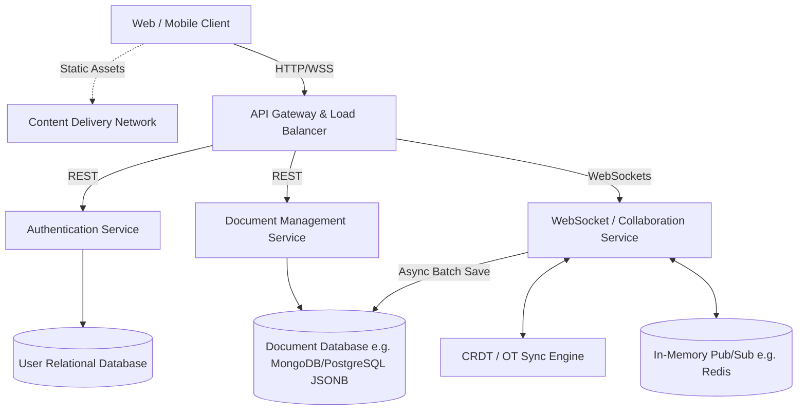

# Collaborative Text Editor Architecture

## 1. Architecture Overview

The proposed solution for a real-time collaborative text editor leverages a cloud-agnostic microservices architecture to enable multiple users to edit the same document concurrently with sub-second latency. The system centers on persistent WebSocket connections for real-time bidirectional communication, coupled with a Conflict-free Replicated Data Type (CRDT) or Operational Transformation (OT) engine to resolve concurrent edit conflicts. 

Traffic is routed through a centralized API Gateway, splitting standard HTTP REST requests (user management, document metadata) from persistent WebSocket connections (live editing). A fast in-memory data store acts as a Pub/Sub message broker to route edit events between horizontally scaled WebSocket server nodes, ensuring that all users viewing a specific document receive updates instantly. Persistent data is asynchronously flushed to a highly available Document Database to maintain state.

## 2. Architecture Diagram

## 3. Well-Architected Framework Analysis

* **Operational Excellence:**
    * **Infrastructure as Code (IaC):** All infrastructure (containers, load balancers, databases) is provisioned using tools like Terraform to ensure reproducible environments.
    * **Observability:** Centralized logging (e.g. ELK stack) and distributed tracing (e.g. OpenTelemetry) are implemented to track requests across microservices. WebSocket connection drop rates and edit-merge latency are established as primary Key Performance Indicators (KPIs).
    * **CI/CD:** Automated pipelines handle testing (including complex concurrent-edit unit tests) and zero-downtime deployments (Blue/Green or Canary).

* **Security:**
    * **Data in Transit:** All traffic is encrypted using TLS 1.3. WebSockets are secured over the `wss://` protocol.
    * **Authentication & Authorization:** The system utilizes OAuth 2.0 and JWT (JSON Web Tokens). Short-lived tokens are validated at the API gateway and upon establishing a WebSocket connection.
    * **Data at Rest:** All databases use block-level encryption (AES-256). Document access control lists (ACLs) enforce strict read/write permissions at the Document Service level.

* **Reliability:**
    * **Stateless Scaling:** Standard REST microservices are entirely stateless. The WebSocket service caches active document states in-memory but relies on Redis as the source of truth for active sessions, allowing any node to fail without bringing down the system.
    * **Multi-AZ Deployment:** All services, including the databases and Redis clusters, are deployed across multiple Availability Zones to withstand data center failures.
    * **Graceful Degradation:** If the real-time WebSocket service fails, the client can fall back to standard HTTP polling, albeit with higher latency, to prevent total data loss.

* **Performance Efficiency:**
    * **Low Latency Messaging:** Utilizing a Pub/Sub model (like Redis) ensures that document deltas (changes) are routed only to the server nodes hosting users subscribed to that specific document, minimizing network chatter.
    * **Edge Delivery:** A CDN serves all static web assets, reducing the load on backend servers and improving initial application load times globally.
    * **Efficient Conflict Resolution:** By relying on CRDTs, mathematical conflict resolution is offloaded to the edges (clients) or localized engines, avoiding the need for heavy, locked database transactions on every keystroke.

* **Cost Optimization:**
    * **Auto-Scaling:** Microservices scale up or down based on CPU, memory, and active concurrent WebSocket connections.
    * **Tiered Storage:** Older, inactive documents are automatically archived from expensive, highly indexed databases to cheaper object storage (e.g. S3-compatible storage).
    * **Batch Writes:** Instead of saving every keystroke to the database, document states are periodically flushed in batches, drastically reducing expensive database write I/O operations.

* **Sustainability:**
    * **Optimized Compute:** Transitioning microservices to run on energy-efficient ARM-based processors where supported.
    * **Delta-only Transmissions:** Only the specific edits (deltas) are transmitted over the network rather than the entire document state, significantly reducing network bandwidth and the associated energy cost of data transmission.
    * **Serverless Offloading:** Non-critical background tasks (like generating PDF exports or running plagiarism checks) are offloaded to serverless functions that spin down immediately after use, eliminating idle server energy consumption.

## 4. Technical Glossary

* **API Gateway:** A server that acts as an API front-end, receiving API requests, enforcing throttling and security policies, routing requests to the back-end service, and then passing the response back to the requester.
* **Availability Zone (AZ):** Isolated locations within a data center region from which public cloud services originate and operate.
* **CDN (Content Delivery Network):** A geographically distributed group of servers that works together to provide fast delivery of Internet content (HTML pages, JavaScript files, stylesheets, images).
* **CRDT (Conflict-free Replicated Data Type):** A data structure that simplifies distributed data storage by ensuring that concurrent operations can be resolved mathematically without strict locking or centralized coordination.
* **JWT (JSON Web Token):** A compact, URL-safe means of representing claims to be transferred between two parties, commonly used for authentication.
* **Microservices:** An architectural style that structures an application as a collection of loosely coupled, independently deployable services organized around business capabilities.
* **OT (Operational Transformation):** An algorithm used primarily in collaborative editing to maintain consistency across multiple clients editing a document concurrently by transforming operations based on previous edits.
* **Pub/Sub (Publish/Subscribe):** A messaging pattern where senders (publishers) categorize messages into classes without knowledge of which receivers (subscribers) there may be, enabling highly scalable real-time routing.
* **WebSockets (WSS):** A communications protocol providing full-duplex (bidirectional) communication channels over a single, long-held TCP connection, ideal for real-time applications. `wss://` is the encrypted version.
