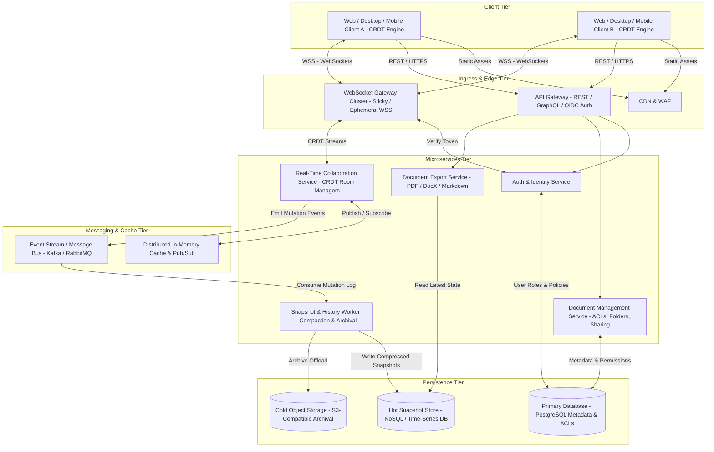

# Real-Time Collaborative Text Editor

## 1. Architecture Overview

This production-ready, cloud-agnostic microservices architecture delivers a low-latency, highly available collaborative text editor. The system is designed around a **local-first, event-driven** model using **Conflict-Free Replicated Data Types (CRDTs)** to guarantee eventual consistency without requiring centralized locking or complex operational transformation (OT) coordination.

The architecture decouples ephemeral, sub-millisecond collaboration traffic (cursor movements, live typing, presence) from heavy, persistent storage operations (snapshotting, document metadata, file exports). By leveraging a stateless WebSocket Gateway layer backed by a distributed Pub/Sub caching tier and asynchronous message queues, the system scales horizontally across multi-region deployments while preserving data integrity and high availability.

## 2. Architecture Diagram

```mermaid
flowchart TB
    subgraph ClientLayer [Client Tier]
        ClientA["Web / Desktop / Mobile Client A - CRDT Engine"]
        ClientB["Web / Desktop / Mobile Client B - CRDT Engine"]
    end

    subgraph IngressLayer [Ingress & Edge Tier]
        CDN["CDN & WAF"]
        APIGateway["API Gateway - REST / GraphQL / OIDC Auth"]
        WSGateway["WebSocket Gateway Cluster - Sticky / Ephemeral WSS"]
    end

    subgraph ServiceLayer [Microservices Tier]
        AuthService["Auth & Identity Service"]
        DocService["Document Management Service - ACLs, Folders, Sharing"]
        CollabService["Real-Time Collaboration Service - CRDT Room Managers"]
        SnapshotService["Snapshot & History Worker - Compaction & Archival"]
        ExportService["Document Export Service - PDF / DocX / Markdown"]
    end

    subgraph MessagingLayer [Messaging & Cache Tier]
        RedisPubSub["Distributed In-Memory Cache & Pub/Sub"]
        Kafka["Event Stream / Message Bus - Kafka / RabbitMQ"]
    end

    subgraph DataLayer [Persistence Tier]
        MetadataDB[("Primary Database - PostgreSQL Metadata & ACLs")]
        SnapshotDB[("Hot Snapshot Store - NoSQL / Time-Series DB")]
        ObjectStore[("Cold Object Storage - S3-Compatible Archival")]
    end

    %% Client Routing
    ClientA -->|Static Assets| CDN
    ClientB -->|Static Assets| CDN
    ClientA -->|REST / HTTPS| APIGateway
    ClientB -->|REST / HTTPS| APIGateway
    ClientA <-->|WSS - WebSockets| WSGateway
    ClientB <-->|WSS - WebSockets| WSGateway

    %% Gateway to Services
    APIGateway --> AuthService
    APIGateway --> DocService
    APIGateway --> ExportService
    WSGateway <-->|Verify Token| AuthService
    WSGateway <-->|CRDT Streams| CollabService

    %% Collaboration Flow
    CollabService <-->|Publish / Subscribe| RedisPubSub
    CollabService -->|Emit Mutation Events| Kafka

    %% Document Management Flow
    DocService <-->|Metadata & Permissions| MetadataDB
    AuthService <-->|User Roles & Policies| MetadataDB

    %% Async Storage & Snapshots
    Kafka -->|Consume Mutation Log| SnapshotService
    SnapshotService -->|Write Compressed Snapshots| SnapshotDB
    SnapshotService -->|Archive Offload| ObjectStore
    ExportService -->|Read Latest State| SnapshotDB
```

## 3. End-to-End System Flow

### Phase 1: Authentication & Document Initialization
1. **User Request:** The client navigates to a document URL. Static assets (frontend UI, WebAssembly/JS CRDT runtime) are served from the **CDN**.
2. **Access Verification:** The client sends an HTTP request with its authorization bearer token to the **API Gateway**. The gateway routes this to the **Auth & Identity Service** and **Document Management Service** to validate identity and confirm the user's Role-Based Access Control (RBAC) permissions (e.g., Editor vs. Viewer).
3. **Initial State Fetch:** Upon successful authorization, the client retrieves the latest compacted document snapshot and pending mutation logs from the **Document Management Service** (fetching from the **Hot Snapshot Store**).
4. **Local Hydration:** The client's local CRDT engine initializes the document state in memory, allowing immediate visual rendering and zero-latency local editing.

### Phase 2: Real-Time Connection & Collaboration
1. **WebSocket Upgrade:** The client opens a secure WebSocket (`wss://`) connection to the **WebSocket Gateway Cluster**, passing an ephemeral session token.
2. **Room Assignment:** The gateway maps the connection to a **Real-Time Collaboration Service** node responsible for the specific Document ID ("Room").
3. **Local Mutation & Broadcast:** When a user types a character, the local CRDT engine applies the change immediately to the DOM and generates a binary-encoded CRDT update payload.
4. **Fan-Out via Pub/Sub:** The payload is streamed over the WebSocket to the Collaboration Service, which publishes the vector update to the **Distributed Pub/Sub (Redis)** topic for that document. All other Collaboration Service pods subscribed to that room receive the update and push it down to connected peer clients.
5. **Presence & Cursors:** Ephemeral cursor coordinates and selection highlights are broadcast using lightweight UDP/WebSocket messages via Pub/Sub. These are explicitly excluded from database transaction logs.

### Phase 3: Asynchronous Snapshotting & Archival
1. **Event Streaming:** Simultaneously, the Collaboration Service emits an ordered sequence of verified CRDT mutations to the **Event Stream (Kafka)**.
2. **Log Compaction:** The **Snapshot & History Worker** consumes these mutation events. To prevent unbounded log growth, it periodically merges individual character deltas into a single compressed state vector snapshot (e.g. every 500 mutations or every 60 seconds of inactivity).
3. **Multi-Tier Persistence:** The worker writes the compacted snapshot to the **Hot Snapshot Store** (for fast retrieval by new peers) and asynchronously archives older versions to **Cold Object Storage** for point-in-time recovery and compliance auditing.

## 4. Well-Architected Framework Analysis

### 4.1 Operational Excellence
* **Observability & Distributed Tracing:** Implement end-to-end tracing across REST and WebSocket connections using OpenTelemetry. Log CRDT mutation latency, WebSocket disconnection rates, and room-sizing metrics.
* **Infrastructure as Code (IaC):** Provision all networking, Kubernetes clusters, and databases declaratively using Terraform or OpenTofu.
* **Automated CI/CD & Canary Deployments:** Deploy stateless service updates via progressive canary rollouts. WebSocket Gateways utilize graceful connection draining so active editing sessions migrate smoothly without data loss.

### 4.2 Security
* **Zero Trust & Edge Security:** Terminate TLS 1.3 at the **WAF/CDN** edge. DDoS mitigation filters flood attacks before reaching the ingress controllers.
* **Tenant Isolation & RBAC:** Every WebSocket message is evaluated against short-lived JWTs scoped to specific Document IDs. Read-only users are cryptographically blocked from publishing mutation events to the CRDT room.
* **Encryption:** Data is encrypted in transit using mTLS between microservices and TLS 1.3 for external traffic. Data at rest (metadata, snapshots, and logs) is encrypted using AES-256 with KMS-managed rotating keys.

### 4.3 Reliability
* **High Availability & Fault Tolerance:** Stateless microservices across the Ingress and Service tiers run across Multi-Availability Zones (AZs) with Horizontal Pod Autoscalers (HPA).
* **Network Partition Resilience:** Because the system uses **CRDTs**, client devices can continue editing offline indefinitely during network outages. When connectivity is restored, local state vectors merge deterministically without merge conflicts.
* **Circuit Breakers & Degradation:** If the Event Stream or Persistence tier experiences latency, the Real-Time Collaboration tier continues functioning from in-memory Redis buffers, temporarily degrading only version-history generation while keeping live co-editing intact.

### 4.4 Performance Efficiency
* **Binary Protocol Optimization:** Instead of verbose JSON, real-time messaging utilizes compact binary serialization formats (e.g. Protocol Buffers, Yjs/Automerge binary protocols) to minimize network payload size and parsing overhead.
* **Edge-Routed WebSockets:** DNS geo-routing directs users to the nearest regional WebSocket Gateway, keeping handshake and round-trip times under 50ms globally.
* **In-Memory Pub/Sub:** Redis Cluster in-memory Pub/Sub ensures node-to-node message fan-out within the same datacenter occurs in sub-millisecond timeframes.

### 4.5 Cost Optimization
* **Tiered Storage Lifecycle:** Document mutation logs are automatically compressed into snapshots. Older historical snapshots and audit logs transition from expensive high-IOPS storage to cold object storage (S3 Standard-IA / Glacier) after 30 days.
* **Compute Right-Sizing:** Ephemeral presence data (cursor positions) is kept strictly in-memory and discarded when sessions close, avoiding unnecessary database write IOPS.
* **Auto-Scaling Compute:** WebSocket Gateway and Collaboration Service pods auto-scale dynamically based on active TCP connections and CPU utilization, preventing over-provisioning during off-peak hours.

### 4.6 Sustainability
* **Payload Minification:** Utilizing binary delta-compression reduces bandwidth consumption and data-center network card energy usage.
* **Serverless / Event-Driven Workers:** The Snapshot, Compaction, and Export services operate as event-driven consumers, scaling down to zero when no editing activity occurs.
* **Optimized Compute Utilization:** By shifting the computational burden of merge-conflict resolution to client-side WebAssembly CRDT engines, server-side CPU utilization per active user is drastically reduced.

## 5. Technical Glossary

* **CRDT (Conflict-Free Replicated Data Type):** A data structure that can be replicated across multiple independent computers and updated concurrently without coordination, guaranteed to mathematically converge to identical states.
* **OT (Operational Transformation):** An older algorithm for real-time collaborative editing (used by early Google Docs) that requires a central server to transform and sequence concurrent operations.
* **WAF (Web Application Firewall):** A security layer that filters, monitors, and blocks malicious HTTP/HTTPS traffic traveling to a web application.
* **RBAC (Role-Based Access Control):** A policy-neutral access control mechanism defined around roles and privileges (e.g. Owner, Editor, Commenter, Viewer).
* **Pub/Sub (Publish/Subscribe):** An asynchronous messaging pattern where senders (publishers) categorize messages into topics without knowing who the receivers (subscribers) are.
* **Hydration:** The process of loading raw, stored data into an in-memory application structure so that it becomes immediately interactive for the user.
* **State Vector:** A compact representation of all changes a client or server has observed in a CRDT document, used to quickly determine missing updates between peers.
* **Compaction:** The automated process of merging hundreds or thousands of sequential change deltas into a single consolidated document snapshot to reduce storage footprint and speed up load times.
* **mTLS (Mutual TLS):** A security protocol where both the client and server cryptographically verify each other's certificates before establishing an encrypted connection, standard for service-to-service communication.
* **HPA (Horizontal Pod Autoscaler):** A Kubernetes controller that automatically scales the number of running pod replicas based on observed CPU, memory, or custom metrics.
* **IaC (Infrastructure as Code):** The management and provisioning of computing infrastructure through machine-readable definition files rather than physical hardware configuration or interactive configuration tools.
