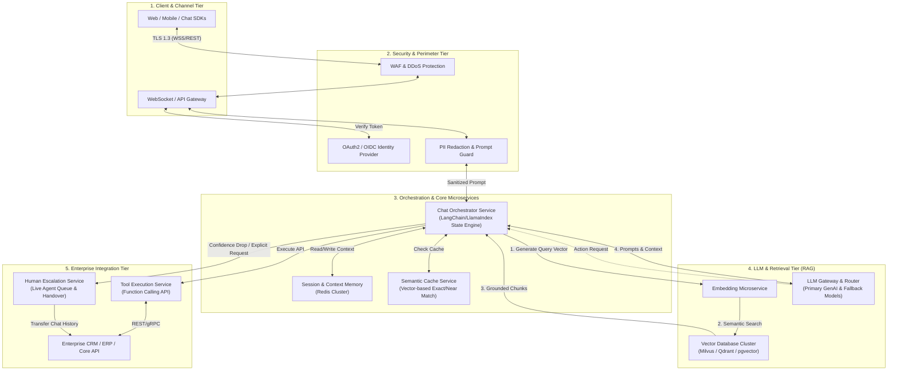

# LLM-Powered Customer Support Integration Architecture

## 1. Architecture Overview
This solutions architecture proposal outlines a production-grade, cloud-agnostic microservices platform designed to integrate an enterprise Customer Support Chatbot on top of a Large Language Model (LLM) ecosystem. Unlike traditional static, intent-based conversational agents, this architecture deploys **Retrieval-Augmented Generation (RAG)** coupled with an **Agentic Tool-Calling Orchestrator** to accurately resolve complex customer inquiries, execute backend transactions, and gracefully fall back to human agents when required.

The design separates stateless conversational orchestration, low-latency vector knowledge retrieval, enterprise system integrations, and real-time human escalation into distinct, scalable microservices. To prevent hallucination and secure sensitive customer data, the platform introduces a hard safety boundary comprising prompt injection defenses, Personally Identifiable Information (PII) masking, semantic caching, and strict role-based access control (RBAC) across all data pipelines.

## 2. Architecture Diagram

## 3. End-to-End System Flow
1. **Channel Ingestion & Security Screening:**
   - A customer submits a message via a Web/Mobile chat client. The request passes through an API Gateway protected by a Web Application Firewall (WAF) and requires a valid OAuth2/OIDC JWT payload to identify the user session.
   - The message payload enters the **PII Redaction & Prompt Guard**, which strips sensitive data (e.g. credit cards, SSNs) and evaluates the input for adversarial prompt-injection payloads.
2. **Session Context & Semantic Cache Resolution:**
   - The **Chat Orchestrator Service** receives the sanitized prompt and retrieves conversational history from the **Session & Context Memory** cluster (Redis).
   - Before executing inference, the orchestrator queries the **Semantic Cache Service**. If an identical or highly similar query embedding was recently answered and remains valid, the cached response is immediately returned, bypassing the LLM.
3. **Retrieval-Augmented Generation (RAG):**
   - Upon a cache miss, the user prompt is vectorized via the **Embedding Microservice** and queried against the **Vector Database Cluster** to retrieve the top-*k* semantically relevant domain documents, product manuals, or policy guidelines.
   - The orchestrator synthesizes the user prompt, conversation history, retrieved documents, and explicit enterprise system instructions into a unified prompt payload.
4. **LLM Inference & Tool Calling:**
   - The prompt is routed via the **LLM Gateway** to the optimal model based on task complexity and system load.
   - If the user requests an action (e.g. "Check my order status #12345"), the LLM emits a structured function-call intent rather than free text.
   - The orchestrator intercepts this intent and invokes the **Tool Execution Service**, which securely queries downstream **Enterprise CRM/ERP Systems** via internal APIs. The data is fed back into the LLM to formulate an accurate, grounded customer response.
5. **Quality Verification & Human Escalation:**
   - The generated response is evaluated for factual consistency against the retrieved chunks (hallucination check).
   - If the user explicitly requests a human, or if the LLM confidence score falls below a defined threshold, the orchestrator triggers the **Human Escalation Service**, routing the full conversation context and customer sentiment analysis to an available live agent's CRM interface.

## 4. Well-Architected Framework Analysis

### 4.1 Operational Excellence
- **Infrastructure as Code (IaC):** The entire microservice footprint, vector database clusters, and networking topologies are defined and deployed using Terraform and Kubernetes Helm charts across any public cloud.
- **CI/CD Pipelines:** Automated canary deployments for microservice updates. Prompt and LLM version releases are evaluated using automated evaluation frameworks (e.g. LLM-as-a-Judge, Ragas) to measure hallucination rates and semantic drift prior to production rollout.
- **Observability:** Distributed tracing (OpenTelemetry) links user chat sessions through vector search latency, LLM generation time, and enterprise API calls, aggregating logs and metrics into centralized dashboards.

### 4.2 Security
- **Data Protection & PII:** In-transit data is encrypted using TLS 1.3, and at-rest data (vector stores, Redis cache) is encrypted with AES-256 using customer-managed encryption keys (CMEK). PII is scrubbed before embeddings or LLM inference are generated.
- **Identity & Access Management:** Service-to-service communication relies on mutual TLS (mTLS) inside a service mesh. External API integrations utilize short-lived OAuth2 tokens scoped strictly to least-privilege customer data access.
- **Adversarial Mitigation:** An edge-deployed Prompt Guard inspects all inbound messages for jailbreak attempts, prompt injection, and toxic content before payload execution.

### 4.3 Reliability
- **Resiliency & Fault Tolerance:** All microservices are deployed statelessly across Multi-Availability Zone (Multi-AZ) Kubernetes clusters with horizontal pod autoscalers (HPA).
- **Graceful Degradation:** If the primary LLM provider experiences an outage, the **LLM Gateway** automatically falls back to an alternative secondary model or an on-premise open-weights model. If the Vector Database is unreachable, the system falls back to standard FAQ retrieval or immediately initiates human escalation.
- **Disaster Recovery:** Redis session states and vector index snapshots are continuously replicated to a secondary failover region with an RPO < 5 minutes and RTO < 15 minutes.

### 4.4 Performance Efficiency
- **Latency Optimization:** Semantic Caching reduces response latency for frequent inquiries from ~1,500ms (LLM generation) to <50ms.
- **Streaming Responses:** The API Gateway leverages Server-Sent Events (SSE) or WebSockets to stream LLM tokens to the client interface in real time, reducing Time-to-First-Token (TTFT) perceived latency.
- **Vector Search Indexing:** Vector databases use Hierarchical Navigable Small World (HNSW) indexing with optimized memory mapping to ensure sub-10ms similarity search execution at scale.

### 4.5 Cost Optimization
- **Model Right-Sizing:** The LLM Gateway implements dynamic model routing—directing straightforward informational queries to smaller, cost-effective models (e.g., 8B–70B parameter models) and reserving frontier, high-parameter LLMs strictly for complex multi-turn reasoning and tool orchestration.
- **Token Usage Reduction:** System prompts are optimized and compressed; the semantic cache absorbs up to 30% of repetitive Tier-1 support queries, eliminating unnecessary token-generation costs.
- **Auto-Scaling Compute:** GPU inference nodes (if self-hosting models) scale down to zero during off-peak hours using Kubernetes event-driven autoscaling (KEDA).

### 4.6 Sustainability
- **Compute Efficiency:** Maximizing cache hit rates directly diminishes compute-intensive GPU cycles required for inference, lowering the overall carbon footprint per resolved customer query.
- **Resource Consolidation:** Microservices are packaged as lightweight Linux containers running on ARM-based compute architectures, delivering higher performance per watt compared to traditional x86 server infrastructure.
- **Data Footprint Management:** Automated Time-to-Live (TTL) expiration policies evict transient chat logs and stale session embeddings from cache and high-performance storage after 30 days.

## 5. Technical Glossary
- **RAG (Retrieval-Augmented Generation):** An architectural framework that retrieves contextually relevant data from an external knowledge base and feeds it to an LLM to ground its output and prevent hallucinations.
- **Vector Database:** A specialized database designed to store and query high-dimensional numerical vectors (embeddings), enabling rapid semantic similarity search over text content.
- **Semantic Caching:** A caching mechanism that evaluates the semantic meaning of an incoming prompt against stored historical queries using vector embeddings, returning cached answers for similar questions even if wording differs.
- **Tool Calling / Function Calling:** The capability of an LLM to output structured JSON instructions that trigger deterministic backend software functions, database queries, or external API executions.
- **TTFT (Time-to-First-Token):** A key performance metric in generative AI systems measuring the elapsed time between sending a request and receiving the first generated token back from the model.
- **Hallucination:** An occurrence where a Large Language Model generates plausible-sounding but factually incorrect or unsupported assertions.
- **mTLS (Mutual TLS):** A cryptographic protocol where both the client and server authenticate each other using digital certificates, establishing a secure, zero-trust network channel between microservices.
- **HNSW (Hierarchical Navigable Small World):** A graph-based algorithm and indexing structure utilized by vector databases to execute fast and efficient Approximate Nearest Neighbor (ANN) searches.
