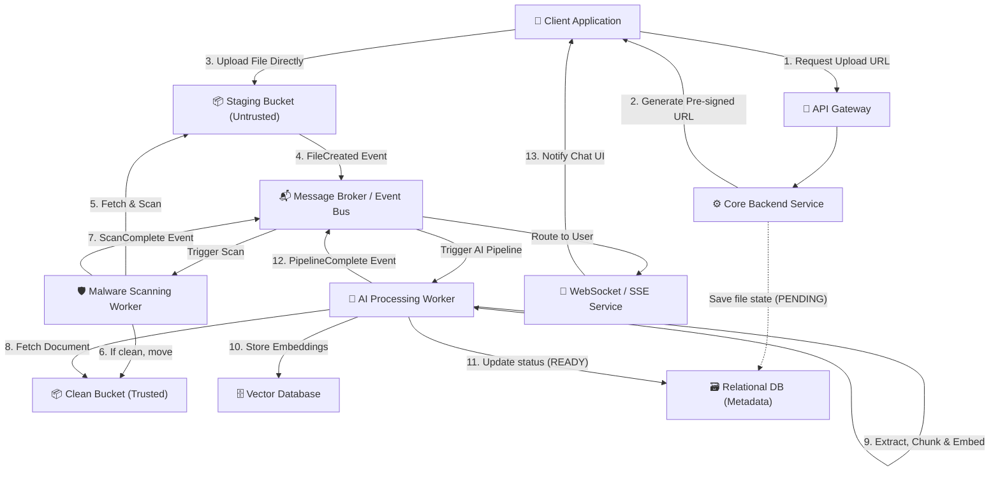

# File Upload Architecture for AI Chat Applications

## 1. Architecture Overview
This architecture defines a highly scalable, secure, and event-driven file upload pipeline tailored for AI chat applications (such as Retrieval-Augmented Generation or RAG systems). Because file uploads can introduce significant bandwidth load and security vulnerabilities, this design uses the **Pre-signed URL pattern** to bypass the core backend APIs, routing large payloads directly to an isolated staging area. 

Once the file lands in the untrusted staging storage, an asynchronous event-driven pipeline takes over. It first scans the file for malware or embedded threats. If cleared, the file is moved to trusted storage where an AI worker extracts the text, breaks it into manageable chunks, and converts it into numerical vector embeddings. These embeddings are stored in a Vector Database mapped securely to the user's session. Finally, a real-time notification is pushed back to the client UI via WebSockets or Server-Sent Events (SSE), indicating the AI is ready to interact with the uploaded document.

## 2. Architecture Diagram

## 3. Well-Architected Framework Analysis

### Operational Excellence
* **Observability & Tracing:** Because the pipeline is asynchronous, distributed tracing (e.g. OpenTelemetry) must be implemented across the Event Bus to track the file's journey from upload to embedding. Each file is assigned a unique correlation ID at the time the pre-signed URL is generated.
* **Infrastructure as Code (IaC):** The entire stack should be provisioned using tools like Terraform or Pulumi to ensure environments remain consistent and reproducible. 
* **Monitoring Queue Depths:** Alarms should be set on the Message Broker to monitor queue depths. If the AI Worker queue backs up during a traffic spike, auto-scaling rules will trigger to spin up additional worker nodes.

### Security
* **Direct-to-Storage Uploads:** By using pre-signed URLs, the backend is protected from large payload floods (DDoS mitigation) and buffer overflow attacks.
* **Malware Scanning & CDR:** Untrusted files are isolated in a staging bucket. A dedicated security worker scans for malware and strips out malicious macros or embedded scripts (Content Disarm and Reconstruction) before the AI parser touches it.
* **Tenant Isolation in Vector DB:** Embeddings are highly sensitive representations of company data. The Vector DB must enforce strict tenant boundaries (often using metadata filtering by `user_id` or `workspace_id`) to prevent one user's prompt from retrieving another user's document chunks.

### Reliability
* **Event-Driven Decoupling:** The client does not wait on a synchronous HTTP connection while the AI embeds a 500-page PDF. The decoupled message broker ensures that if the AI API rate-limits or fails, the job isn't lost.
* **Dead Letter Queues (DLQ):** If a file fails to process after multiple retries (e.g. a corrupted PDF that crashes the chunker), the event is routed to a DLQ for engineering review, and a graceful error state is communicated to the client UI.

### Performance Efficiency
* **Bandwidth Offloading:** Bypassing the backend for file uploads frees up application threads to serve core chat requests faster.
* **Parallel Embedding Generation:** The AI Processing Worker can split large documents into batches of chunks and generate vector embeddings concurrently before committing them to the Vector DB.
* **Approximate Nearest Neighbor (ANN):** The Vector Database is specifically optimized for high-dimensional math, allowing the chat application to retrieve relevant context in milliseconds rather than traditional database lookup times.

### Cost Optimization
* **Serverless Compute for Workers:** Since file uploads can be sporadic, utilizing serverless functions or auto-scaling container runtimes for the Malware Scanner and AI Worker ensures you only pay for compute when a file is actively being processed.
* **Storage Lifecycle Policies:** Raw files in the clean bucket and their corresponding vectors in the DB can be configured with Time-To-Live (TTL) expiration rules. Once a chat session ends or ages out, the heavy artifacts are automatically deleted to save storage costs.

### Sustainability
* **Efficient Chunking & Overlap:** Optimizing how text is chunked reduces the number of tokens sent to the LLM embedding models. Fewer tokens processed means less compute energy expended by GPU clusters.
* **Scaling to Zero:** The asynchronous worker nodes can scale down to zero during off-peak hours, minimizing idle energy consumption in the data center.

## 4. Technical Glossary

* **Pre-signed URL:** A temporarily authenticated URL generated by a backend that grants a client direct, time-bound permission to upload or download a file to/from Object Storage without exposing permanent cloud credentials.
* **Object Storage / Bucket:** A cloud-agnostic architecture for managing data as objects rather than a file hierarchy or blocks (e.g. AWS S3, Google Cloud Storage, Azure Blob Storage).
* **Message Broker / Event Bus:** An intermediary software system that translates and routes asynchronous messages between disconnected microservices (e.g. Apache Kafka, RabbitMQ, AWS EventBridge).
* **Dead Letter Queue (DLQ):** A secondary queue where a messaging system routes messages that cannot be processed successfully, preventing them from infinitely blocking the primary processing queue.
* **Content Disarm and Reconstruction (CDR):** A security technology that assumes all files are malicious, strips out active executable content (like macros), and rebuilds the file with only safe components.
* **Chunking:** The process of breaking a large document into smaller, semantically meaningful text segments so they fit within the context window limits of an LLM.
* **Embeddings:** High-dimensional arrays of numbers (vectors) that represent the semantic meaning of text. 
* **Vector Database:** A specialized database designed to store, manage, and query high-dimensional embeddings efficiently (e.g. Pinecone, Milvus, Qdrant).
* **Approximate Nearest Neighbor (ANN):** An algorithm used by Vector Databases to quickly find vectors that are most similar to a query vector, trading a tiny bit of accuracy for a massive increase in search speed.
* **Server-Sent Events (SSE) / WebSockets:** Protocols that allow a server to push real-time, asynchronous updates to a web client over a single, long-lived connection.
