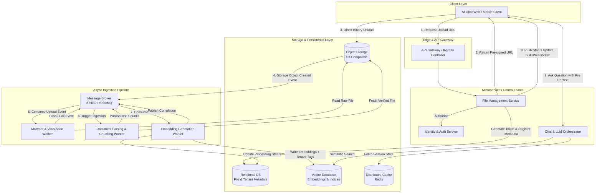

# File Upload & Ingestion Architecture for AI Chat Applications

## 1. Architecture Overview

This architectural proposal defines a **cloud-agnostic, event-driven microservices platform** for securely ingesting, processing, and vectorizing user-uploaded files (PDFs, spreadsheets, images, and plain text documents) within an enterprise AI Chat application. 

#### Core Objectives:
*   **Zero-Bottleneck Uploads:** Offload binary data transfers from backend application servers by utilizing ephemeral **Pre-Signed URLs** for direct-to-object-storage uploads.
*   **Asynchronous Document Processing:** Decouple file ingestion from the synchronous chat flow using an event-driven message broker to handle OCR, text extraction, chunking, and vector embedding generation without blocking UI responsiveness.
*   **Enterprise Security & Compliance:** Enforce rigorous perimeter defense through automated malware scanning, strict tenant isolation, and end-to-end encryption.
*   **Real-Time State Synchronization:** Provide immediate user feedback via **Server-Sent Events (SSE)** or **WebSockets** as files transition from raw uploads to queryable vector representations for **Retrieval-Augmented Generation (RAG)**.

## 2. Architecture Diagram

```mermaid
graph TB
    subgraph Client Layer
        UI[AI Chat Web / Mobile Client]
    end

    subgraph Edge & API Gateway
        GW[API Gateway / Ingress Controller]
    end

    subgraph Microservices Control Plane
        AUTH[Identity & Auth Service]
        FILE_API[File Management Service]
        CHAT_API[Chat & LLM Orchestrator]
    end

    subgraph Async Ingestion Pipeline
        BROKER[Message Broker<br/>Kafka / RabbitMQ]
        AV[Malware & Virus Scan Worker]
        PARSE[Document Parsing & Chunking Worker]
        EMBED[Embedding Generation Worker]
    end

    subgraph Storage & Persistence Layer
        OBJ_STORE[(Object Storage<br/>S3-Compatible)]
        META_DB[(Relational DB<br/>File & Tenant Metadata)]
        VEC_DB[(Vector Database<br/>Embeddings & Indices)]
        CACHE[(Distributed Cache<br/>Redis)]
    end

    %% Flow: Upload Initialization
    UI -->|1. Request Upload URL| GW
    GW --> FILE_API
    FILE_API -->|Authorize| AUTH
    FILE_API -->|Generate Token & Register Metadata| META_DB
    FILE_API -->|2. Return Pre-signed URL| UI

    %% Flow: Direct Upload
    UI -->|3. Direct Binary Upload| OBJ_STORE

    %% Flow: Event-Driven Processing
    OBJ_STORE -->|4. Storage Object Created Event| BROKER
    BROKER -->|5. Consume Upload Event| AV
    AV -->|Read Raw File| OBJ_STORE
    AV -->|Pass / Fail Event| BROKER

    BROKER -->|6. Trigger Ingestion| PARSE
    PARSE -->|Fetch Verified File| OBJ_STORE
    PARSE -->|Publish Text Chunks| BROKER

    BROKER -->|7. Consume Chunks| EMBED
    EMBED -->|Write Embeddings + Tenant Tags| VEC_DB
    EMBED -->|Update Processing Status| META_DB
    EMBED -->|Publish Completion| BROKER

    %% Flow: Real-time Status & Chat
    FILE_API -->|8. Push Status Update SSE/WebSocket| UI
    UI -->|9. Ask Question with File Context| CHAT_API
    CHAT_API -->|Semantic Search| VEC_DB
    CHAT_API -->|Fetch Session State| CACHE
```

## 3. End-to-End System Flow

1.  **Upload Request & Pre-Signed URL Generation:**
    *   The user drags and drops a file into the AI Chat interface.
    *   The client sends a metadata request (`filename`, `MIME type`, `size`, `chat_session_id`) to the **File Management Service** via the API Gateway.
    *   The service validates user authorization, creates a `PENDING` record in the **Relational DB**, and generates a time-bound, cryptographically signed upload URL from **Object Storage**.
2.  **Direct-to-Storage Binary Transfer:**
    *   The client pushes the raw file directly to **Object Storage** via HTTP `PUT` using the pre-signed URL.
    *   This eliminates proxy overhead and prevents large binaries from saturating the microservices cluster.
3.  **Event Ingestion & Malware Screening:**
    *   Upon successful upload, Object Storage emits an `ObjectCreated` event to the **Message Broker** (e.g. Apache Kafka or RabbitMQ).
    *   An isolated **Malware & Virus Scan Worker** consumes the event, scans the binary in an ephemeral sandbox, and updates the state. If malicious, the binary is quarantined/purged, and an error event is emitted; if clean, an `ObjectVerified` event is published.
4.  **Parsing, Chunking, & Vectorization:**
    *   The **Document Parsing & Chunking Worker** consumes the `ObjectVerified` event, retrieves the file, applies OCR if necessary, strips boilerplate formatting, and splits the document into semantic chunks (e.g. 512–1024 tokens with overlap).
    *   The **Embedding Generation Worker** converts these text chunks into dense vector representations using an embedding model and inserts them into the **Vector Database**, explicitly tagging each vector with `tenant_id`, `user_id`, and `file_id`.
5.  **Status Synchronization & RAG Availability:**
    *   The worker marks the file status as `READY` in the **Relational DB** and publishes a `FileProcessed` event.
    *   The **File Management Service** relays this state change to the client over an established **SSE/WebSocket** connection. The file icon in the chat changes from "Processing" to "Ready," and subsequent user prompts can immediately query the document via RAG.

---

## 4. Well-Architected Framework Analysis

### 4.1 Operational Excellence
*   **Distributed Tracing:** Implement standard W3C Trace Context across HTTP headers and message payloads via **OpenTelemetry** to track a file's lifecycle from the initial URL request to vector index insertion.
*   **Automated Schema & Index Migrations:** Manage Relational DB tables and Vector Database schema definitions (e.g. vector dimensionality, distance metrics) using automated migration pipelines within CI/CD.
*   **Dead Letter Queues (DLQs):** Any ingestion task failing more than three times (e.g. due to a corrupted PDF parser) is automatically routed to a DLQ for alert generation and manual triage without stalling the primary pipeline.

### 4.2 Security
*   **Zero-Trust Tenant Isolation:** All vector embeddings and database records enforce strict multi-tenant filtering. Queries against the Vector Database must include validated token credentials (`tenant_id` and `user_id`) in the metadata filter.
*   **Least Privilege & Ephemeral Access:** Pre-signed URLs are restricted to HTTP `PUT` only, scoped to a deterministic object key, and expire after 15 minutes.
*   **Data Protection:** All storage layers (Object Storage, Relational DB, Vector DB) use **AES-256** encryption at rest. All service-to-service communication requires **TLS 1.3** with mutual TLS (mTLS) within the service mesh.

### 4.3 Reliability
*   **Asynchronous Decoupling & Backpressure:** Using a persistent message broker ensures that sudden spikes in file uploads do not overwhelm CPU-heavy embedding services. Workers consume at their maximum sustainable throughput.
*   **Idempotent Worker Execution:** All ingestion workers design against `file_id` and content hash (`SHA-256`). Re-processing an identical event overwrites or skips existing vectors cleanly without generating duplicates.
*   **Multi-AZ Fault Tolerance:** Storage backends and stateful services are deployed across a minimum of three Availability Zones (AZs) with automated failover.

### 4.4 Performance Efficiency
*   **Bandwidth Offloading:** Direct-to-storage uploads reduce compute network I/O consumption by 80–90% compared to proxying files through API containers.
*   **Streaming Document Parsers:** Memory-efficient streaming parsers read large files without loading the entire binary into container memory, preventing out-of-memory (OOM) pod evictions.
*   **Horizontal Autoscaling:** Kubernetes Horizontal Pod Autoscalers (HPA) scale parsing and embedding worker replicas based on message broker queue depth rather than simple CPU utilization.

### 4.5 Cost Optimization
*   **Storage Tiering & Lifecycle Policies:** Raw uploaded files move from Hot Object Storage to cheaper Archive/Cold Storage tiers after 30 days, or are deleted automatically if the user only requires persistent vector embeddings.
*   **Batching Embedding API Requests:** The Embedding Generation Worker groups individual text chunks into optimized batch requests (e.g. 64 chunks per API call) to maximize inference throughput and minimize external API call overhead.
*   **Deduplication via Hashing:** Upon initial upload registration, the system calculates a SHA-256 checksum. If another user in the same tenant uploads an identical file, the system references existing embeddings, avoiding redundant parsing and storage costs.

### 4.6 Sustainability
*   **Scale-to-Zero Compute:** Event-driven workers run on auto-scaling serverless container infrastructure (or Kubernetes KEDA), scaling down to zero replicas during off-peak hours to eliminate idle power consumption.
*   **ARM-Based Compute Architecture:** Where feasible, background parsing and vectorization workloads target ARM-based processors, improving performance per watt by up to 30% over standard x86 architectures.
*   **Right-Sized Vector Dimensions:** Selecting optimal embedding dimensions (e.g. using Matryoshka Representation Learning or scalar quantization) reduces RAM footprints in the vector database, lowering underlying server hardware requirements.

---

## 5. Technical Glossary

| Term | Definition |
| :--- | :--- |
| **Pre-Signed URL** | A temporary, cryptographically signed URL that grants a client direct read or write access to an object storage bucket without requiring persistent cloud credentials. |
| **RAG (Retrieval-Augmented Generation)** | An AI pattern where relevant data is retrieved from a vector database and appended to an LLM's prompt to ground its answers in specific, private knowledge. |
| **Vector Database** | A specialized database designed to store, index, and query high-dimensional mathematical vectors (embeddings) to enable rapid semantic similarity searches. |
| **Embedding** | A numerical array (vector) representation of text, images, or audio generated by a machine learning model, where similar concepts are mathematically close together. |
| **DLQ (Dead Letter Queue)** | A secondary message queue used to isolate message payloads that cannot be processed successfully by workers after a predefined number of retries. |
| **SSE (Server-Sent Events)** | A lightweight HTTP protocol allowing servers to push real-time, unidirectional event updates to web clients over a single long-lived TCP connection. |
| **Idempotency** | A property of operations in system design where applying the same operation multiple times yields the exact same state without unintended side effects. |
| **Chunking** | The process of breaking large documents into smaller, semantically coherent blocks of text to fit within an LLM's context window and improve retrieval precision. |
| **mTLS (Mutual TLS)** | An extension of standard TLS where both the client and server cryptographically authenticate each other before establishing an encrypted network channel. |
| **OpenTelemetry** | An open-source observability framework providing standardized SDKs and APIs to generate, collect, and export traces, metrics, and logs. |
