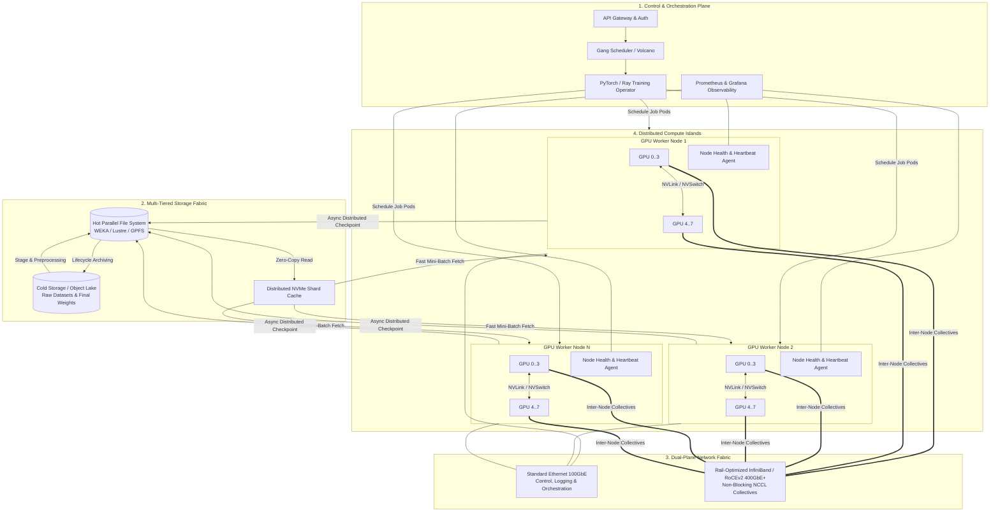

# Highly Distributed LLM Training System Architecture

## 1. Architecture Overview
Training Large Language Models (LLMs) at scale (spanning tens to hundreds of billions of parameters) requires a highly optimized, cloud-agnostic High-Performance Computing (HPC) architecture. Unlike traditional web microservices, distributed training workloads are **tightly coupled** and strictly constrained by interconnect latency, memory bandwidth, and aggregate compute availability.

This architecture decouples the training lifecycle into four modular tiers: **Data Preparation & Ingestion**, **Control & Orchestration**, **High-Performance Compute (HPC) Fabric**, and **Storage & Checkpoint Resiliency**. Leveraging standard enterprise open-source patterns (Kubernetes with Volcano/KubeRay, PyTorch FSDP/Megatron-LM, and asynchronous multi-tiered storage), this design achieves high Model Flop Utilization (**MFU > 55%**) while providing automated fault tolerance for long-running training jobs across thousands of accelerators.

## 2. Architecture Diagram

## 3. End-to-End System Flow

1. **Dataset Ingestion & Preprocessing:**
   * Raw unstructured datasets (text, code, multimodal tokens) are ingested into the **Cold Object Storage** lake.
   * Distributed preprocessing pipelines (tokenization, deduplication, and shuffling) convert raw data into immutable, indexed binary shards stored on the **Hot Parallel File System (PFS)**.

2. **Job Submission & Gang Scheduling:**
   * An ML Engineer submits a declarative PyTorch/Megatron-LM training job specification to the Kubernetes API.
   * The **Volcano Gang Scheduler** evaluates aggregate cluster capacity. It enforces **all-or-nothing scheduling**. The job is only provisioned when the exact number of required GPUs and network topology constraints are simultaneously available, preventing partial scheduling deadlocks.

3. **Multi-Dimensional Parallel Initialization:**
   * The training operator initializes worker pods across compute nodes.
   * Workers establish communication groups via **NCCL** over the **Rail-Optimized Interconnect (InfiniBand/RoCEv2)**, partitioning the model across four parallel dimensions:
     * **Tensor Parallelism (TP):** Intra-node across NVLink/NVSwitch for individual matrix multiplications.
     * **Pipeline Parallelism (PP):** Inter-node across sequential transformer layers.
     * **Data Parallelism / FSDP:** Gradients, optimizer states, and model parameters sharded across all data-parallel ranks.
     * **Expert Parallelism (EP):** For Mixture-of-Experts (MoE) token routing across nodes.

4. **Distributed Training & Gradient Synchronization:**
   * Each worker streams mini-batches from the local **NVMe Shard Cache** (backed by the PFS).
   * Forward passes compute activations; backward passes compute gradients.
   * Collectives (`AllReduce`, `AllGather`, `ReduceScatter`) execute over the dedicated high-speed network fabric, overlapped with backwards-pass computation to hide communication latency.

5. **Asynchronous Distributed Checkpointing:**
   * At configured step intervals, workers write sharded memory states directly to the **Hot PFS** using asynchronous I/O threads, preventing GPU compute stalls.
   * A background worker consolidates and archives older checkpoints to **Cold Object Storage** for disaster recovery.

6. **Automated Fault Detection & Self-Healing:**
   * If a GPU, memory ECC error, or interconnect failure occurs, node heartbeat agents alert the control plane.
   * The **Training Operator** terminates the job group, cordons the unhealthy node, provisions a replacement node, and resumes training from the latest checkpoint stored on the PFS within minutes.

## 4. Well-Architected Framework Analysis

### 4.1 Operational Excellence
* **Declarative Infrastructure & GitOps:** All cluster provisioning, network routing, and training job specs are version-controlled and deployed via GitOps pipelines (ArgoCD/Flux).
* **Gang Scheduling:** Eliminates resource deadlocks where partial allocations idle expensive GPU resources.
* **Granular Hardware Observability:** Real-time metrics track GPU temperature, ECC memory errors, NVLink bandwidth utilization, and NCCL collective latency to detect silent hardware degradation early.

### 4.2 Security
* **Zero-Trust Control Plane:** Inter-node orchestration and control plane traffic is secured via mutual TLS (mTLS).
* **Data Encryption at Rest & in Transit:** Object lakes and parallel file systems use AES-256 encryption at rest. Multi-tenant clusters use Kubernetes NetworkPolicies and SR-IOV network isolation to prevent lateral packet sniffing across tenant jobs.
* **Secret Management:** Access tokens for storage and model registries are injected at runtime via ephemeral volume mounts; no static credentials reside in container images.

### 4.3 Reliability
* **Asynchronous Checkpointing:** Decouples checkpoint disk-write latency from the GPU execution loop, ensuring high resilience against node failures without sacrificing throughput.
* **Automated Node Eviction:** Health daemons continuously run light NCCL synthetic tests before job initialization; nodes failing latency or memory benchmarks are automatically cordoned and replaced.
* **Deterministic Resumption:** State preservation includes random-number generator (RNG) seeds and data-loader byte offsets, guaranteeing mathematical reproducibility after crash recovery.

### 4.4 Performance Efficiency
* **Rail-Optimized Network Topology:** Guarantees that GPU *i* on Node A communicates directly with GPU *i* on Node B via dedicated network interface cards (NICs), preventing PCIe bus bottlenecks.
* **3D/4D Parallelism & Mixed Precision:** Maximizes Model Flop Utilization (**MFU**) by combining FP8/BF16 tensor computations with optimized Megatron-LM memory layouts.
* **High-Throughput I/O Staging:** Bypasses standard NFS in favor of a POSIX-compliant Parallel File System (e.g. Lustre/WEKA) to saturate read queues across thousands of data-parallel workers.

### 4.5 Cost Optimization
* **Tiered Storage Lifecycle:** Keeps only active training shards and the last **3** checkpoints on expensive NVMe/PFS tiers; automatically migrates older checkpoints and training logs to low-cost Cold Object Storage.
* **Dynamic Resource Right-Sizing:** Uses automatic benchmarking jobs to determine the optimal TP/PP/FSDP parallelism ratios before launching long-running jobs, avoiding underutilized GPU allocations.
* **Preemptible/Spot Capacity Integration:** Designed to allow fault-tolerant data-parallel workers to leverage discounted ephemeral infrastructure where SLAs permit.

### 4.6 Sustainability
* **Maximizing Performance-per-Watt:** High MFU targeting (**> 55%**) ensures that energy consumed by GPU cooling and power supplies translates directly into mathematical work rather than idling on communication wait times.
* **Dynamic Power Capping:** Integrates with GPU management libraries to throttle power caps during non-compute-intensive phases (e.g. checkpoint validation, dataset shuffling), reducing total cluster carbon footprint.
* **Efficient Precision Formatting:** Native adoption of **FP8** and **BF16** formats cuts memory movement and compute energy requirements by up to **50%** compared to traditional FP32 training.

## 5. Technical Glossary

- **BF16 / FP8** | **Brain Floating Point 16 / Floating Point 8:** Reduced-precision numerical formats that significantly accelerate matrix multiplication and reduce GPU memory consumption with minimal loss in model accuracy.
- **FSDP** | **Fully Sharded Data Parallel:** A data-parallelism training strategy that shards model parameters, gradients, and optimizer states across data-parallel worker ranks to fit massive models in aggregate GPU memory.
- **Gang Scheduling:** An HPC scheduling paradigm that ensures a distributed job is only dispatched when all required compute nodes can be provisioned simultaneously, avoiding deadlocks.
- **Megatron-LM:** A framework developed by NVIDIA for large-scale transformer training, providing optimized implementations of Tensor Parallelism, Pipeline Parallelism, and Sequence Parallelism.
- **MFU** | **Model Flop Utilization:** The ratio of achieved floating-point operations per second (FLOPs) to the theoretical maximum peak FLOPs of the underlying hardware array.
- **NCCL** | **NVIDIA Collective Communications Library:** A library providing multi-GPU and multi-node collective communication primitives (`AllReduce`, `AllGather`, `Broadcast`) optimized for NVLink and InfiniBand.
- **NVLink / NVSwitch:** High-speed, direct GPU-to-GPU interconnect technology that provides orders-of-magnitude higher bandwidth than standard PCIe buses within a compute server.
- **PFS** | **Parallel File System:** A high-performance storage system (e.g. Lustre, WEKA, IBM Storage Scale/GPFS) that stripes data across multiple networked servers to support massive concurrent reads/writes from compute clusters.
- **Rail-Optimized Topology:** A networking configuration where each GPU in a server is wired to its own dedicated network interface card (NIC) and switch fabric, allowing inter-node GPU-to-GPU traffic to bypass CPU and PCIe root complexes.
- **RoCEv2** | **RDMA over Converged Ethernet version 2:** A network protocol enabling Remote Direct Memory Access over standard Ethernet networks, providing InfiniBand-like latency and throughput.
