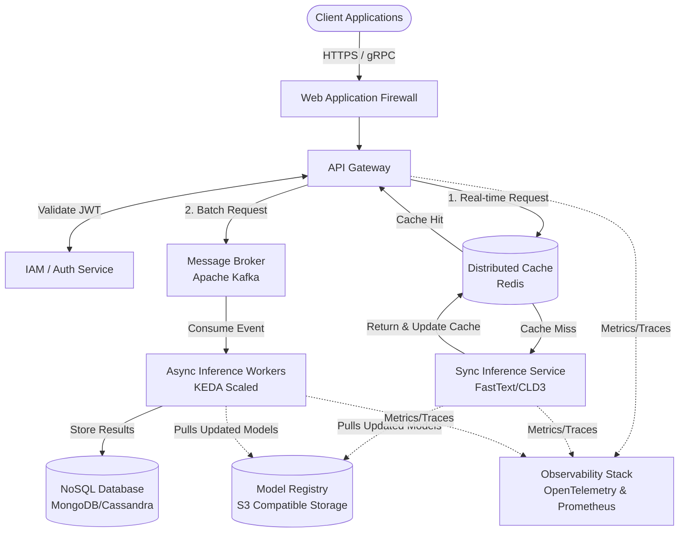

# Language Detection System Architecture

## 1. Architecture Overview
The proposed solution is a highly scalable, cloud-agnostic microservices architecture designed to detect the language of input text in both real-time (synchronous) and batch (asynchronous) modes. At its core, the system utilizes a lightweight, highly optimized NLP classification engine (such as FastText or CLD3) rather than resource-heavy Large Language Models, ensuring sub-millisecond inference times. The architecture utilizes an API Gateway for routing and security, a distributed caching layer to bypass computation for frequently evaluated strings, and an event-driven queue for processing massive document batches offline. The entire infrastructure is containerized and orchestrated via Kubernetes to ensure seamless horizontal scalability.

## 2. Architecture Diagram

## 3. Well-Architected Framework Analysis

### Operational Excellence
* **Infrastructure as Code (IaC):** The entire environment is provisioned using Terraform, ensuring repeatable, version-controlled infrastructure deployments.
* **GitOps CI/CD:** Deployments are managed via tools like ArgoCD or Flux, automating rollouts, canary deployments, and rollbacks directly from Git repositories.
* **Centralized Observability:** Integration with OpenTelemetry ensures distributed tracing across services. Prometheus handles metric scraping (e.g. inference latency, queue depth), while ELK/Grafana handles log aggregation and visualization.

### Security
* **Defense in Depth:** A Web Application Firewall (WAF) mitigates common layer 7 attacks. The API Gateway mandates OAuth2/JWT validation for all incoming requests.
* **Data Privacy:** Text payloads are sanitized and scrubbed of PII (Personally Identifiable Information) if logged. The cache relies on one-way cryptographic hashes (e.g. SHA-256) of the text to prevent storing sensitive raw data in memory.
* **Least Privilege Identity:** Microservices communicate using mTLS and assume granular IAM roles, ensuring the Inference Service can read from the Model Registry but cannot overwrite it.

### Reliability
* **Stateless Deployments:** Inference microservices are completely stateless, allowing Kubernetes to aggressively kill and restart pods without data loss.
* **Graceful Degradation:** If the backend inference service fails, the API Gateway is configured with Resilence4j circuit breakers to fail fast and return a default fallback response or cached data, preventing system-wide cascading failures.
* **Multi-AZ Redundancy:** Nodes, message brokers, and databases are distributed across at least three Availability Zones to survive datacenter-level outages.

### Performance Efficiency
* **Right-Sized Tooling:** By using specialized statistical NLP models like FastText instead of heavy Transformer-based LLMs, the system achieves sub-millisecond response times with minimal CPU footprint.
* **Aggressive Caching:** A Redis distributed cache sits in front of the inference engine. Because language detection is deterministic, caching the hash of frequently analyzed text drastically reduces compute load.
* **Event-Driven Autoscaling:** Asynchronous batch workers use KEDA (Kubernetes Event-driven Autoscaling) to dynamically scale out based on the lag/depth of the Kafka topics, ensuring peak workloads are processed swiftly.

### Cost Optimization
* **Compute Tiering:** Batch processing workers run on heavily discounted preemptible/spot instances, as asynchronous tasks are fault-tolerant and can easily resume if an instance is terminated.
* **ARM Architecture:** Inference services are compiled to run on ARM-based processors (like AWS Graviton or Ampere Altra), yielding up to a 40% price-performance improvement over standard x86 instances.
* **Scale to Zero:** Async workers scale down to zero during off-peak hours to eliminate idle compute waste.

### Sustainability
* **Energy-Efficient Modeling:** Selecting highly efficient algorithms (FastText/CLD3) directly reduces the CPU cycles required per request, which in turn dramatically lowers the power consumption and carbon footprint of the server farm.
* **Hardware Utilization:** Aggressive caching and optimal container bin-packing ensure that physical hardware is utilized efficiently, minimizing electronic waste and redundant energy draw.

## 4. Technical Glossary

* **API Gateway:** A reverse proxy that acts as the single entry point for all clients, handling routing, rate limiting, and authentication.
* **FastText / CLD3:** Open-source, lightweight libraries specifically optimized for text classification and language representation, requiring significantly less compute than modern LLMs.
* **Distributed Cache (Redis):** An in-memory data structure store used to cache the results of previous language detections, reducing repetitive processing.
* **Message Broker (Apache Kafka):** A distributed event streaming platform used to handle high-throughput, asynchronous batch processing requests without dropping data.
* **KEDA (Kubernetes Event-driven Autoscaling):** A tool that drives the scaling of Kubernetes containers based on the volume of events needing to be processed (e.g. number of messages in a Kafka queue).
* **mTLS (Mutual TLS):** A security practice where both the client and server verify each other's digital certificates, ensuring encrypted and trusted communication between internal microservices.
* **WAF (Web Application Firewall):** A security layer that monitors and filters HTTP traffic to protect the system from common exploits like SQL injection or cross-site scripting.
* **Canary Deployment:** A deployment strategy where a new version of a service is rolled out to a small subset of users before scaling to the entire infrastructure, minimizing the blast radius of potential bugs.
