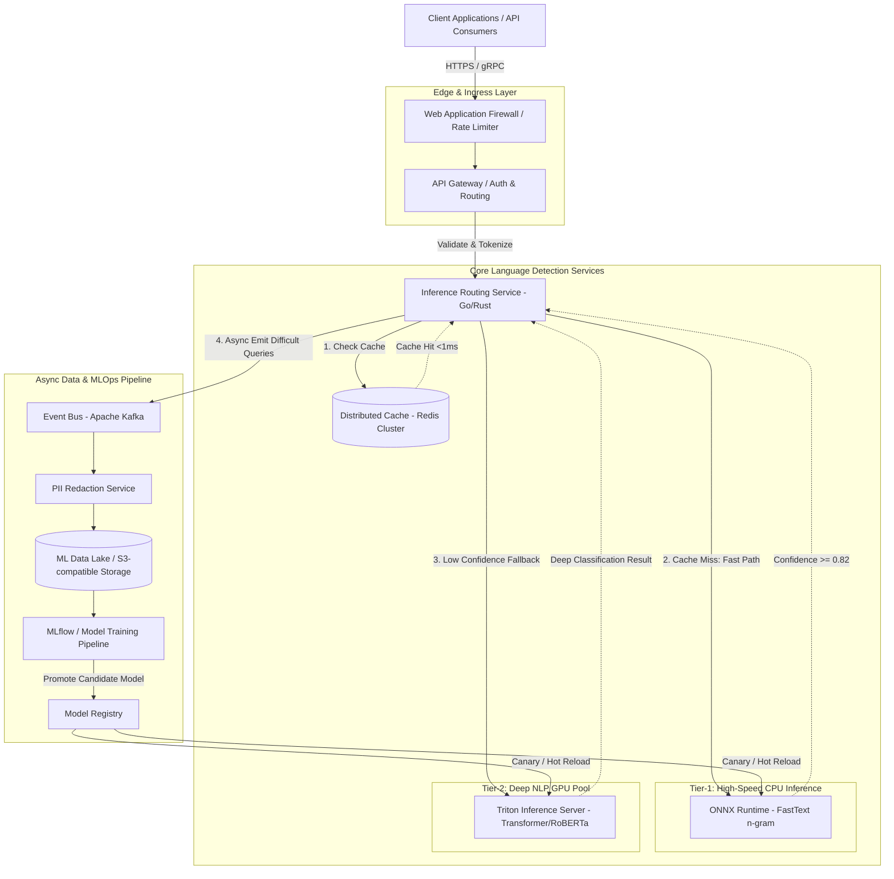

# Enteprise Language Detection System

## 1. Architecture Overview

The **Enterprise Language Detection System (ELDS)** is a cloud-agnostic, low-latency, high-throughput microservices platform designed to accurately identify natural languages from raw unstructured text. Built to serve enterprise workloads, such as real-time chat translation, content moderation, search indexing, and automated customer routing. The architecture balances **sub-10ms P95 latency** with **high classification accuracy** across 100+ languages and dialects.

### Core Objectives & Design Tradeoffs
- **Tiered Inference Strategy (Speed vs. Accuracy):** To avoid the high cost and latency of running Large Language Models (LLMs) or deep Transformer models for every request, ELDS implements a **two-tier inference pattern**.
  - **Tier 1 (Fast Path):** Uses a lightweight, CPU-optimized n-gram/linear model (`fastText` compiled to ONNX) capable of processing requests in `<3ms` with ~95% accuracy for standard single-language inputs.
  - **Tier 2 (Deep Path):** When Tier 1 confidence falls below a configurable threshold ($< 0.82$), such as with mixed-language text, short slang, or low-resource dialects, the request is dynamically routed to a GPU-backed **Transformer Classification Service**.
- **Deterministic Caching:** Implements a distributed in-memory cache using SHA-256 hashes of normalized text strings to serve repeated queries (e.g. standard greetings, viral posts, system prompts) in `<1ms`.
- **Zero-Downtime MLOps:** Seamless model updates via shadow deployments and canary releases without degrading production availability.

## 2. Architecture Diagram

```mermaid
graph TD
    %% Client Layer
    Client[Client Applications / API Consumers]
    
    %% Ingress & Edge Layer
    subgraph Edge_Layer [Edge & Ingress Layer]
        WAF[Web Application Firewall / Rate Limiter]
        APIGW[API Gateway / Auth & Routing]
    end

    %% Core Services Layer
    subgraph Core_Services [Core Language Detection Services]
        Router[Inference Routing Service - Go/Rust]
        Cache[(Distributed Cache - Redis Cluster)]
        
        subgraph Tier1_Pool [Tier-1: High-Speed CPU Inference]
        T1_Model[ONNX Runtime - FastText n-gram]
        end
        
        subgraph Tier2_Pool [Tier-2: Deep NLP GPU Pool]
        T2_Model[Triton Inference Server - Transformer/RoBERTa]
        end
    end

    %% Event & MLOps Layer
    subgraph Data_MLOps_Layer [Async Data & MLOps Pipeline]
        Kafka[Event Bus - Apache Kafka]
        Anonymizer[PII Redaction Service]
        DataLake[(ML Data Lake / S3-compatible Storage)]
        MLOps[MLflow / Model Training Pipeline]
        Registry[Model Registry]
    end

    %% Request Flow
    Client -->|HTTPS / gRPC| WAF
    WAF --> APIGW
    APIGW -->|Validate & Tokenize| Router
    
    Router -->|1. Check Cache| Cache
    Cache -.->|Cache Hit <1ms| Router
    
    Router -->|2. Cache Miss: Fast Path| T1_Model
    T1_Model -.->|Confidence >= 0.82| Router
    
    Router -->|3. Low Confidence Fallback| T2_Model
    T2_Model -.->|Deep Classification Result| Router
    
    Router -->|4. Async Emit Difficult Queries| Kafka
    Kafka --> Anonymizer
    Anonymizer --> DataLake
    DataLake --> MLOps
    MLOps -->|Promote Candidate Model| Registry
    Registry -->|Canary / Hot Reload| T1_Model
    Registry -->|Canary / Hot Reload| T2_Model
```

## 3. End-to-End System Flow

1. **Ingress & Authentication:**
   - A client application sends an HTTP `POST /v1/detect` or gRPC `DetectLanguage` request containing a text payload and optional metadata (e.g. expected character set, domain context).
   - The Web Application Firewall (WAF) evaluates rate limits, protects against volumetric attacks, and forwards valid traffic to the **API Gateway**, where mTLS and JWT/API key authentication are verified.

2. **Normalization & Cache Lookup:**
   - The **Inference Routing Service** receives the request, strips non-printable control characters, trims excess whitespace, and computes a SHA-256 hash of the normalized text.
   - It queries the **Distributed Redis Cache**. If a cached language classification exists, the service immediately returns the result (typical latency: `0.8ms - 1.5ms`).

3. **Tier-1 Lightweight Inference (Fast Path):**
   - On a cache miss, the text is passed to the **Tier-1 CPU Inference Pool** running an optimized ONNX runtime (e.g. `fastText` model trained on character and word n-grams).
   - If the top predicted language returns a **confidence score >= 0.82**, the classification is deemed authoritative. The result is written asynchronously to Redis (TTL: 24 hours) and returned to the client (typical latency: `3ms - 6ms`).

4. **Tier-2 Deep Inference Fallback (Deep Path):**
   - If Tier-1 returns a confidence score `< 0.82` (common for short texts, transliterations, or multilingual code-switching), the router escalates the payload to the **Tier-2 GPU Inference Pool**.
   - A fine-tuned multilingual Transformer model (managed via Triton Inference Server) evaluates the text, captures deeper syntactic and contextual cues, and returns the final language probabilities (typical latency: `15ms - 35ms`).

5. **Async Feedback & Continuous Retraining (MLOps):**
   - All Tier-2 escalations and low-confidence queries are asynchronously published to **Apache Kafka**.
   - A **PII Redaction Service** consumes the stream, strips personally identifiable information, and sinks the anonymized text into an **ML Data Lake**.
   - Scheduled ML pipelines periodically retrain Tier-1 and Tier-2 models using edge-case data. Automated evaluation scripts compare candidate models against benchmark datasets in **MLflow** before pushing weights to the **Model Registry** for zero-downtime hot-reloading.

## 4. Well-Architected Framework Analysis

### 4.1 Operational Excellence
- **Automated Deployments:** GitOps pipelines (ArgoCD/Flux) manage Kubernetes manifests. Model weights are decoupled from application containers, allowing independent, versioned model rollouts via Model Registry webhooks.
- **Observability & Drift Detection:** OpenTelemetry instruments every service hop. Custom Prometheus metrics track *Inference Confidence Distribution*, *Tier-2 Escalation Rate*, and *Cache Hit Ratios*. A spike in Tier-2 escalations triggers alerts for potential data drift or emerging slang vocabulary.

### 4.2 Security
- **Data Protection:** TLS 1.3 encryption in transit; AES-256 encryption at rest for cache and data lake volumes.
- **Privacy & PII Mitigation:** Language detection does not require permanent retention of raw user text. Payloads are processed in volatile memory and discarded immediately unless flagged for ML training, at which point they pass through an automated PII redaction pipeline.
- **Network Isolation:** Core inference pods and Redis clusters reside in private Kubernetes subnets without public ingress, accessible only via mutual TLS (mTLS) from the API Gateway.

### 4.3 Reliability
- **Multi-AZ High Availability:** Microservices and Redis clusters are deployed across a minimum of three Availability Zones (AZs) with pod anti-affinity rules.
- **Circuit Breakers & Graceful Degradation:** If the GPU-backed Tier-2 pool experiences saturation or latency spikes, a circuit breaker trips automatically. The system degrades gracefully by serving the best-effort Tier-1 CPU prediction along with an `uncertain_flag: true` metadata field, preventing cascading system failures.

### 4.4 Performance Efficiency
- **Model Quantization:** Tier-1 models are quantized to INT8 precision within ONNX Runtime, increasing CPU cache locality and throughput by ~3x compared to FP32 with negligible accuracy loss (`< 0.1%`).
- **Horizontal Pod Autoscaling (HPA):** Inference routing pods scale on CPU utilization, while Tier-1/Tier-2 inference workers scale on **request queue depth** and P95 latency thresholds.

### 4.5 Cost Optimization
- **Compute Right-Sizing:** By successfully classifying >90% of traffic at Tier 1 (CPU-based), the architecture minimizes reliance on expensive GPU compute instances.
- **Cache Optimization:** Highly repetitive payloads (e.g. standard UI strings, common search queries) are served entirely from Redis, bypassing compute inference costs altogether.
- **Spot / Preemptible GPU Nodes:** Tier-2 GPU pools utilize spot/preemptible instances with automated fallback to on-demand nodes, reducing GPU compute spend by up to 60%.

### 4.6 Sustainability
- **Energy-Efficient Inference:** Prioritizing lightweight, quantized CPU inference over deep neural networks drastically reduces total kilowatt-hours consumed per million API calls.
- **Dynamic Scale-to-Zero:** During off-peak hours, non-critical Tier-2 staging environments and batch-retraining pipelines scale to zero, eliminating idle energy waste.

## 5. Technical Glossary

- **Canary Release:** A deployment strategy where a new version of an application or ML model is gradually rolled out to a small subset of production traffic before full adoption.
- **fastText:** An open-source, lightweight text classification library developed by Facebook AI that uses word and character n-grams for rapid supervised learning.
- **GitOps:** A DevOps operational model using Git repositories as the single source of truth for declarative infrastructure and application deployments.
- **mTLS (Mutual TLS):** A security protocol where both the client and server cryptographically authenticate each other using X.509 digital certificates.
- **n-gram:** A contiguous sequence of *n* items (characters or words) from a given sample of text or speech, used extensively in probabilistic language models.
- **ONNX (Open Neural Network Exchange):** An open format built to represent machine learning models, enabling portability and high-performance inference optimization across diverse hardware architectures.
- **P95 Latency:** The latency threshold at which 95% of all system requests are processed faster than the given measurement, representing tail-end performance.
- **PII (Personally Identifiable Information):** Any data that could potentially identify a specific individual (e.g. names, email addresses, phone numbers).
- **Quantization:** The process of reducing the numerical precision of model weights (e.g. from 32-bit floating point to 8-bit integer) to reduce memory footprint and accelerate inference speed.
- **RoBERTa:** A Robustly Optimized BERT Pretraining Approach; a powerful Transformer-based neural network architecture used for complex Natural Language Processing (NLP) tasks.
- **Triton Inference Server:** An open-source model serving software by NVIDIA designed to deploy, execute, and scale machine learning models across CPU and GPU infrastructures.
- **TTL (Time to Live):** A mechanism that sets an expiration lifespan for cached data, after which the data is automatically discarded or refreshed.
