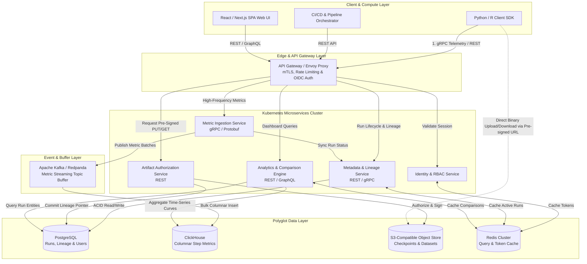

# ML Experiment Tracking & Analysis Platform

## 1. Architecture Overview

The **ML Experiment Tracking & Analysis Platform** is a distributed, high-throughput microservices architecture engineered to capture, organize, track, and analyze machine learning training lifecycle data at scale. As organizations scale from single-node experiments to distributed multi-cluster model training (e.g. Large Language Models, computer vision, and multimodal architectures), tracking hyperparameters, metrics, lineage, and model checkpoints becomes an infrastructure bottleneck. Traditional monolithic tracking tools quickly suffer from database connection saturation, high latency, and storage inefficiencies.

### Core Objectives & Architectural Tradeoffs
* **High-Throughput Asynchronous Ingestion:** To prevent telemetry reporting from blocking GPU training loops, the platform separates ingestion from persistent storage using a streaming buffer (**Apache Kafka / Redpanda**). *Tradeoff:* Introduces eventual consistency for real-time dashboard analytics in exchange for zero-overhead, non-blocking SDK operations.
* **Polyglot Persistence Strategy:** Relational databases degrade when storing high-cardinality time-series step metrics. We decouple state: **PostgreSQL** manages transactional metadata, lineage, and run states, while **ClickHouse** (columnar time-series database) handles high-frequency step metrics and vector comparisons.
* **Direct-to-Object-Storage Artifact Transfers:** Heavy model checkpoints and evaluation datasets are never proxied through application APIs. Instead, the **Artifact Service** issues short-lived, cryptographically signed pre-signed URLs, allowing distributed nodes to stream multi-gigabyte payloads directly to S3-compatible storage.
* **Enterprise Governance & Zero-Trust Security:** Built-in Role-Based Access Control (RBAC), tenant project isolation, and cryptographic lineage binding ensure full reproducibility and compliance across enterprise business units.

## 2. Architecture Diagram



## 3. End-to-End System Flow

```
[Training Pod / SDK]            [API Gateway]            [Microservices]             [Storage & DBs]
         |                            |                         |                           |
         |-- 1. Authenticate / OIDC ->|                         |                           |
         |                            |-- Validate Token ------>| [Identity Service]        |
         |<- 2. Session JWT ----------|                         |                           |
         |                            |                         |                           |
         |-- 3. Register Run -------->|-- Route Request ------->| [Metadata Service]        |
         |   (Git SHA, Params, Env)   |                         |-- Write Run Metadata ---->| [PostgreSQL]
         |<- 4. Return Run ID --------|                         |                           |
         |                            |                         |                           |
         |-- 5. Stream Step Metrics ->|-- gRPC Stream --------->| [Ingestion Service]       |
         |   (Loss, Epoch, Accuracy)  |                         |-- Produce Batch --------->| [Apache Kafka]
         |                            |                         |-- Consume & Bulk Insert ->| [ClickHouse]
         |                            |                         |                           |
         |-- 6. Request Checkpoint -->|-- Request URL --------->| [Artifact Service]        |
         |      Upload Authorization  |                         |                           |
         |<- 7. Pre-Signed S3 URL ----|                         |                           |
         |                            |                         |                           |
         |-- 8. Direct Binary Upload (Model Weights, ONNX, Evaluation Artifacts) ---------->| [S3 Object Store]
         |                            |                         |                           |
         |-- 9. Commit Artifact SHA ->|-- Finalize Lineage ---->| [Artifact Service]        |
         |                            |                         |-- Bind Pointer & SHA ---->| [PostgreSQL]
```

### Detailed Lifecycle Narrative
1. **Authentication & Session Initialization:**
   The ML practitioner or automated Kubernetes training pod initializes the Python SDK using an enterprise identity token or API service principal. The **API Gateway (Envoy)** routes the credential to the **Identity & RBAC Service**, which verifies permissions and issues a short-lived, project-scoped JSON Web Token (JWT).
2. **Experiment Run Registration & Lineage Capture:**
   At the start of a training script, the SDK sends an initialization payload containing hyperparameter key-value pairs, Git commit hashes, environment variable snapshots, container image digests, and hardware specifications (e.g., GPU model, node count). The **Metadata & Lineage Service** commits this metadata as an ACID transaction into **PostgreSQL** and marks the run status as `ACTIVE`.
3. **High-Frequency Metric Ingestion:**
   As training loops progress, step-level metrics (e.g., training loss, validation accuracy, learning rate schedules) are streamed asynchronously over persistent **gRPC (Protocol Buffers)** connections to the **Metric Ingestion Service**.
4. **Asynchronous Stream Buffering & Columnar Storage:**
   To guarantee low latency for the training script and survive database maintenance windows, the Ingestion Service pushes validated metric events into partitioned **Apache Kafka** topics. Dedicated streaming workers consume these topics in micro-batches and execute high-speed columnar inserts into **ClickHouse**.
5. **Artifact Upload Authorization:**
   When the training loop saves a model checkpoint or validation curve plot, the SDK sends a request to the **Artifact Authorization Service** specifying file size, name, and MIME type. The service verifies the user's write permissions and generates an ephemeral, cryptographically signed **Pre-Signed PUT URL** mapped to an **S3-compatible Object Store**.
6. **Direct-to-Object Binary Transfer:**
   The SDK uploads the multi-gigabyte binary payload directly to S3 using HTTP PUT via the pre-signed URL. This bypasses all internal microservice networks, preserving cluster bandwidth and preventing memory exhaustion.
7. **Lineage Binding & Checksum Verification:**
   Upon upload completion, the SDK calculates the local SHA-256 checksum of the artifact and reports it to the **Artifact Authorization Service**. The service verifies object existence in S3, commits an immutable lineage pointer in **PostgreSQL**, and links the model artifact to the exact experiment run.
8. **Interactive Analysis & Dashboarding:**
   When a data scientist opens the React Web UI to compare 50 historical runs, the **Analytics & Comparison Engine** retrieves structured experiment metadata from **PostgreSQL** and concurrently executes vectorized time-series aggregation queries against **ClickHouse**. Frequently accessed comparison leaderboards are served directly from **Redis**.

## 4. Well-Architected Framework Analysis

### 4.1 Operational Excellence
* **GitOps Infrastructure Deployment:** All application components are packaged as Helm charts and deployed via **ArgoCD** onto Kubernetes. Underlying cloud-agnostic data infrastructure (PostgreSQL, ClickHouse, Kafka, S3-compatible storage) is provisioned declaratively via **Terraform**.
* **Comprehensive Observability Suite:** Every microservice exposes Prometheus metrics (latency histograms, active gRPC connections, error rates). Distributed request tracing across the gateway, microservices, and storage layers is implemented via **OpenTelemetry** and visualized in **Jaeger/Grafana**.
* **Automated Database Migrations:** Schema changes for both PostgreSQL and ClickHouse are version-controlled using **Liquibase** jobs, executed automatically as Kubernetes pre-upgrade hooks to ensure zero-downtime deployments.

### 4.2 Security
* **Zero-Trust Network Architecture:** All pod-to-pod communication within the Kubernetes cluster is encrypted and authenticated using mutual TLS (mTLS) enforced by an **Istio Service Mesh**.
* **Identity & Fine-Grained Governance:** Authentication is integrated with enterprise identity providers via OpenID Connect (OIDC). Authorizations follow strict Role-Based Access Control (RBAC), isolating experiments and artifacts by team, workspace, and classification level.
* **Cryptographic Data Protection:** Data at rest is encrypted across all storage engines (AES-256). Pre-signed S3 URLs are time-limited (defaulting to 15-minute expiration) and bound to explicit checksums to prevent man-in-the-middle payload tampering.

### 4.3 Reliability
* **Spike-Resilient Buffering:** If the analytics database (ClickHouse) experiences latency spikes or maintenance restarts, **Apache Kafka** absorbs ingestion traffic without dropping metrics or stalling active GPU training nodes.
* **High Availability (HA) Deployment:** All stateless microservices run across multiple availability zones with automated Horizontal Pod Autoscaling (HPA) and Kubernetes liveness/readiness probes.
* **Disaster Recovery & Data Durability:** PostgreSQL implements continuous Point-in-Time Recovery (PITR) streaming replication. ClickHouse analytical partitions are backed up daily, while S3 artifact buckets utilize cross-region replication with 99.999999999% (11 9s) durability guarantees.

### 4.4 Performance Efficiency
* **Polyglot Storage Decoupling:** Separating transactional metadata (PostgreSQL) from time-series metrics (ClickHouse) allows comparison queries across millions of data points to execute in sub-100 milliseconds, avoiding relational index bloat.
* **Binary Protocol Optimization:** High-frequency metric ingestion utilizes **gRPC/Protobuf** instead of REST/JSON. This reduces serialization/deserialization CPU overhead by over 50% and decreases network payload footprint by ~60%.
* **Multi-Tier Caching:** **Redis** caches hot run configurations, active user sessions, and frequently executed comparison dashboards, serving 85%+ of read requests from memory.

### 4.5 Cost Optimization
* **Automated Storage Lifecycle Management:** Object storage buckets apply intelligent tiering policies: checkpoint artifacts transition from hot storage to Infrequent Access (IA) after 30 days, and archive to cold object storage (e.g. Glacier/Deep Archive equivalent) after 90 days.
* **Columnar Data Compression:** ClickHouse leverages native ZStandard (ZSTD) and LZ4 columnar compression algorithms, shrinking time-series metric storage requirements by 75–85% compared to standard row-oriented databases.
* **Right-Sized Compute Utilization:** Asynchronous Kafka buffering smooths out traffic bursts, allowing the platform to size Kubernetes worker nodes for average workload throughput rather than peak burst capacity.

### 4.6 Sustainability
* **Elimination of Proxy Bandwidth Waste:** Offloading heavy multi-gigabyte checkpoint transfers to direct-to-S3 pre-signed URLs eliminates unnecessary data hops, reducing server CPU utilization, memory pressure, and network energy consumption.
* **CPU-Efficient Serialization:** Standardizing on Protocol Buffers minimizes CPU clock cycles wasted on string parsing and JSON garbage collection on both energy-intensive GPU training nodes and cluster microservices.
* **Dynamic Resource Scaling:** Horizontal Pod Autoscalers scale ingestion and analytics pods down to minimal baselines during off-peak hours based on real-time Kafka consumer lag metrics.

### 5. Technical Glossary

* **ACID (Atomicity, Consistency, Isolation, Durability):** A set of database transaction properties that guarantee database reliability and validity even in the event of system failures or concurrent modifications.
* **ClickHouse (Columnar TSDB):** An open-source, high-performance columnar database management system designed for real-time online analytical processing (OLAP) and high-frequency time-series data storage.
* **Envoy Proxy:** An open-source edge and service proxy designed for cloud-native applications, providing advanced load balancing, mTLS termination, and telemetry collection.
* **GitOps:** An operational framework that takes DevOps best practices used for application development (such as version control, collaboration, compliance, and CI/CD) and applies them to infrastructure automation.
* **gRPC / Protocol Buffers (Protobuf):** A high-performance, open-source Remote Procedure Call (RPC) framework that uses compact binary Protocol Buffers for structured data serialization, outperforming text-based JSON over HTTP.
* **Horizontal Pod Autoscaler (HPA):** A Kubernetes controller that automatically updates a workload resource (like a Deployment) to scale the number of pods up or down based on observed CPU, memory, or custom metrics.
* **Istio Service Mesh:** An infrastructure layer that provides transparent security (mTLS), observability, and traffic management between microservices deployed within a Kubernetes cluster.
* **Lineage Tracking:** The complete historical record of how an ML model was created, including code commits, data snapshots, hyperparameter configurations, and execution environments.
* **mTLS (Mutual TLS):** A protocol where both the client and server cryptographically verify each other's certificates before establishing a secure, encrypted communication channel.
* **OIDC (OpenID Connect):** An identity authentication layer built on top of the OAuth 2.0 protocol that allows clients to verify end-user identities based on authentication performed by an authorization server.
* **PITR (Point-in-Time Recovery):** A database backup and restore capability that allows administrators to restore a database to its exact state at any specific second in the past.
* **Pre-Signed URL:** An ephemeral URL generated by an object storage service that grants temporary, time-bound read or write access to a specific bucket or object without exposing static storage credentials.
* **RBAC (Role-Based Access Control):** A security paradigm that restricts network or application access based on the roles of individual users within an enterprise.
