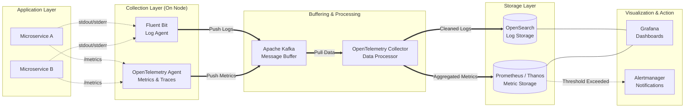

# Centralized Observability Platform: Metrics & Logging Service

## 1. Architecture Overview
When running multiple microservices, figuring out why a system crashed or why it is running slow can be like finding a needle in a haystack. The proposed **Centralized Observability Platform** solves this by gathering all logs (text records of what happened) and metrics (numbers representing system health, like CPU usage) into one single, searchable place.

Because we are building a cloud-agnostic solution, we rely on industry-standard open-source tools. The core objective of this design is to decouple the applications from the monitoring tools. Instead of microservices sending data directly to databases, they send it to lightweight agents. A "buffer" is placed in the middle of the system to absorb massive traffic spikes (like a Black Friday sale) without losing a single log or crashing the database. 

## 2. Architecture Diagram

## 3. End-to-End System Flow
Here is how data moves through the system from the moment a microservice does something to the moment an engineer sees it on a screen:

1. **Generation:** As microservices run, they naturally produce logs (by printing to standard output) and generate metrics (like counting how many users logged in). 
2. **Collection:** Lightweight agents sit right next to the applications. **Fluent Bit** grabs the text logs, while the **OpenTelemetry Agent** gathers the system metrics.
3. **Buffering:** Instead of sending data straight to the database, the agents send it to **Apache Kafka**. Kafka acts as a massive shock-absorber. If a database restarts or traffic spikes, Kafka safely holds onto the data until the system catches up.
4. **Processing:** The **OpenTelemetry Collector** constantly reads the raw data from Kafka. It acts as a filter and translator—removing sensitive user data (like passwords or credit cards), adding helpful tags (like the environment name), and formatting the data correctly.
5. **Storage:** The cleaned data is split up. Logs are sent to **OpenSearch** (which is great for text searches), and metrics are sent to **Prometheus** (which is built specifically for storing numbers over time).
6. **Visualization & Alerting:** Engineers open **Grafana** to view beautiful, live charts combining both logs and metrics. If a metric crosses a dangerous threshold (e.g. CPU hits 95%), Prometheus tells the **Alertmanager** to immediately send a Slack message or page the on-call engineer.

## 4. Well-Architected Framework Analysis

### 4.1 Operational Excellence
- **Centralized Troubleshooting:** Developers don't need to log into individual servers to read text files. Everything is in Grafana.
- **Infrastructure as Code:** The entire monitoring stack can be deployed using tools like Terraform, meaning it is version-controlled and repeatable across development, staging, and production.

### 4.2 Security
- **Data Masking:** The OpenTelemetry Collector is configured to automatically scrub Personally Identifiable Information (PII) before logs are ever saved to the database.
- **Access Control:** Grafana integrates with corporate login systems (Single Sign-On). We can restrict access so junior developers only see staging logs, while senior leads can access production logs.
- **Encrypted Traffic:** All data moving between the agents, Kafka, and the storage layer is encrypted using TLS.

### 4.3 Reliability
- **No Data Loss:** Because we use Kafka as a buffer, a sudden surge of errors won't overwhelm our log database. Kafka simply holds the queue until OpenSearch is ready to process it.
- **High Availability:** Kafka, OpenSearch, and Prometheus are all deployed in clusters across multiple physical data centers. If one server dies, the others seamlessly take over.

### 4.4 Performance Efficiency
- **Lightweight Agents:** Fluent Bit is written in the 'C' programming language, meaning it uses almost zero memory and CPU, leaving more resources available for the actual applications.
- **Decoupled Architecture:** Applications do not wait for logs to be saved. They just write to memory and move on, ensuring the monitoring system never slows down the user experience.

### 4.5 Cost Optimization
- **Data Tiering:** Logs are expensive to keep forever. We set up policies to keep "hot" (recent) logs in fast storage for 14 days, and then automatically archive older logs to cheap, cold object storage (like AWS S3 or MinIO) for compliance.
- **Metric Downsampling:** As metrics get older, we don't need second-by-second accuracy. We compress old data into hourly averages, drastically cutting down storage costs.

### 4.6 Sustainability
- **Compute Efficiency:** By filtering out "junk" logs (like repetitive health checks) at the collection layer, we prevent unnecessary data processing and reduce the electricity required to power our databases.
- **Auto-Scaling:** The OpenTelemetry Collectors scale down during quiet hours (like the middle of the night) to reduce our overall compute footprint.

## 5. Technical Glossary
- **Microservices:** A way of building software where the application is broken down into small, independent pieces that talk to each other.
- **OpenTelemetry (OTel):** A standardized, open-source framework used to gather and process logs, metrics, and traces so you aren't locked into a single vendor's tool.
- **Fluent Bit:** A super fast, lightweight software agent that collects logs from different sources and sends them to a central destination.
- **Apache Kafka:** A highly reliable digital "conveyor belt" or buffer that can temporarily hold massive amounts of messages between systems.
- **OpenSearch:** A powerful search engine and database specifically optimized for searching through massive amounts of text data (like logs).
- **Prometheus:** A database built specifically to store and query time-series data (numbers that change over time, like temperature or CPU usage).
- **Grafana:** A visualization web application that connects to databases and turns raw data into readable charts, graphs, and dashboards.
- **PII (Personally Identifiable Information):** Sensitive data that can identify a specific person, such as social security numbers, emails, or credit card details.
- **Downsampling:** The process of taking high-resolution data (e.g., data recorded every second) and summarizing it (e.g., one average value per hour) to save storage space over time.
