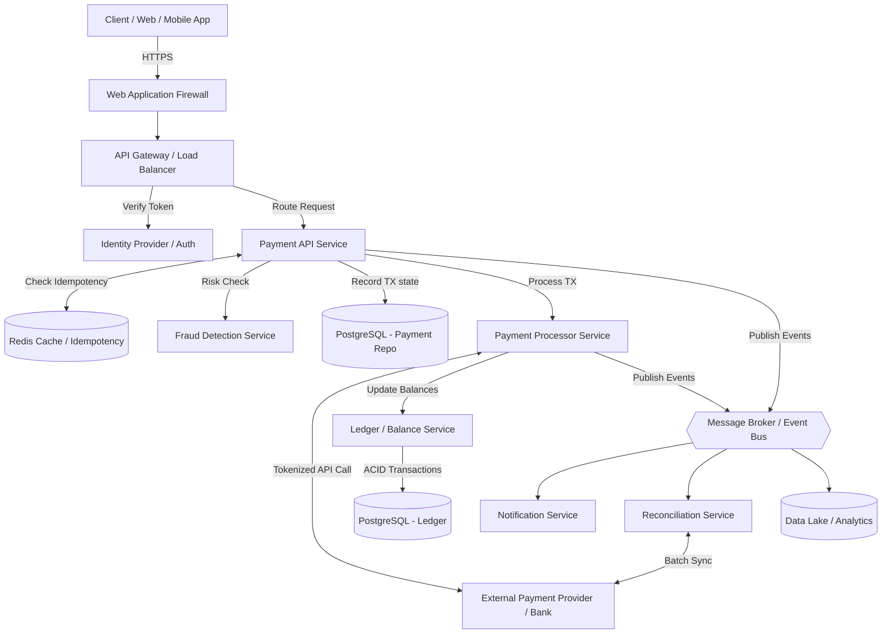

# Payment Processing System Architecture

## 1. Architecture Overview
The proposed solution is a cloud-agnostic, highly available, and deeply secure payment processing system built on microservices principles. It utilizes an event-driven architecture to ensure strong data consistency, idempotency, and fault tolerance. By decoupling core transaction processing from background tasks (like notifications and reconciliation) via a message broker, the system can scale elastically to handle high-throughput traffic spikes while maintaining PCI-DSS compliance and ACID guarantees for financial data.

## 2. Architecture Diagram

## 3. End-to-End System Flow
1. **Initialization & Edge Security:** The client application submits a payment request containing a unique Idempotency Key, tokenized payment details, and transaction metadata. The Web Application Firewall (WAF) inspects the payload for malicious patterns.
2. **Authentication & Routing:** The API Gateway intercepts the request, validates the user's JSON Web Token (JWT) against the Identity Provider, applies rate limiting, and routes the request to the Payment API Service.
3. **Idempotency Check:** The Payment API Service queries Redis using the provided Idempotency Key. If the key exists, the system immediately returns the cached response, preventing accidental double-charging.
4. **Fraud Assessment:** The Payment API Service forwards transaction metadata to the Fraud Detection Service, which evaluates the risk score in real-time. If flagged, the transaction is synchronously rejected.
5. **Database Initialization:** The Payment API Service records an initial `PENDING` state in the core Payment PostgreSQL database.
6. **Payment Execution:** The Payment Processor Service handles integration with External Payment Providers (e.g. Stripe, Visa, internal bank APIs) using secure, tokenized payloads. It awaits a synchronous `SUCCESS` or `FAILURE` response.
7. **Ledger Update:** Upon a successful external payment, the Processor calls the Ledger Service. The Ledger Service utilizes ACID-compliant database transactions to credit and debit the appropriate internal accounts via a double-entry bookkeeping pattern.
8. **Event Publication:** The Payment API Service updates the transaction state to `COMPLETED` and publishes a `PaymentCompleted` event to the Message Broker (Kafka). 
9. **Asynchronous Processing:** Downstream consumers react to the event:
   - The Notification Service sends an email/SMS receipt to the user.
   - The Data Lake ingests the event for BI reporting and machine learning.
10. **Reconciliation:** A cron-triggered Reconciliation Service periodically fetches settlement reports from the External Payment Provider, comparing them against the internal Ledger to identify and alert on any discrepancies.

## 4. Well-Architected Framework Analysis

### Operational Excellence
- **Infrastructure as Code (IaC):** Environments are provisioned using Terraform/OpenTofu, ensuring repeatability.
- **Observability:** Distributed tracing (OpenTelemetry) tracks requests across microservices. Centralized logging (e.g. ELK stack) and metrics (Prometheus/Grafana) provide immediate visibility into system health and transaction failure rates.
- **Deployment:** CI/CD pipelines automate testing and deployment using blue/green or canary release strategies to achieve zero-downtime updates.

### Security
- **Data Protection:** All traffic in transit is secured via TLS 1.3. Data at rest (especially PII and transaction records) is encrypted using AES-256. 
- **Compliance:** The architecture strictly isolates the cardholder data environment (CDE) to maintain PCI-DSS compliance, heavily utilizing tokenization to ensure the core databases never store raw PANs (Primary Account Numbers).
- **Access Control:** Principle of least privilege is enforced via strict IAM roles for service-to-service communication.

### Reliability
- **Fault Tolerance:** Services are deployed across multiple Availability Zones (AZs). Circuit Breaker patterns are implemented in the Payment Processor Service to gracefully handle downstream bank API outages.
- **Data Consistency:** The system relies on idempotency and double-entry ledger database constraints to guarantee no funds are created or destroyed erroneously.
- **Decoupling:** Asynchronous communication via Kafka prevents the failure of a non-critical system (like notifications) from impacting the core payment flow.

### Performance Efficiency
- **Caching:** Redis minimizes database load by caching idempotency keys and static configurations.
- **Database Scaling:** PostgreSQL databases use connection pooling (e.g. PgBouncer) and read-replicas to offload read-heavy query patterns from the primary write node.
- **Elasticity:** Microservices run on container orchestration platforms (like Kubernetes) configured with Horizontal Pod Autoscalers (HPA) to scale dynamically based on CPU and memory utilization.

### Cost Optimization
- **Right-Sizing:** Container resources (CPU/Memory limits) are continuously profiled and optimized.
- **Storage Lifecycle:** Historical transaction data is tiered. Active data is kept in high-performance block storage, while data older than 7 years (for audit purposes) is moved to cold object storage (e.g. S3 Glacier).
- **Spot Compute:** Ephemeral, fault-tolerant background workloads like asynchronous reporting or reconciliation can leverage spot/preemptible instances for significant cost savings.

### Sustainability
- **Carbon-Aware Region Selection:** Compute clusters are deployed in regions powered primarily by renewable energy where data residency laws permit.
- **Compute Efficiency:** Efficient, compiled languages (e.g. Go, Rust) or highly optimized runtimes (e.g. Java/GraalVM) are used for high-throughput services to reduce CPU cycles and overall energy consumption.
- **Scaling to Zero:** Non-production environments are automatically scaled down outside of business hours to minimize carbon footprint.

## 5. Technical Glossary
- **ACID (Atomicity, Consistency, Isolation, Durability):** A set of properties of database transactions intended to guarantee data validity despite errors, power failures, or other mishaps. Essential for financial ledgers.
- **API Gateway:** A server that acts as an API front-end, receiving API requests, enforcing throttling and security policies, passing requests to the back-end service, and passing the response back to the requester.
- **Circuit Breaker:** A design pattern used in microservices to prevent a cascading failure when a downstream service is unresponsive by temporarily blocking traffic to it.
- **Double-Entry Ledger:** An accounting principle where every financial transaction has equal and opposite effects in at least two different accounts.
- **Idempotency:** A property of operations in computer science where applying an operation multiple times yields the same result as applying it once. Crucial in payments to prevent double-billing on network retries.
- **JWT (JSON Web Token):** An open standard that defines a compact and self-contained way for securely transmitting information between parties as a JSON object.
- **Message Broker:** Intermediary software (like Apache Kafka or RabbitMQ) that translates a message from the formal messaging protocol of the sender to the formal messaging protocol of the receiver, decoupling microservices.
- **PCI-DSS (Payment Card Industry Data Security Standard):** An information security standard for organizations that handle branded credit cards from the major card schemes.
- **Tokenization:** The process of substituting a sensitive data element (like a credit card number) with a non-sensitive equivalent, referred to as a token, that has no extrinsic or exploitable meaning or value.
- **WAF (Web Application Firewall):** A specific form of application firewall that filters, monitors, and blocks HTTP traffic to and from a web service to protect against exploits like SQL injection or cross-site scripting.
