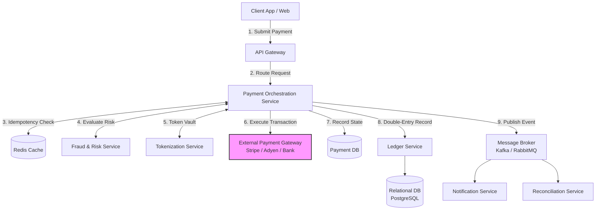

# Enterprise Payment Processing Architecture

## 1. Architecture Overview
This solution is a cloud-agnostic, microservices-based payment processing system designed to handle financial transactions securely and reliably. When dealing with money, the architecture must guarantee three things: we never lose a transaction, we never charge a customer twice, and we keep sensitive financial data safe from hackers. 

To achieve this, we divide the system into specialized, independent services. A central Payment Service acts as the orchestrator, coordinating fraud checks, interacting with external payment gateways (like Stripe or a bank), and ensuring every cent is accurately recorded. We use a mix of real-time processing for the actual payment and asynchronous (background) processing for sending receipts and logging analytics. We do this because keeping background tasks out of the main checkout flow ensures the system remains lightning-fast for the user.

## 2. Architecture Diagram

```mermaid
flowchart TD
    %% Client and Entry Point
    Client[Client App / Web] -->|1. Submit Payment| API[API Gateway]
    
    %% Core Payment Processing
    API -->|2. Route Request| PS[Payment Orchestration Service]
    
    %% Synchronous Checks
    PS <-->|3. Idempotency Check| Cache[(Redis Cache)]
    PS <-->|4. Evaluate Risk| FS[Fraud & Risk Service]
    PS <-->|5. Token Vault| TV[Tokenization Service]
    
    %% External Gateway
    PS -->|6. Execute Transaction| PSP[External Payment Gateway\nStripe / Adyen / Bank]
    
    %% Storage & Ledger
    PS -->|7. Record State| DB[(Payment DB)]
    PS -->|8. Double-Entry Record| LS[Ledger Service]
    LS --> LDB[(Relational DB\nPostgreSQL)]
    
    %% Asynchronous Processing
    PS -->|9. Publish Event| MB[Message Broker\nKafka / RabbitMQ]
    MB --> NS[Notification Service]
    MB --> RS[Reconciliation Service]
    
    %% Styling
    classDef external fill:#f9f,stroke:#333,stroke-width:2px;
    class PSP external;
```

## 3. End-to-End System Flow
Here is the step-by-step journey of a payment request from the moment a user clicks "Buy":

1. **The Request:** The user submits their payment. The request hits our **API Gateway**, which acts as a digital bouncer, ensuring the user is authorized and blocking malicious traffic.
2. **Double-Charge Protection:** The API Gateway forwards the request to the **Payment Orchestration Service**. Before processing, this service checks our **Redis Cache** for an "Idempotency Key" (a unique ID sent by the user's device). We use Redis here because it is incredibly fast. If we have seen this exact ID recently, we know it is a duplicate click and we block the double charge.
3. **Security & Fraud Check:** The Payment Service asks the **Tokenization Service** to retrieve the actual credit card details (which are never stored in our main databases to minimize security risks). Simultaneously, it asks the **Fraud & Risk Service** to score the transaction. If it looks suspicious, it is rejected immediately.
4. **The Money Move:** The Payment Service reaches out to an **External Payment Gateway** to authorize and capture the funds.
5. **The Financial Record:** Once approved, the Payment Service saves the "Success" state in its database and commands the **Ledger Service** to record the movement of money. We use a strict relational database (PostgreSQL) here because it guarantees the math always balances perfectly.
6. **Post-Payment Cleanup:** The Payment Service drops a "Payment Successful" message into a **Message Broker**. This acts like a post office. The **Notification Service** picks up the message to email a receipt, while the **Reconciliation Service** logs it for accounting, all happening in the background so the user's checkout completes instantly.

## 4. Well-Architected Framework Analysis

### 4.1 Operational Excellence
- **Centralized Tracing:** Every request gets a unique tracking ID. We do this so engineers can easily trace a failed payment through all microservices to find exactly where it broke.
- **Automated Deployments:** Services are containerized (e.g. Docker) and deployed automatically. This ensures that if a new update causes issues, we can instantly roll back to the previous working version without downtime.

### 4.2 Security
- **PCI-DSS Compliance:** We isolate the **Tokenization Service** into a highly secure, restricted zone. We do this so the rest of the system only ever sees safe, random tokens (e.g. `tok_12345`), drastically reducing the risk of a data breach.
- **Encryption Everywhere:** Data is encrypted while traveling across the network (TLS) and while resting in the databases, ensuring that intercepted data is useless to attackers.

### 4.3 Reliability
- **Retries and Dead-Letter Queues:** Network blips happen. If an external bank is temporarily down, our system uses automated retries with "exponential backoff" (waiting longer between each try) to avoid overwhelming the network. Failed attempts go to a "Dead Letter Queue" for human review.
- **ACID Transactions:** We strictly use Relational Databases for the Ledger. This guarantees that if a server crashes mid-transaction, the database will not save a half-completed, inaccurate financial record.

### 4.4 Performance Efficiency
- **Asynchronous Offloading:** We use a Message Broker to handle tasks like email receipts. We do this to keep the main user-facing process fast, handling only the actual payment in real-time.
- **Read/Write Splitting:** We separate the database servers that *write* new payments from those that *read* data for reporting. This prevents heavy accounting searches from slowing down live customer checkouts.

### 4.5 Cost Optimization
- **Auto-Scaling:** The system automatically spins up more servers during peak traffic (like sales events) and turns them off when traffic drops, ensuring we only pay for the compute power we actually need.
- **Data Archiving:** Historical transactions are automatically moved from expensive, high-speed databases into cheaper, long-term storage (like Amazon S3), saving significant storage costs over time.

### 4.6 Sustainability
- **Right-Sizing Compute:** Containerized microservices let us pack applications efficiently onto servers. This reduces the amount of wasted, idle CPU power and lowers the overall carbon footprint.
- **Event-Driven Architecture:** Background services (like Notifications) only "wake up" when the Message Broker tells them there is work to do. This reduces energy consumption during quiet periods.

## 5. Technical Glossary
- **API Gateway:** The front door to our system that routes traffic, checks permissions, and blocks bad requests.
- **Idempotency:** A concept meaning "safe to retry." It ensures that no matter how many times a user clicks "Pay", they are charged exactly once.
- **Tokenization:** Swapping sensitive data (like a credit card number) with a meaningless string of characters (a token) to keep the real data safe from hackers.
- **Message Broker:** A system (like Kafka or RabbitMQ) that acts as a digital post office, allowing one service to drop off a message so another service can process it later.
- **Double-Entry Ledger:** An accounting rule where every transaction has two equal entries (a debit and a credit) to ensure money isn't magically created or lost.
- **ACID Compliance:** Database rules (Atomicity, Consistency, Isolation, Durability) guaranteeing that data is saved accurately and securely, which is mandatory for handling money.
