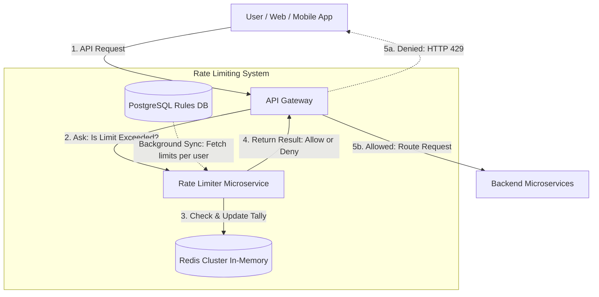

# Distributed Rate Limiter Architecture

## 1. Architecture Overview
A rate limiter acts as a traffic cop for your APIs. Its main job is to control the number of requests a user or service can make within a specific time frame (like 100 requests per minute). 

We need a rate limiter for three main reasons: to prevent abuse or bad actors from crashing the system (DDoS attacks), to ensure fair usage so one heavy user doesn't slow down the system for everyone else, and to enforce pricing tiers (e.g. free users get 50 requests/day, premium users get 1,000). 

This cloud-agnostic solution relies on a dedicated API Gateway to intercept traffic, a fast Microservice to process the rules, and an in-memory Redis database to keep a lightning-fast tally of user activity. We choose this setup because rate limiting must happen in milliseconds without slowing down the actual user experience.

## 2. Architecture Diagram

## 3. End-to-End System Flow
Here is exactly how a request moves through the system:

1. **The Request Arrives:** A user clicks a button or an app sends a request. This traffic first hits our API Gateway, which sits at the very front of our network.
2. **The Check-In:** Before sending the request to our backend servers, the API Gateway pauses and asks the Rate Limiter Service, "Is this specific user allowed to make this request right now?"
3. **The Tally Update:** The Rate Limiter Service identifies the user (usually by an API key or IP address) and reaches out to Redis. Redis is an in-memory database, meaning it can read and write data almost instantly. 
4. **The Evaluation:** Inside Redis, we run a tiny script (a Lua script) that does two things at the exact same time: it checks how many requests the user has made in the last minute, and it adds this new request to the tally. Doing this in one step prevents errors if the user sends two requests at the exact same millisecond.
5. **The Decision:** 
    * If the user is **under** their limit, the Rate Limiter tells the Gateway to let the traffic through. The Gateway forwards the request to the backend microservices as normal.
    * If the user is **over** their limit, the Rate Limiter tells the Gateway to stop the traffic. The Gateway immediately replies to the user with an "HTTP 429: Too Many Requests" error message, protecting our backend servers from doing any unnecessary work.

## 4. Well-Architected Framework Analysis

### 4.1 Operational Excellence
We deploy the Rate Limiter as its own independent microservice using containers (like Docker/Kubernetes). This allows developers to update the rate limiting logic without touching the main application. We use monitoring tools to track how often users hit their limits (429 errors); if we see a massive sudden spike, we can set up automated alerts for the engineering team to investigate potential attacks.

### 4.2 Security
The rate limiter is our first line of defense against Denial of Service (DDoS) attacks and brute-force login attempts. By blocking abusive traffic at the Gateway level, malicious requests never reach or compromise our core databases. We also secure the connection between the Gateway and the Limiter using internal encryption (Mutual TLS) so no one can bypass the rules.

### 4.3 Reliability
If the Rate Limiter service crashes, we design the system to "fail-open." This means if the API Gateway cannot reach the Rate Limiter, it will temporarily let all traffic through rather than blocking entirely. It is better to risk a slightly heavier load on the backend for a few minutes than to accidentally block all legitimate paying customers while the system restarts. 

### 4.4 Performance Efficiency
Rate limiting must be incredibly fast; adding more than 10-20 milliseconds to a request is unacceptable. We achieve this by using Redis (which lives in RAM, not on slow hard drives) and keeping the rate limiting rules cached directly in the service. The system is designed to scale out horizontally: as traffic grows, we can simply add more Rate Limiter service copies.

### 4.5 Cost Optimization
By catching and dropping excess traffic at the front door, we save money. We don't have to pay for the CPU, memory, and database processing power that would otherwise be wasted processing abusive or out-of-tier requests. Additionally, we set expiration timers (Time-To-Live) on the Redis data, so old tallies automatically delete themselves, keeping our memory storage small and cheap.

### 4.6 Sustainability
Because this architecture dynamically scales, we only run the servers we need at any given time. Blocking bad traffic early prevents our downstream backend servers from over-working, which reduces our overall compute footprint, saving energy and minimizing our cloud carbon footprint.

## 5. Technical Glossary
* **API Gateway:** A server that acts as a front door for all incoming traffic. It directs requests to the right places and enforces rules (like rate limiting) before letting traffic inside.
* **Microservice:** Breaking a large application down into small, independent pieces. Here, the Rate Limiter is its own small piece.
* **Redis:** A database that stores information in the computer's temporary memory (RAM) instead of a hard drive, making it incredibly fast. Perfect for quick math like counting requests.
* **Lua Script:** A lightweight piece of code that runs directly inside Redis. We use it to ensure counting is accurate even if thousands of requests hit at the exact same microsecond.
* **HTTP 429 (Too Many Requests):** The standard internet error code used to tell an app or user to slow down because they are asking for too much data too quickly.
* **Fail-Open:** A design choice where, if a security or checking system breaks down, the default action is to allow traffic through rather than locking everyone out.
