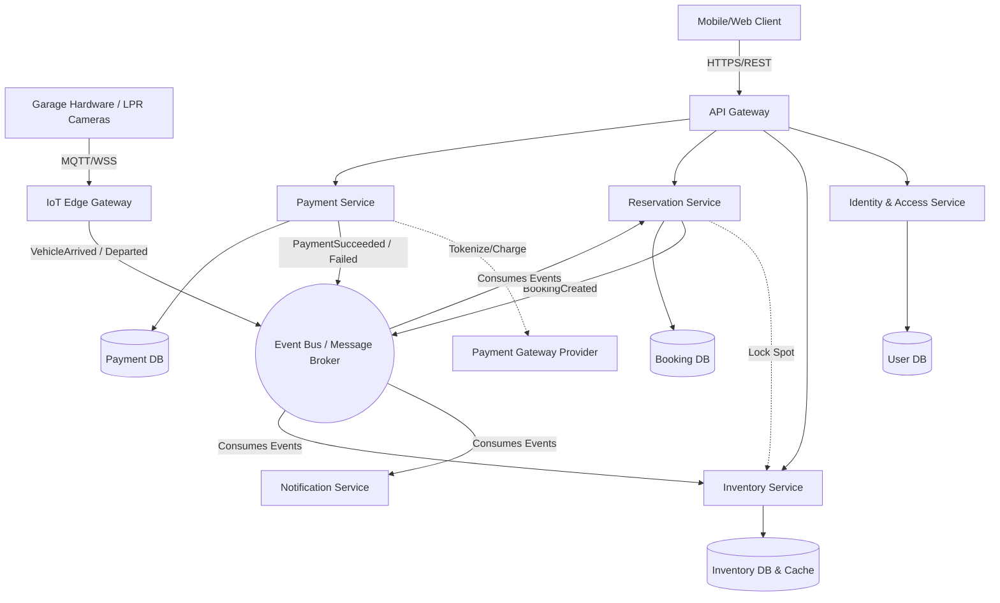

# Parking Garage Reservation and Payment System Architecture

## 1. Architecture Overview
This solution proposes a cloud-agnostic, event-driven microservices architecture designed to handle high-concurrency parking reservations, process secure payments, and interface directly with physical garage hardware (like boom gates and license plate recognition cameras). By decoupling the domain components into independent services communicating via a message broker, the system achieves high availability, fault tolerance, and independent scalability. The design utilizes a distributed locking mechanism to prevent double-booking of parking spots and isolates payment processing to simplify compliance.

## 2. Architecture Diagram

## 3. Well-Architected Framework Analysis

### Operational Excellence
* **Infrastructure as Code (IaC):** All infrastructure (Kubernetes clusters, databases, networking) is provisioned using Terraform, ensuring repeatable and version-controlled environments.
* **Observability:** Implementing the OpenTelemetry standard for distributed tracing across all microservices. Logs and metrics are aggregated centrally (e.g. via the ELK/EFK stack and Prometheus/Grafana) to monitor API latency, booking failure rates, and hardware connectivity state.
* **CI/CD:** Automated deployment pipelines ensure that code changes undergo unit, integration, and security testing before being deployed using GitOps practices (e.g. ArgoCD) to prevent configuration drift.

### Security
* **Identity & Access Management:** User authentication is handled via OAuth2/OIDC protocols. Service-to-service communication within the cluster is secured using mTLS (Mutual TLS) facilitated by a service mesh.
* **Data Protection:** All data is encrypted at rest using AES-256 and in transit via TLS 1.3. 
* **Compliance:** The Payment Service is isolated from the rest of the architecture to reduce the PCI-DSS compliance scope. Credit card details are never stored; the system uses secure tokenization directly with the external payment gateway.

### Reliability
* **Fault Tolerance:** Services are deployed across multiple Availability Zones (Multi-AZ). The API Gateway implements rate limiting, and inter-service HTTP calls utilize Circuit Breakers (e.g. Resilience4j) to prevent cascading failures if a downstream service (like the payment provider) goes offline.
* **Concurrency Management:** The Inventory Service utilizes a distributed lock (via Redis) to manage the state of parking spots during the checkout flow, strictly eliminating the risk of double-booking under heavy load.
* **Event-Driven Resilience:** Utilizing an event bus ensures that if the Notification Service goes down, messages are queued and processed once the service recovers, ensuring no loss of booking confirmations.

### Performance Efficiency
* **Read-Heavy Optimization:** Checking parking availability heavily outweighs booking requests. The system uses the CQRS pattern to serve availability data from a high-speed Redis cache, which is asynchronously updated when reservations are confirmed.
* **Asynchronous Processing:** Long-running workflows (like generating PDF invoices and sending emails) are offloaded to background workers via the message broker, keeping the client-facing APIs lightweight and responsive.

### Cost Optimization
* **Auto-Scaling:** Kubernetes Horizontal Pod Autoscalers (HPA) scale microservices dynamically based on CPU and custom metrics (e.g. queue length). Services scale down during off-peak night hours to reduce compute costs.
* **Spot Instances:** Fault-tolerant, stateless background workers (like the Notification Service) run on significantly cheaper ephemeral compute nodes (Spot Instances).
* **Managed Open Source:** Utilizing cloud-agnostic, managed open-source solutions (e.g. managed PostgreSQL and Kafka) avoids proprietary vendor lock-in while minimizing direct database administration overhead.

### Sustainability
* **Resource Right-Sizing:** Container CPU and memory limits are strictly profiled to minimize idle compute waste.
* **Energy-Efficient Compute:** Where supported by the underlying cloud provider, the system targets ARM-based processors (which generally offer better performance-per-watt) for Node Pools.
* **Efficient Protocols:** The IoT gateway utilizes MQTT, a lightweight binary protocol, reducing the network bandwidth and energy consumption required for constant communication with physical garage hardware.

## 4. Technical Glossary

* **API Gateway:** A server that acts as an API front-end, receiving API requests, enforcing throttling and security policies, passing requests to the back-end service, and returning the response.
* **CI/CD (Continuous Integration / Continuous Deployment):** A method to frequently deliver apps to customers by introducing automation into the stages of app development.
* **CQRS (Command Query Responsibility Segregation):** A design pattern that separates the data mutation operations (Commands) from the data retrieval operations (Queries) to optimize performance and scalability independently.
* **Distributed Lock:** A mechanism to ensure that across a distributed system (multiple servers), only one process can access a specific resource (like a specific parking spot) at a time.
* **Event-Driven Architecture:** A software design pattern where decoupled applications can asynchronously publish and subscribe to events via a message broker.
* **Horizontal Pod Autoscaler (HPA):** A Kubernetes feature that automatically updates a workload resource (like a Deployment) to match demand based on observed metrics.
* **IaC (Infrastructure as Code):** The process of managing and provisioning computing infrastructure through machine-readable definition files rather than physical hardware configuration.
* **Message Broker / Event Bus (e.g. Kafka):** Intermediary software that enables applications, systems, and services to communicate and exchange information securely and reliably.
* **MQTT (Message Queuing Telemetry Transport):** A lightweight, publish-subscribe network protocol that transports messages between devices, designed for connections with remote locations where a "small code footprint" is required or network bandwidth is limited.
* **mTLS (Mutual TLS):** A process where both the client and the server authenticate each other using digital certificates, ensuring traffic is secure and trusted in both directions.
* **OpenTelemetry:** A collection of tools, APIs, and SDKs used to instrument, generate, collect, and export telemetry data (metrics, logs, and traces) for analysis.
* **PCI-DSS (Payment Card Industry Data Security Standard):** An information security standard for organizations that handle branded credit cards from major card schemes.
* **Service Mesh:** A dedicated infrastructure layer for facilitating service-to-service communications between microservices, using a proxy.
