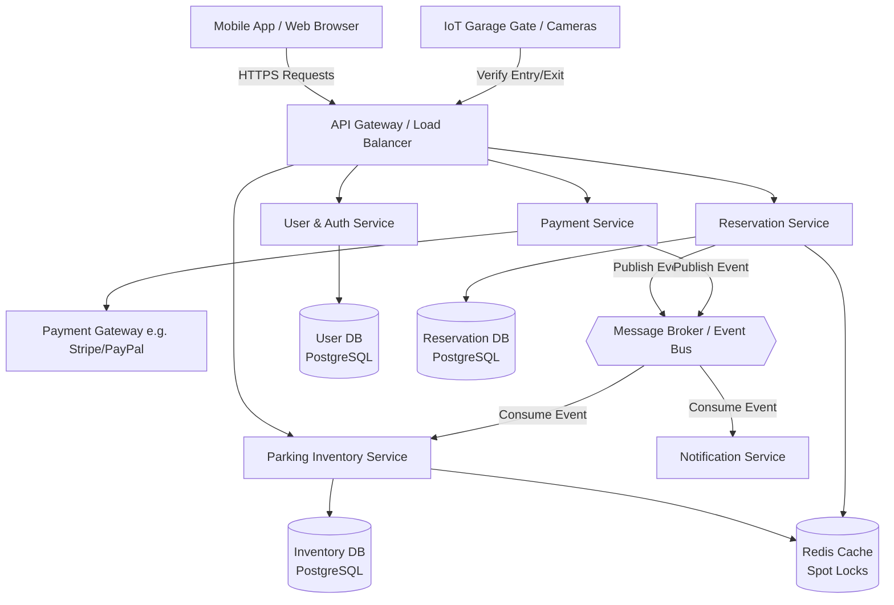

# Smart Parking: Cloud-Agnostic Reservation and Payment Architecture

## 1. Architecture Overview
This architecture provides a scalable, cloud-agnostic system for a parking garage where users can find available spots, reserve them in advance, and pay securely. 

To ensure the system is easy to maintain and can grow without breaking, we are using a **Microservices Architecture**. Instead of building one massive application (a monolith), we split the system into small, independent pieces (services) that each handle a specific job, like handling users, managing parking spots, or processing payments. This means if the payment service needs an update, it won't take the whole reservation system offline. We use standard, open-source technologies so this solution can run on any major cloud provider (AWS, Google Cloud, or Azure) or even in a private data center.

## 2. Architecture Diagram

```mermaid
graph TD
    %% External Interfaces
    Client[Mobile App / Web Browser]
    Gate[IoT Garage Gate / Cameras]
    Stripe[Payment Gateway e.g. Stripe/PayPal]
    
    %% API Gateway
    Gateway[API Gateway / Load Balancer]
    
    %% Microservices
    UserSvc[User & Auth Service]
    InventorySvc[Parking Inventory Service]
    ReservationSvc[Reservation Service]
    PaymentSvc[Payment Service]
    NotificationSvc[Notification Service]
    
    %% Event Bus
    Kafka{{Message Broker / Event Bus}}
    
    %% Databases
    UserDB[(User DB\nPostgreSQL)]
    InventoryDB[(Inventory DB\nPostgreSQL)]
    RedisCache[(Redis Cache\nSpot Locks)]
    ReservationDB[(Reservation DB\nPostgreSQL)]
    
    %% Connections - Flow
    Client -->|HTTPS Requests| Gateway
    Gate -->|Verify Entry/Exit| Gateway
    
    Gateway --> UserSvc
    Gateway --> InventorySvc
    Gateway --> ReservationSvc
    Gateway --> PaymentSvc
    
    UserSvc --> UserDB
    
    InventorySvc --> InventoryDB
    InventorySvc --> RedisCache
    
    ReservationSvc --> ReservationDB
    ReservationSvc --> RedisCache
    ReservationSvc -->|Publish Event| Kafka
    
    PaymentSvc --> Stripe
    PaymentSvc -->|Publish Event| Kafka
    
    Kafka -->|Consume Event| NotificationSvc
    Kafka -->|Consume Event| InventorySvc
```

## 3. End-to-End System Flow
Here is how data moves through the system when a user books a parking spot:

1. **Search and Discovery:** The user opens the app to find a spot. The app talks to the **API Gateway**, which routes the request to the **Inventory Service**. To make this lightning-fast, the Inventory Service checks a fast-memory cache (Redis) rather than digging through the main database every single time.
2. **Locking a Spot (Temporary Hold):** When the user selects a spot, the **Reservation Service** places a temporary 5-minute "lock" on it using the Cache. This prevents the frustrating experience of two people trying to book the exact same spot at the same time.
3. **Payment Processing:** The user enters their credit card details. The **Payment Service** securely forwards this to an external provider (like Stripe). We never store raw credit card numbers on our own servers for security reasons.
4. **Confirmation & Event Trigger:** Once the payment clears, the Payment Service announces a "Payment Successful" message to the **Message Broker** (the central post office of our system). 
5. **Asynchronous Actions:** 
   - The **Reservation Service** hears this message and permanently saves the booking in the database.
   - The **Notification Service** hears it and sends an email/SMS receipt to the user.
   - The **Inventory Service** updates the main database so that the spot is officially marked as taken.
6. **Garage Entry:** When the user arrives at the garage, they scan a QR code (or a camera reads their license plate). The physical gate securely pings our API Gateway to verify the reservation, and if valid, the gate opens.

## 4. Well-Architected Framework Analysis

### 4.1 Operational Excellence
* We package every microservice into "Containers" (using Docker). This means developers can test the exact same code on their laptops that will run in production. We also use automated deployment pipelines (CI/CD) so updates can be rolled out smoothly without human error. Centralized logging tools track every action, so if a bug happens, engineers can easily trace the user's steps to fix it quickly.

### 4.2 Security
* Security is applied at multiple layers. All data traveling over the internet is encrypted (HTTPS/TLS). User passwords and accounts are protected by strict authentication protocols. Crucially, by offloading payments to a dedicated provider like Stripe, we bypass the heavy regulatory burden of storing credit cards (PCI-DSS compliance), drastically reducing our security risk.

### 4.3 Reliability
* If the email server goes down, it shouldn't stop people from paying and parking. Because we use a Message Broker, the system will just save the "send email" task and deliver the receipt once the notification service comes back online. Additionally, running multiple copies of each service ensures that if one server crashes, another instantly takes over.

### 4.4 Performance Efficiency
* Parking garages experience "rush hours" (e.g. morning commutes, special events). Our architecture allows us to automatically spin up more servers for the Inventory and Payment services during high-traffic times, and spin them down when it's quiet. Using a high-speed cache (Redis) for spot availability ensures the app feels instant, even when thousands of people are checking for spots.

### 4.5 Cost Optimization
* By making the architecture cloud-agnostic, the business isn't locked into a single vendor's pricing; we can move to whoever offers the best rates. Furthermore, because the system automatically scales down during the night when nobody is booking spots, we don't pay for idle, unused computing power.

### 4.6 Sustainability
* By avoiding a massive, always-on monolithic server, we drastically reduce our carbon footprint. The auto-scaling design ensures we only consume electricity and server resources that perfectly match user demand. We also write our backend services in lightweight, energy-efficient programming languages that require less CPU power to run.

## 5. Technical Glossary
* **Microservices:** Breaking down a large software application into small, independent pieces that talk to each other.
* **API Gateway:** The single "front door" for the system. It takes requests from the mobile app and directs them to the correct backend service.
* **Message Broker (Event Bus):** A middleman that allows different services to communicate asynchronously. It holds onto messages (like "payment complete") until the receiving service is ready to process them.
* **Redis (Cache):** A super-fast, memory-based storage system used to remember temporary data (like locking a parking spot for 5 minutes) so we don't have to wait for a slower traditional database.
* **PostgreSQL:** A highly reliable, traditional relational database used for storing permanent records like user accounts and payment histories.
* **Containers (Docker):** A way to package software so it runs exactly the same way on any computer or cloud server.
* **PCI-DSS Compliance:** The strict security rules a company must follow if they want to handle, store, or process credit card information directly.
