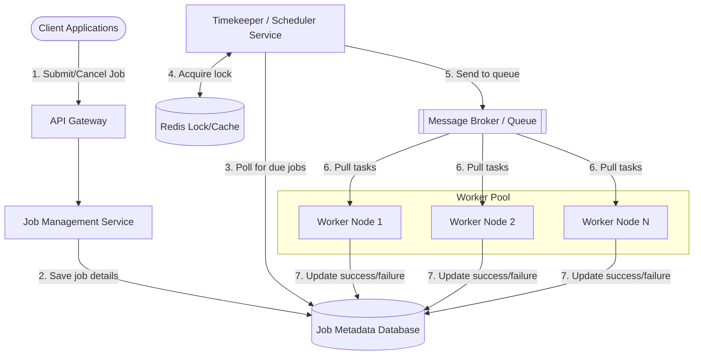

# Distributed Job Scheduling System Architecture

## 1. Architecture Overview
In a modern digital business, you often need to run tasks in the background, like sending a million marketing emails at 8:00 AM, generating nightly financial reports, or processing user-uploaded videos. When a system grows, a single server is no longer powerful enough to handle all these tasks on time. 

This architecture proposes a **Distributed Job Scheduling System**. Think of it as a highly reliable, massive alarm clock connected to an army of workers. It allows users to schedule tasks (jobs) for the future or on a repeating schedule (like every Tuesday). When the time comes, the system reliably wakes up, grabs the task, and hands it off to an available worker machine. We use a cloud-agnostic microservices approach, meaning it separates the "scheduling" logic from the "doing" logic. This prevents bottlenecks, ensures no job is executed twice, and allows the system to scale seamlessly as workload increases.

## 2. Architecture Diagram

## 3. End-to-End System Flow
Here is the step-by-step journey of how a job moves through the system from creation to completion:

1. **Job Submission:** A user or application sends a request to the API Gateway to schedule a task (e.g. "Send a newsletter tomorrow at 9 AM"). 
2. **Storage:** The API passes this to the Job Management Service, which saves the job details, schedule time, and status as "Pending" in the main Database.
3. **Checking the Clock:** The Timekeeper (Scheduler Service) constantly checks the database for jobs that are due to run right now.
4. **Preventing Duplicates:** Because we have multiple Timekeepers running (so the system doesn't break if one crashes), they use a fast memory cache (Redis) as a "lock." The first Timekeeper to see the job locks it, ensuring another Timekeeper doesn't accidentally trigger the exact same job twice.
5. **Queueing:** The Timekeeper grabs the due job and places it into a Message Broker (a digital waiting line or queue). 
6. **Execution:** Worker Nodes (our army of task doers) are always listening to the queue. As soon as a job appears, an idle worker pulls it off the line and executes the actual work (e.g. sending the email).
7. **Reporting Back:** Once the worker finishes, it updates the database to mark the job as "Completed" (or "Failed" if something went wrong, prompting a retry).

## 4. Well-Architected Framework Analysis

* **4.1 Operational Excellence:** 
  We separate the application into independent pieces (API, Scheduler, Workers). This makes it incredibly easy to update one part without breaking the others. Centralized logging records every job's lifecycle, so if a task fails, developers can immediately trace exactly where and why it broke.
* **4.2 Security:** 
  Clients must authenticate via the API Gateway before scheduling tasks. The worker nodes are placed in a private network (VPC) with no direct internet access, preventing outside attackers from tampering with the machines doing the heavy lifting.
* **4.3 Reliability:** 
  If a worker crashes while processing a job, the Message Broker notices the worker disappeared and safely puts the job back in the queue for another worker to pick up. We also use a "Dead Letter Queue" to capture tasks that repeatedly fail, preventing them from clogging up the system.
* **4.4 Performance Efficiency:** 
  By decoupling the *scheduling* from the *execution*, we avoid bottlenecks. If millions of jobs are due at the exact same minute, the Message Broker safely holds them in line. We can automatically spin up hundreds of new Worker Nodes to drain the queue quickly, and then turn them off when the queue is empty.
* **4.5 Cost Optimization:** 
  We use auto-scaling for the Worker Pool. You only pay for maximum computing power during peak times (like the end of the month or a morning rush). During quiet hours, the system shrinks down to a bare minimum, keeping cloud bills low.
* **4.6 Sustainability:** 
  By automatically scaling down unused worker nodes and using a highly efficient queueing mechanism rather than having servers constantly pinging each other, we drastically reduce our wasted compute cycles and overall carbon footprint.

## 5. Technical Glossary
* **API Gateway:** A digital "front door" that receives all incoming requests from users, checks their tickets (authentication), and routes them to the right room.
* **Message Broker / Queue:** A system (like RabbitMQ or Apache Kafka) that safely holds messages or tasks in a line until a system is ready to process them, ensuring nothing gets lost in transit.
* **Worker Node:** A server or container whose sole purpose is to receive instructions and do the heavy lifting (the actual processing of the job).
* **Distributed Lock:** A technique used when multiple computers are working together, ensuring that only *one* computer is allowed to interact with a specific piece of data at a time to prevent duplicate actions.
* **Redis:** An extremely fast, in-memory data store. We use it here as a scratchpad to manage our distributed locks.
* **Dead Letter Queue (DLQ):** A special holding area for tasks that have failed multiple times. It sets them aside so humans or developers can investigate why they are broken without slowing down the rest of the healthy tasks.
* **Auto-scaling:** A cloud computing feature that automatically adds or removes servers based on how much work currently needs to be done.
