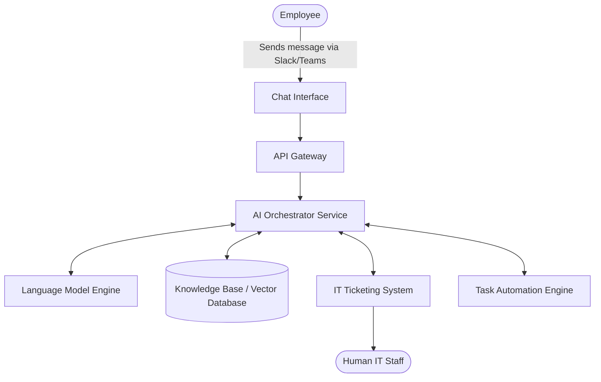

## AI-Powered IT Service Desk Assistant Architecture

## 1. Architecture Overview
This architecture designs an AI-driven helper to sit on the front lines of your IT service desk. The goal is to immediately answer common employee questions (like "How do I connect to the VPN?") and automate simple, repetitive tasks (like password resets) without human involvement. We use a cloud-agnostic microservices approach, meaning the system is broken down into small, independent parts. We chose this design because it prevents vendor lock-in (you can run it on any cloud) and ensures that if the AI goes down for maintenance, your standard IT ticketing system stays online and unaffected. 

## 2. Architecture Diagram

## 3. End-to-End System Flow
1. **The Request:** An employee types a question into their daily chat tool (like Slack or Microsoft Teams), such as "I need access to the design software."
2. **The Front Door:** The message passes through the API Gateway, which acts like a security guard ensuring the request is coming from a verified employee.
3. **The Brain (Orchestrator):** The AI Orchestrator receives the message. It immediately searches the Knowledge Base (your company's internal wikis and past resolved tickets) to find the exact rules for granting software access.
4. **The Decision:** The Orchestrator sends the employee's request and the company rules to the Language Model (LLM). The LLM reads the context and decides what to do next.
5. **The Action:** 
   - If it's a simple, approved task, the Orchestrator tells the Automation Engine to grant the software access automatically. 
   - If the request is complex or the user seems frustrated, the Orchestrator automatically opens a ticket in the IT Ticketing System (like Jira or ServiceNow) and alerts a human IT staff member.
6. **The Reply:** The AI replies to the employee in the chat tool in natural, friendly plain English, letting them know the software is ready or that a human is looking into it.

## 4. Well-Architected Framework Analysis

* **4.1 Operational Excellence:** By separating the AI brain from the chat interface and ticketing tools, IT teams can update the AI's instructions or swap out the language model without taking the whole support desk offline.
* **4.2 Security:** The AI never has direct access to sensitive company databases. It only interacts with the Knowledge Base and Automation Engine through strict, limited permissions (the principle of least privilege).
* **4.3 Reliability:** The system is highly resilient. If the AI service crashes, the API Gateway is designed to automatically route user messages directly to the traditional IT ticketing system, ensuring employees can always get help.
* **4.4 Performance Efficiency:** By using a Vector Database, the system can search through thousands of company documents in milliseconds, providing the AI with the exact context it needs to reply instantly.
* **4.5 Cost Optimization:** Because this architecture uses containerized microservices, it can automatically scale up during the morning rush when everyone logs in and forgets their passwords, and scale down to almost zero cost overnight.
* **4.6 Sustainability:** Automating 40% to 50% of routine tickets reduces the overall computing time spent by human agents navigating multiple heavy IT portals. We also use targeted, efficient language models rather than overly massive ones, reducing energy consumption per query.

## 5. Technical Glossary
* **API Gateway:** A digital front door that manages, secures, and routes incoming data traffic to the right place.
* **Microservices:** A way of building software where the application is split into small, independent pieces that talk to each other, rather than one giant, tangled program.
* **AI Orchestrator:** The central traffic cop of the AI system. It doesn't generate the text itself, but it manages the steps of fetching data, asking the AI model for an answer, and triggering actions.
* **Language Model (LLM):** The core AI engine (like OpenAI's GPT or open-source alternatives) that understands human text and generates natural-sounding responses.
* **Vector Database:** A specialized database that stores text as mathematical numbers, making it incredibly fast for an AI to search for "concepts" rather than just exact keyword matches.
* **ITSM (IT Service Management):** The software your company uses to track internal tech issues and requests (e.g., ServiceNow, Jira Service Desk).
