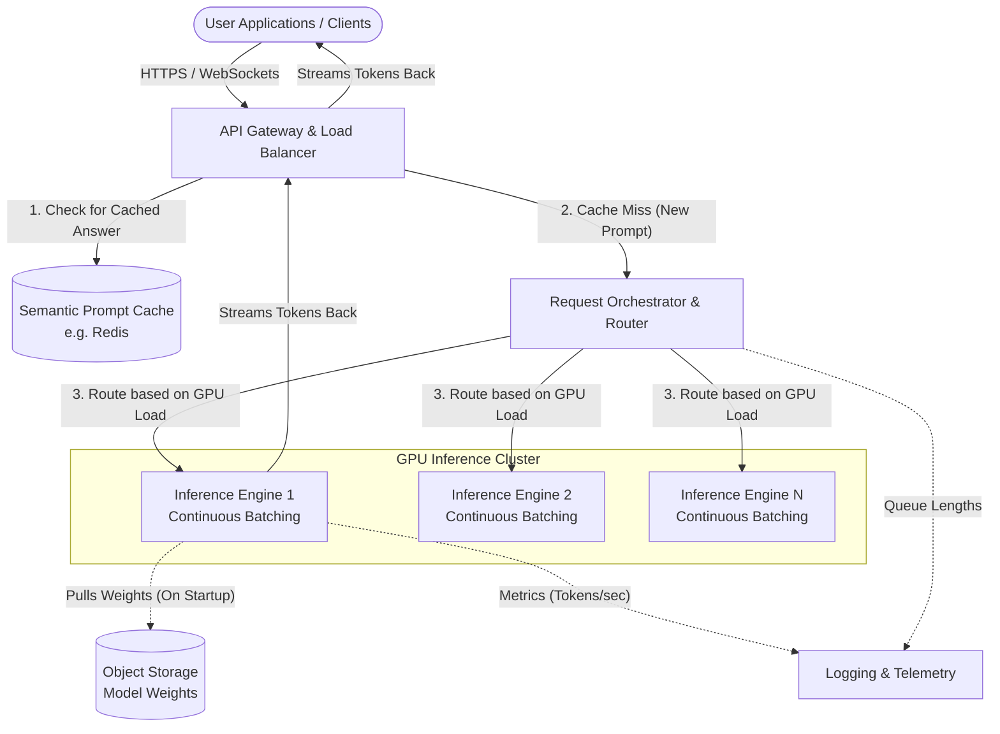

# High-Performance LLM Inference API Architecture

## 1. Architecture Overview
Serving Large Language Models (LLMs) is incredibly demanding on computer hardware, specifically on expensive GPUs (Graphics Processing Units). If a system processes one user's question at a time, the GPU sits idle while waiting for the next word to be generated. 

To solve this, this architecture provides a highly efficient API designed to orchestrate and batch multiple user requests together. By using a cloud-agnostic microservices approach, the system sits in front of specialized "Inference Workers." These workers use a technique called "Continuous Batching" to group different users' requests together in real-time, maximizing GPU usage. We also include a caching layer so that if two users ask the exact same question, the system instantly returns the saved answer instead of doing the heavy lifting twice. 

## 2. Architecture Diagram

## 3. End-to-End System Flow
Here is how a user's request travels through the system from start to finish:

1. **Request Arrival:** A user sends a prompt (e.g. "Write a poem about space") to our system. The **API Gateway** receives it, verifies the user's access, and checks if they are sending too many requests too fast (rate limiting).
2. **Checking the Memory (Cache):** Before doing any heavy computation, the Gateway checks the **Prompt Cache**. If someone else recently asked for a poem about space, the system instantly sends back the saved poem. This saves time and money.
3. **Smart Routing:** If the prompt is new, it goes to the **Request Orchestrator**. The Orchestrator looks at all the available GPU Inference Workers. It acts like a traffic cop, sending the request to the worker that is currently the least busy.
4. **Continuous Batching (The Heavy Lifting):** The chosen Inference Worker receives the prompt. Instead of making this request wait in line until older requests are completely finished, the worker's engine uses *Continuous Batching*. It sneaks the new request into the GPU alongside existing requests, generating words (tokens) for multiple users at the exact same time.
5. **Streaming the Response:** As the GPU generates the answer word-by-word, the worker streams these words back through the Gateway and directly to the user's screen, making the application feel fast and responsive.

## 4. Well-Architected Framework Analysis

### 4.1 Operational Excellence
- **Automated Deployments:** Model weights are stored in cloud object storage and are automatically pulled when a new GPU worker starts up. This makes updating to a newer AI model as simple as updating a file path.
- **Deep Monitoring:** The system constantly tracks specific AI metrics, like "Time to First Token" (how long before the user sees the first word) and "Tokens per Second," so engineers can see exactly how the system is performing.

### 4.2 Security
- **Strict Access Control:** The API Gateway ensures only authenticated users with valid API keys can access the models.
- **Data Privacy:** Because this is a self-hosted architecture (not sending data to a public AI company), customer data stays entirely within your private network, fulfilling strict compliance requirements.

### 4.3 Reliability
- **Health Checks & Retries:** If a GPU worker crashes or runs out of memory, the Orchestrator instantly notices, stops sending it traffic, and safely reroutes the user's request to a healthy worker so the user never sees an error.
- **Multi-Node Deployment:** Workers are spread across different physical servers (or data centers) so a single hardware failure doesn't take the whole API offline.

### 4.4 Performance Efficiency
- **Continuous Batching:** This is the core performance driver. Traditional batching waits for a group of requests to finish completely. Continuous batching injects new requests the millisecond a slot opens up on the GPU, keeping the hardware working at nearly 100% efficiency.
- **Streaming Protocols:** Using WebSockets or Server-Sent Events (SSE) ensures users see the text being typed out in real-time, drastically improving perceived performance.

### 4.5 Cost Optimization
- **Prompt Caching:** Every time the cache serves an answer, you bypass the GPU entirely. This means zero compute cost for repeated questions.
- **Autoscaling:** The Orchestrator monitors traffic. During the night when traffic is low, it shuts down expensive GPU servers. During rush hour, it turns them back on.

### 4.6 Sustainability
- **Maximizing Hardware Efficiency:** By grouping requests tightly together via Continuous Batching, we serve more users with fewer physical servers. Less hardware means lower electricity consumption and a smaller carbon footprint.
- **Scale-to-Zero:** If there are completely idle periods, the architecture can scale the GPU nodes down to zero, consuming no active power until the next request arrives.

## 5. Technical Glossary
- **LLM (Large Language Model):** A complex artificial intelligence program (like GPT or LLaMA) designed to understand and generate human-like text.
- **GPU (Graphics Processing Unit):** Highly specialized computer chips that are exceptionally good at doing the math required for AI to generate text quickly. 
- **Inference:** The actual act of an AI model running and generating an answer based on a prompt. (Contrasted with "training", which is teaching the model).
- **Continuous Batching:** A smart scheduling technique that groups different users' prompts together inside the GPU word-by-word, rather than making users wait in a traditional line.
- **Token:** A piece of a word. LLMs read and write in tokens. (e.g. the word "hamburger" might be split into "ham", "bur", and "ger").
- **API Gateway:** The front door of a software system that manages all incoming traffic, checks security, and passes requests to the right place inside the house.
- **Semantic Prompt Cache:** A fast storage database that remembers previous questions and answers. "Semantic" means it can recognize that "How big is the moon?" and "What is the size of the moon?" are asking the same thing.
