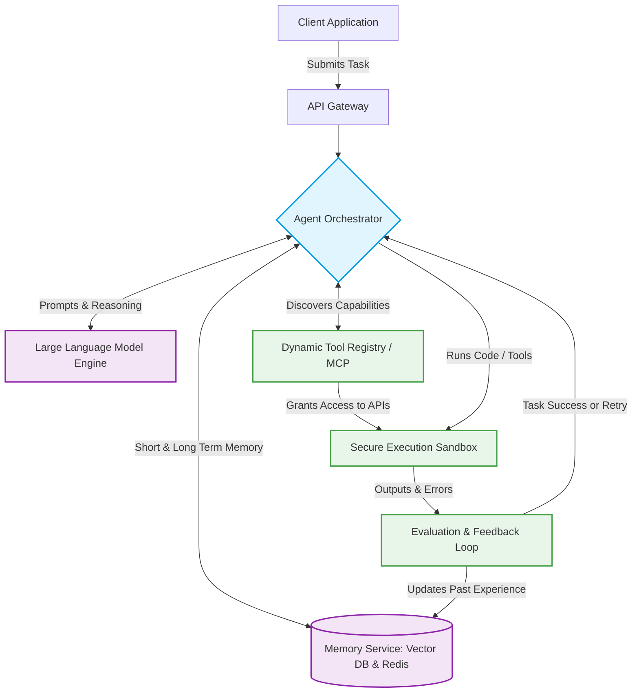

# Autonomous Agentic AI System Architecture

## 1. Architecture Overview
Traditional AI systems are built to answer questions or perform very specific, hard-coded tasks. An Autonomous Agentic AI System is different: it acts like a digital worker that can figure out how to solve new, unknown problems on its own. 

When given a new task, this system breaks the problem down into steps, searches a library of available tools to find what it needs, writes the necessary steps to use those tools, and tests its solution. If it fails, it learns from the mistake and tries again. By using a standardized system to discover new tools (like the Model Context Protocol) and a memory database to remember past successes, the system can continuously adapt to new requirements without needing a human to rewrite its code. 

## 2. Architecture Diagram

## 3. End-to-End System Flow
Here is exactly how the system handles a brand-new task from start to finish:

1. **Receive the Request:** A user submits a broad request (e.g. "Find the latest sales data, format it into a chart, and email it to the team") through the **API Gateway**.
2. **Plan and Reason:** The **Agent Orchestrator** sends the request to the **LLM Engine**. The AI breaks the big goal down into smaller, actionable steps: 1) Get data, 2) Make chart, 3) Send email. It checks the **Memory Service** to see if it has solved a similar problem before.
3. **Discover Tools:** For each step, the Orchestrator checks the **Dynamic Tool Registry**. This registry tells the AI exactly what tools (like a database query tool or an email API) are currently available and how to use them.
4. **Execute Safely:** The AI writes the commands to use these tools and runs them inside a **Secure Execution Sandbox**. This isolated environment ensures that if the AI makes a mistake or writes bad code, it cannot crash the main system or access unauthorized data.
5. **Evaluate and Learn:** The **Evaluation & Feedback Loop** looks at the result. If the email API throws an error because a field was missing, it tells the Orchestrator to try again. If the task succeeds, the exact steps taken are saved back into the **Memory Service** so the AI knows exactly how to do it faster next time.

## 4. Well-Architected Framework Analysis

### 4.1 Operational Excellence
* **Standardized Tooling:** By using standardized protocols to plug in new tools, developers can add new capabilities to the AI without changing the core orchestrator code.
* **Decision Traceability:** Every step the AI plans, tries, and fails is logged. This makes it easy for engineers to debug exactly *why* the AI made a certain decision.

### 4.2 Security
* **Sandboxing:** Because the AI can write and execute code to solve new problems, all execution happens in temporary, isolated containers. This prevents malicious code or accidental infinite loops from harming the broader network.
* **Least Privilege:** The AI does not have open access to everything. It must request access to specific tools through the registry, which enforces strict identity and access rules.

### 4.3 Reliability
* **Self-Healing via Retry Logic:** If a tool fails or an API format changes, the evaluation loop automatically prompts the LLM to read the error message and rewrite its request.
* **Model Fallbacks:** If the primary, complex LLM goes down, the system automatically routes tasks to a secondary, slightly smaller backup model to ensure continuous uptime.

### 4.4 Performance Efficiency
* **Semantic Caching:** Before asking the heavy, slow LLM to think about a problem, the system checks the Memory Service. If someone asked the exact same question an hour ago, it instantly returns the cached answer.
* **Horizontal Scaling:** The execution sandboxes can scale in and out dynamically. If the AI decides to run 50 data-gathering tasks in parallel, the cloud spins up 50 tiny containers instantly.

### 4.5 Cost Optimization
* **Model Routing:** Not every task requires a massive, expensive AI model. The system uses a cheaper, smaller model to do simple tasks (like routing or simple formatting) and only wakes up the expensive model for heavy logical reasoning.
* **Ephemeral Infrastructure:** The execution sandboxes only exist for the few seconds they are running code, meaning you never pay for idle computing power.

### 4.6 Sustainability
* **Shared Context:** By pulling past experiences from the Vector Database, the AI requires fewer attempts (and therefore less compute energy) to arrive at the correct solution.
* **Resource Scaling:** Scaling infrastructure down to zero when the agent is idle significantly reduces the physical carbon footprint of the underlying data center.

## 5. Technical Glossary
* **Agentic AI:** An AI system designed to act independently to achieve a goal, rather than just passively generating text in a chat window.
* **Orchestrator:** The "manager" software component that routes information between the AI, the databases, and the execution tools. 
* **Dynamic Tool Registry / MCP (Model Context Protocol):** A standard way to connect AI models to external tools and data sources. It allows the AI to "discover" what tools it can use on the fly.
* **Vector Database:** A specialized type of database that stores information in a way that AI can easily search based on "meaning" rather than exact keyword matches. Used as the AI's long-term memory.
* **Secure Sandbox Container:** A tiny, isolated virtual computer that spins up to run a specific piece of code safely, and then destroys itself immediately after.
* **LLM (Large Language Model):** The underlying artificial intelligence (like GPT or Claude) that provides the actual reasoning, reading, and writing capabilities.
