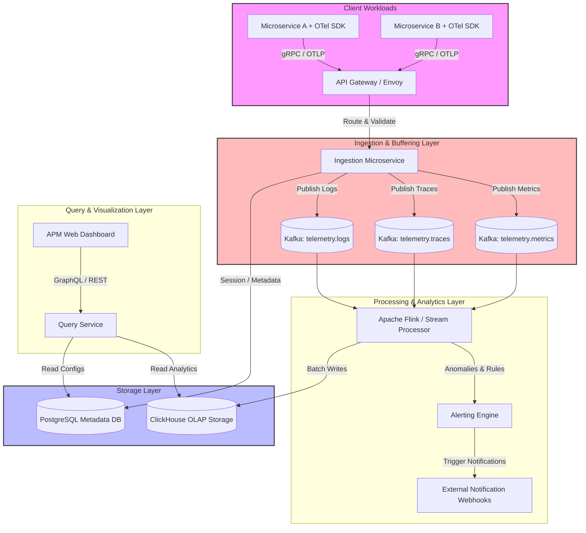

# Application Performance Monitoring (APM) System Architecture

## 1. Architecture Overview

This production-ready, cloud-agnostic Application Performance Monitoring (APM) system is designed to ingest, process, store, and visualize the three core pillars of observability at scale: **Metrics, Logs, and Traces**. 

The architecture follows a microservices pattern optimized for high-throughput, low-latency ingestion, and decoupling of write and read paths (CQRS pattern). Telemetry data is collected via standard OpenTelemetry (OTel) agents embedded within client workloads. This data is transmitted securely to an Ingestion Gateway, buffered using a distributed message queue (Apache Kafka) to prevent system overload during traffic spikes, and processed via a stream-processing tier (Apache Flink). 

Storage is tier-optimized using ClickHouse for ultra-efficient, columnar processing of large-scale time-series and tracing data, alongside PostgreSQL for relational metadata storage.

---

## 2. Architecture Diagram

---

## 3. Well-Architected Framework Analysis

### Operational Excellence
* **Standardized Instrumentation:** By mandating OpenTelemetry (OTel), the system avoids vendor lock-in and provides a unified specification for collecting logs, metrics, and traces across various runtimes.
* **Continuous Observability (Self-Monitoring):** The APM system monitors itself using a secondary deployment tier. System performance anomalies within the processing engine (Apache Flink) or ingestion delays (Kafka lag) automatically trigger alerts.
* **Automated Runbooks:** The Alerting Engine ties specific event signatures to automated webhook actions, allowing auto-remediation (e.g. scaling consumer groups when Kafka lag spikes past operational limits).

### Security
* **Data Transport and Edge Protection:** Mutual TLS (mTLS) is enforced from the OTel SDK to the Envoy API Gateway, ensuring encryption in transit and cryptographic identity verification.
* **Identity and Access Management (IAM):** Role-Based Access Control (RBAC) governs data visibility. Fine-grained security filters mask or drop Sensitive Personal Information (SPI) and Personally Identifiable Information (PII) at the Ingestion Service level before passing data to Kafka.
* **Data Sanitization and Rate Limiting:** The API Gateway deploys token-bucket rate limiting per tenant ID to protect against Denial of Service (DoS) flows from malfunctioning or malicious clients.

### Reliability
* **Fault Isolation via Buffering:** Utilizing Apache Kafka as a persistent commit log guarantees that even if downstream processing or storage clusters experience an outage, data remains safely buffered for up to 7 days without data loss.
* **High Availability Configuration:** Every microservice layer is stateless and distributed across multiple availability zones. Databases use distributed replication copies (ClickHouse clusters with ZooKeeper/Keeper coordination) to guarantee zero single points of failure.
* **Graceful Degradation & Dynamic Sampling:** Under extreme load, the Ingestion Service dynamically adapts its adaptive sampling algorithms, reducing tracing precision (e.g. dropping 90% of HTTP 200 OK spans) while preserving 100% of error spans and critical operational metrics.

### Performance Efficiency
* **Write and Read Path Decoupling (CQRS):** The write path (Ingestion -> Kafka -> Flink -> ClickHouse) is fully optimized for continuous, high-volume append streaming. The read path (UI -> Query Service -> ClickHouse) targets complex analytical operations, ensuring heavy dashboard loads do not interfere with system ingestion throughput.
* **Columnar Datastore Selection:** ClickHouse is utilized because columnar databases radically outperform row-oriented engines for analytical aggregation functions (e.g. calculating the 99th percentile response latency over billions of rows).
* **Batch Ingestion Realities:** Microservices do not execute single-row inserts. Stream processors accumulate metrics and trace structures to write to ClickHouse in highly tuned batch blocks (e.g. 10,000+ rows per write), drastically cutting disk I/O overhead.

### Cost Optimization
* **Data Lifecycle Management & Tiered Storage:** Storage costs are optimized using tiered management. Hot data (past 7 days) resides on high-performance NVMe drives. Warm data (8 to 30 days) migrates to standard SSDs, and cold archival data (31 to 90+ days) is serialized into highly compressed Parquet files stored on cost-efficient object storage.
* **Aggressive Sampling Techniques:** Head-based and tail-based sampling significantly reduce network and storage costs by filtering out non-actionable, repetitive telemetry data close to the source.
* **Resource Elasticity:** Microservice consumer groups run on autoscaling clusters configured to scale down automatically during off-peak traffic hours when application workloads produce fewer telemetry inputs.

### Sustainability
* **Compute Footprint Minimization:** Selecting high-efficiency system runtimes (such as Go or Rust) for the Ingestion and Query microservices minimizes idle CPU utilization and lowers overall data center power consumption compared to resource-heavy runtimes.
* **Optimized Hardware Architecture:** Deploying infrastructure on ARM64-based container nodes yields up to a 40% improvement in performance-per-watt ratios compared to traditional x86 computer architectures.
* **Efficient Serialization Formats:** Telemetry is transmitted using Protocol Buffers (Protobuf) via gRPC, significantly shrinking network payload sizes and reducing total data center networking power requirements.

---

## 4. Technical Glossary

* **APM (Application Performance Monitoring):** A system designed to track, analyze, and manage the availability and performance of software applications.
* **OpenTelemetry (OTel):** A vendor-agnostic, open-source observability framework providing standardized APIs, SDKs, and tooling to generate and export telemetry data.
* **Telemetry:** The collection of data generated by systems, categorized into the three pillars: Metrics (numerical status values), Logs (structured text events), and Traces (end-to-end request path records).
* **gRPC / OTLP:** gRPC is a high-performance Remote Procedure Call framework. OTLP (OpenTelemetry Protocol) is the native delivery specification used to stream collected metrics, logs, and traces over HTTP/2 or gRPC connections.
* **CQRS (Command Query Responsibility Segregation):** An architectural pattern that separates the data mutation models (writes) from the data read models (queries) to maximize performance and scalability.
* **Apache Kafka:** A distributed, partitioned, and replicated commit-log messaging platform used here as a durable buffer between data ingestion and backend stream processing.
* **Apache Flink:** A distributed stream-processing engine designed for real-time computations over stateful event data streams.
* **OLAP (Online Analytical Processing):** A category of database technologies optimized for high-speed, complex analytical queries on massive data volumes.
* **ClickHouse:** An open-source, high-performance columnar OLAP database management system built explicitly for ultra-fast analytical reporting and time-series aggregations.
* **Adaptive Sampling:** A methodology where data-collection systems dynamically alter the percentage of captured transactions based on execution success state, system traffic spikes, or anomaly status.
* **mTLS (Mutual TLS):** A security process where both the client and server validate each other's cryptographic X.509 certificates before establishing a secure, encrypted network connection.
