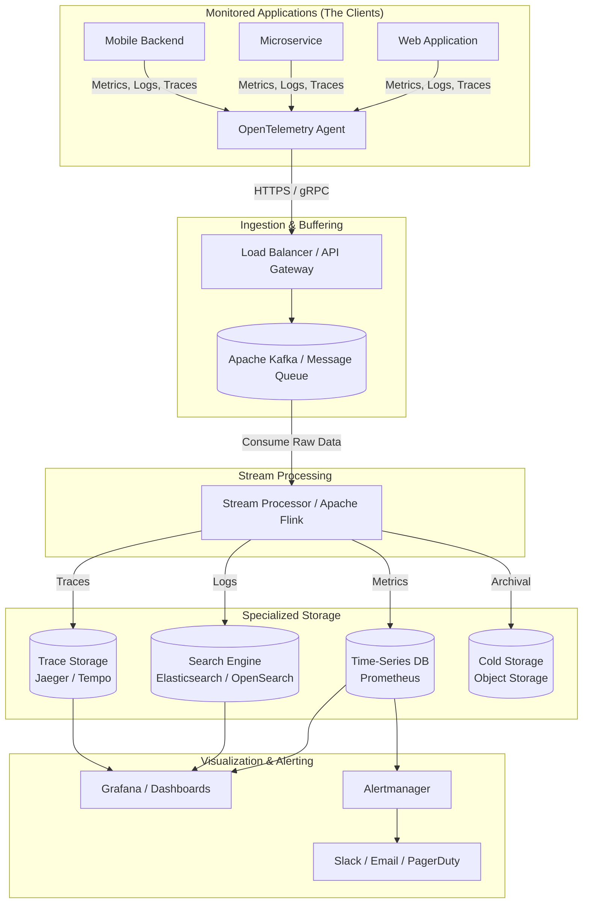

# Enterprise Application Performance Monitoring (APM) System

## 1. Architecture Overview
This Application Performance Monitoring (APM) system acts as the "nervous system" for your software environment. Its primary goal is to collect health and performance data, specifically metrics, logs, and traces, from all your running applications. By centralizing this data, engineering teams can see exactly what is happening in real-time, diagnose bugs faster, and prevent minor issues from turning into full system outages. 

We are using a **cloud-agnostic microservices architecture**. This means the system can be deployed on AWS, Google Cloud, Azure, or your own private data centers without changing the core design. We separate the tasks of collecting, buffering, analyzing, and storing data so that the monitoring system itself remains fast and reliable, even when dealing with massive spikes in traffic.

## 2. Architecture Diagram

```mermaid
flowchart TD
    %% Define External Monitored Apps
    subgraph Monitored_Environment ["Monitored Applications (The Clients)"]
        App1[Web Application] -->|Metrics, Logs, Traces| OT[OpenTelemetry Agent]
        App2[Microservice] -->|Metrics, Logs, Traces| OT
        App3[Mobile Backend] -->|Metrics, Logs, Traces| OT
    end

    %% Ingestion Layer
    subgraph Ingestion_Layer ["Ingestion & Buffering"]
        LB[Load Balancer / API Gateway]
        MQ[(Apache Kafka / Message Queue)]
        
        OT -->|HTTPS / gRPC| LB
        LB --> MQ
    end

    %% Processing Layer
    subgraph Processing_Layer ["Stream Processing"]
        SP[Stream Processor / Apache Flink]
        MQ -->|Consume Raw Data| SP
    end

    %% Storage Layer
    subgraph Storage_Layer ["Specialized Storage"]
        TSDB[(Time-Series DB\nPrometheus)]
        Search[(Search Engine\nElasticsearch / OpenSearch)]
        TraceDB[(Trace Storage\nJaeger / Tempo)]
        Cold[(Cold Storage\nObject Storage)]
        
        SP -->|Metrics| TSDB
        SP -->|Logs| Search
        SP -->|Traces| TraceDB
        SP -->|Archival| Cold
    end

    %% Visualization & Alerting
    subgraph Presentation_Layer ["Visualization & Alerting"]
        UI[Grafana / Dashboards]
        Alert[Alertmanager]
        Notify[Slack / Email / PagerDuty]
        
        TSDB --> UI
        Search --> UI
        TraceDB --> UI
        
        TSDB --> Alert
        Alert --> Notify
    end
```

## 3. End-to-End System Flow
Here is the step-by-step journey of how data moves from your applications to your engineers' screens:

1. **Collection (The Agents):** We install a lightweight tool called an OpenTelemetry Agent on your application servers. This agent quietly observes the application, collecting metrics (like CPU usage), logs (error messages), and traces (the exact path a user's request took through your code).
2. **Ingestion & Buffering:** The agent sends this data to a Load Balancer, which acts as the front door. The data is immediately dropped into a high-speed message queue (Apache Kafka). *Why?* If your applications suddenly generate a massive spike in errors, Kafka safely holds onto this data so our monitoring system doesn't get overwhelmed and crash.
3. **Processing:** A Stream Processor pulls data from the queue in real-time. It cleans the data, formats it, and separates it into three distinct buckets: metrics, logs, and traces. 
4. **Specialized Storage:** The data is routed to the database best suited for its type:
   * **Metrics** go to a Time-Series Database (like Prometheus) which is incredibly fast at storing numbers over time.
   * **Logs** go to a Search Engine (like Elasticsearch) so engineers can type in keywords and find errors instantly.
   * **Traces** go to a Trace Database (like Jaeger) to visualize request timelines.
5. **Visualization & Alerting:** Finally, tools like Grafana pull data from these databases to create easy-to-read charts and dashboards. Meanwhile, an Alerting service constantly watches the data. If it sees something bad (like CPU usage hitting 99%), it immediately pings the engineering team via Slack or PagerDuty.

## 4. Well-Architected Framework Analysis

* **4.1 Operational Excellence:** We use Infrastructure as Code (Terraform) and container orchestration (Kubernetes) to deploy the monitoring system. This means the entire APM stack can be spun up, updated, or torn down with automated scripts, reducing human error and making maintenance a breeze.
* **4.2 Security:** All data traveling between your apps and the APM system is encrypted using TLS. The API Gateway ensures that only authorized applications with valid API keys can send data. Access to the dashboards is restricted using Role-Based Access Control (RBAC), ensuring junior staff and senior admins have appropriate permissions.
* **4.3 Reliability:** By introducing a message queue (Kafka) in the middle of the architecture, we decouple the data collectors from the databases. If the databases briefly go down for maintenance, Kafka holds onto the monitoring data. Once the databases are back up, the system processes the backlog without losing a single log.
* **4.4 Performance Efficiency:** Using specialized databases for different data types ensures fast search and retrieval. Additionally, the Stream Processor and Message Queue are designed to scale horizontally—meaning if monitoring traffic increases, we simply automatically add more servers to handle the load without redesigning the system.
* **4.5 Cost Optimization:** Monitoring data gets massive very quickly. To save money, we implement automated data lifecycle policies. Recent data (last 14 days) is kept on expensive, fast storage for quick troubleshooting. Older data is automatically compressed and moved to cheap "Cold Object Storage" for compliance and historical analysis.
* **4.6 Sustainability:** By dynamically auto-scaling the processing layer, we ensure we are only using computing power when necessary. Archiving old data to cold storage also reduces the energy footprint required to keep massive arrays of fast hard drives spinning idly.

## 5. Technical Glossary
* **OpenTelemetry:** An open-source standard for collecting monitoring data. We use it so you aren't locked into a specific vendor's proprietary agent.
* **Metrics, Logs, and Traces (The Three Pillars of Observability):** 
  * *Metrics:* Numbers (e.g. "Memory usage is at 80%").
  * *Logs:* Text records (e.g. "User X failed to log in at 2:00 PM").
  * *Traces:* The mapped journey of a request (e.g. "The request hit the web server, then took 2 seconds in the database").
* **Message Queue (Apache Kafka):** A digital shock absorber. It holds onto massive amounts of incoming data temporarily so downstream systems can process it at their own pace.
* **Stream Processing:** Analyzing and modifying data while it is actively moving from one place to another, rather than waiting for it to be saved to a database first.
* **Time-Series Database (TSDB):** A specialized database optimized for measuring how things change over time (like tracking the stock market or server CPU usage minute-by-minute).
