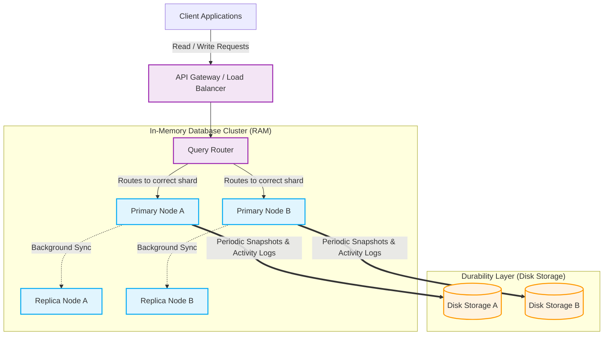

# Distributed In-Memory Database Architecture

## 1. Architecture Overview
An In-Memory Database (IMDB) is a data storage system that relies entirely on a computer's main memory (RAM) instead of traditional, slower disk drives (like SSDs or HDDs) to manage data. The main objective of this architecture is **speed**. By avoiding the slow mechanical or electrical processes of writing to a permanent disk for every single request, an IMDB can read and write data in fractions of a millisecond.

However, RAM is volatile, meaning if the server loses power, the data disappears. To solve this, our architecture combines the ultra-fast performance of RAM with background "saving" mechanisms to traditional disks, ensuring data is both lightning-fast to access and safe from unexpected crashes. This design is highly scalable, cloud-agnostic, and perfect for real-time analytics, user session caching, and high-speed leaderboards.

## 2. Architecture Diagram

## 3. End-to-End System Flow

Here is how data moves through the system when a user wants to save and then retrieve information:

1. **The Request Arrives:** A client application (like a mobile app or website) sends a request to save a user's session data. This request hits the Load Balancer, which acts as a traffic cop.
2. **Routing the Data:** The Load Balancer passes the request to the Query Router. Because a large database is split into smaller, manageable pieces (called shards), the Router figures out exactly which server node (Primary Node A or B) is responsible for holding this specific piece of data.
3. **Lightning-Fast Write (RAM):** The selected Primary Node receives the data and instantly writes it into its RAM. The node immediately tells the client, "Success!" This is why the database is so fast, it doesn't wait for a slow disk drive to finish saving.
4. **Securing the Data (Disk):** Behind the scenes, a fraction of a second later, the Primary Node writes a log of this transaction to a permanent disk (the Durability Layer). This acts like a receipt. If the power goes out, the system can read this receipt to rebuild the RAM exactly as it was.
5. **Backing Up (Replication):** At the same time, the Primary Node copies the new data to a backup server (Replica Node). If the Primary Node ever physically breaks, the Replica instantly steps up to take its place without the user noticing.
6. **Reading the Data:** When the user returns and wants to load their session, the Router sends the request to the correct node. The node fetches the data straight from RAM and sends it back in under a millisecond. 

## 4. Well-Architected Framework Analysis

### 4.1 Operational Excellence
- **What it means:** Making the system easy to run, monitor, and fix.
- **How we do it:** We use automated health checks. If a Primary Node stops responding, the system automatically promotes a Replica Node to take over. We also stream logs and metrics (like how full the RAM is) to a central dashboard so engineers can spot trouble before the system crashes.

### 4.2 Security
- **What it means:** Keeping hackers out and protecting user data.
- **How we do it:** All communication between the client, router, and database nodes is encrypted. We also use strict role-based access control, meaning an application can only read or write the specific data it has a password for, preventing unauthorized snooping.

### 4.3 Reliability
- **What it means:** Ensuring the database never goes offline or loses data.
- **How we do it:** By combining Replicas (hot backups ready to take over instantly) and Disk Durability (saving transaction logs and snapshots to permanent storage), we ensure that hardware failures do not result in lost data or system downtime.

### 4.4 Performance Efficiency
- **What it means:** Handling sudden spikes in traffic smoothly.
- **How we do it:** Because everything happens in RAM, base performance is incredibly high. If the database gets too crowded, we use "sharding", adding more server nodes and spreading the data across them, rather than trying to buy one impossibly large, expensive server.

### 4.5 Cost Optimization
- **What it means:** Getting the best performance without wasting money, since RAM is expensive.
- **How we do it:** We implement an "Eviction Policy." When the RAM gets full, the system automatically deletes the oldest, least-used data (or moves it to cheaper disk storage) to make room for new, important data. This keeps our memory footprint small and affordable.

### 4.6 Sustainability
- **What it means:** Using only the computing power we actually need to reduce our carbon footprint.
- **How we do it:** By rightsizing our database clusters and utilizing auto-scaling, we ensure we aren't powering massive RAM servers when traffic is low (like in the middle of the night). Better code efficiency means less electricity used by processors.

## 5. Technical Glossary

- **RAM (Random Access Memory):** The computer's short-term memory. It is incredibly fast but loses all its information if the computer is turned off.
- **Volatile Storage:** A type of computer memory (like RAM) that requires power to maintain the stored information.
- **Node:** A single computer server that acts as a worker within a larger network of servers.
- **Sharding:** Slicing a massive database into smaller, manageable chunks and spreading them across multiple servers so no single server gets overwhelmed.
- **Primary/Replica (or Active/Standby):** A setup where one server does the main work (Primary) while another server quietly copies everything (Replica) so it can take over if the first one fails.
- **Snapshot:** A complete picture of everything in the database at a specific moment in time, saved to a permanent disk.
- **Eviction Policy:** A set of rules the database follows to decide which old data to throw away when it runs out of memory (e.g. throwing away the data that hasn't been looked at in the longest time).
