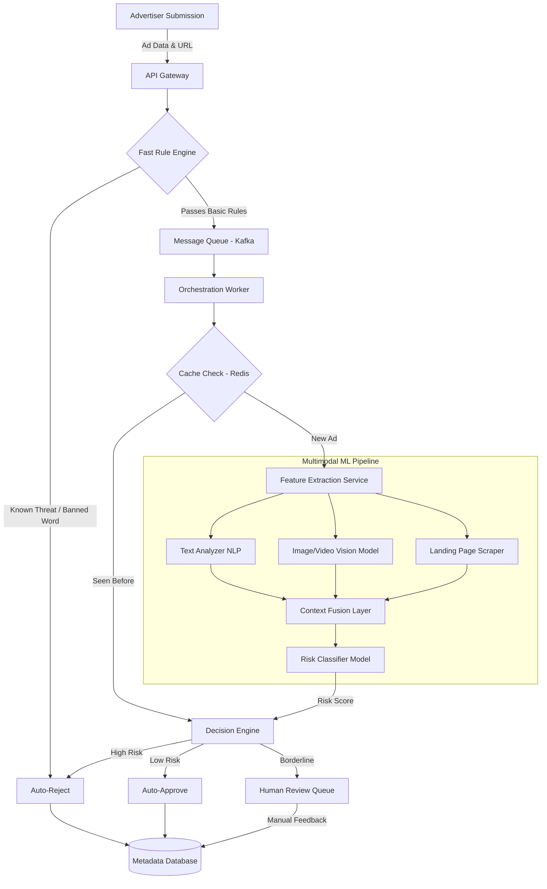

# Multimodal ML Architecture for Forbidden Ad Detection

## 1. Architecture Overview
This solution is an automated machine learning (ML) pipeline designed to review and filter out forbidden advertisements before they reach your users. Bad actors often use sneaky tactics, like combining innocent images with misleading text—to bypass simple keyword filters. 

To combat this, we use a **Multimodal Machine Learning Architecture**. This means the system looks at text, images, and the destination website all at the same time to understand the true context of the ad. We use cloud-agnostic microservices to ensure the system is flexible, scalable, and not tied to one specific cloud provider. By filtering out the obvious violations with fast, cheap rules first, we save our heavy (and expensive) AI processing only for the complex, borderline cases.

## 2. Architecture Diagram

## 3. End-to-End System Flow
1. **Submission & Gateway:** An advertiser uploads their ad. This request passes through an API Gateway, which acts as the front door, ensuring the request is formatted correctly.
2. **Fast Rule Engine:** Before touching any expensive AI, the ad is checked against simple lists (like known banned words or previously flagged image hashes). If it fails here, it is instantly rejected. *Why?* Because checking a simple list is nearly free and instant.
3. **Queuing for Processing:** Ads that pass the basic rules are placed into a Message Queue (like Kafka). *Why?* Processing images and videos takes time. A queue ensures that if thousands of ads are submitted at once, our system doesn't crash; it just works through them at a steady pace.
4. **Cache Check:** The system checks a fast memory cache (like Redis) to see if we've recently analyzed this exact ad. If so, we reuse the previous score to save processing power.
5. **Multimodal Analysis:** The ad is split up. The text goes to a Natural Language Processing (NLP) model, the image/video goes to a Vision model, and a scraper checks the linked website. The "Fusion Layer" combines these insights. *Why?* Because an image of a bat is fine for a sporting goods ad, but bad if paired with text promoting violence. Context matters.
6. **Decision & Feedback:** A final risk score is generated. Extremely high-risk ads are rejected, low-risk are approved, and borderline cases go to human reviewers. The human's final decision is stored in our database to help train and improve the AI models in the future.

## 4. Well-Architected Framework Analysis

### 4.1 Operational Excellence
- **What it means:** Running and updating the system smoothly.
- **How we do it:** We deploy all components as containerized microservices (using Kubernetes). This allows us to update the text-checking AI without having to take the image-checking AI offline.

### 4.2 Security
- **What it means:** Protecting data and preventing system abuse.
- **How we do it:** We don't just trust the ad creative; we actively scrape the destination landing page in a safe, isolated environment (a sandbox). This prevents bad actors from submitting a clean ad that links to a malicious website.

### 4.3 Reliability
- **What it means:** Ensuring the system stays up even if parts break.
- **How we do it:** By using a Message Queue, we decouple the front-end (where advertisers upload) from the back-end (where AI processes). If the AI servers temporarily crash, the advertisers can still upload ads, they just wait safely in the queue until the AI is back online.

### 4.4 Performance Efficiency
- **What it means:** Handling large spikes in traffic.
- **How we do it:** Container orchestration automatically scales up our "Vision Model" servers (which do the heaviest computing) during peak ad-submission hours and scales them back down when traffic is quiet.

### 4.5 Cost Optimization
- **What it means:** Getting the best results without overspending on cloud bills.
- **How we do it:** AI processing requires GPUs, which are very expensive. By using the Fast Rule Engine and Redis caching *before* the ML pipeline, we filter out up to 40% of ads for pennies, reserving expensive GPU time only for new, complex ads.

### 4.6 Sustainability
- **What it means:** Minimizing our environmental impact.
- **How we do it:** Efficient caching means we never process the exact same ad twice. Auto-scaling ensures we aren't burning electricity on idle servers during the middle of the night.

## 5. Technical Glossary
- **Microservices:** Breaking a large application down into small, independent pieces that communicate with each other, rather than one giant block of code.
- **API Gateway:** A management tool that sits between a client and a collection of backend services, acting as a traffic cop.
- **Message Queue (e.g. Kafka):** A digital waiting line for data. It holds onto tasks until a server is ready to process them, preventing overloads.
- **Cache (e.g. Redis):** Ultra-fast, short-term memory for a computer system. Used to store things we look up frequently so we don't have to recalculate them.
- **Multimodal Machine Learning:** An AI system that can understand different types of information (text, images, websites) simultaneously to grasp the full context.
- **Containerization (e.g. Kubernetes):** Packaging software so it runs consistently on any computer or cloud provider, making the system truly cloud-agnostic.
