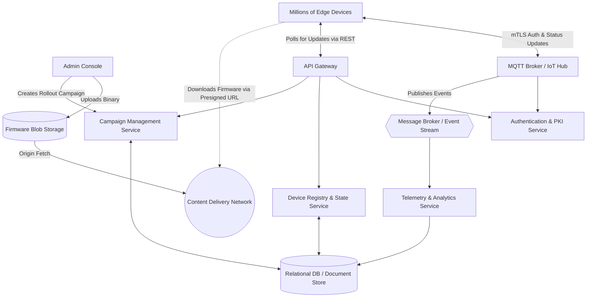

# Over-The-Air (OTA) Software Update System Architecture

## 1. Architecture Overview

This architecture defines a cloud-agnostic, microservices-based Over-The-Air (OTA) software update system designed to handle millions of globally distributed edge devices. The system is decoupled into control-plane and data-plane operations. The control plane manages device states, campaign rollouts (e.g. canary and phased deployments), and security. The data plane utilizes a globally distributed Content Delivery Network (CDN) to offload the heavy lifting of serving large firmware binaries, ensuring high availability and low latency. Communication is secured via Mutual TLS (mTLS), and device telemetry is processed asynchronously through a message broker to track update progress and failures in real time.

## 2. Architecture Diagram

## 3. Well-Architected Framework Analysis

### Operational Excellence
* **Automated Phased Rollouts:** The Campaign Management Service allows for ring-based (canary) deployments, pushing updates to a small percentage of devices before expanding to the entire fleet.
* **Observability:** Device telemetry (success, failure, download speeds) is streamed via the MQTT broker to central analytics, enabling real-time dashboards and automated rollback triggers if failure rates exceed predefined thresholds.
* **CI/CD Integration:** Firmware uploads and campaign creations are exposed via REST APIs, allowing seamless integration with CI/CD pipelines for automated release management.

### Security
* **Device Authentication:** Devices connect using Mutual TLS (mTLS), ensuring that only provisioned devices with valid certificates can request updates.
* **Code Signing:** All firmware binaries are cryptographically signed by the build system. Devices verify the signature against a trusted public key before initiating the installation process.
* **Ephemeral Access:** Devices do not have direct access to the firmware repository. Instead, they receive a short-lived, presigned URL pointing to the CDN, preventing unauthorized scraping or downloading of proprietary software.

### Reliability
* **Multi-Region Redundancy:** Microservices are deployed across multiple availability zones and regions. 
* **Resilient Edge:** By leveraging a CDN for binary distribution, the core infrastructure is protected from the "thundering herd" problem when millions of devices wake up simultaneously to download an update.
* **Idempotency and Retries:** Devices use exponential backoff with jitter for polling and downloading to prevent overwhelming the network. Update operations are idempotent; an interrupted download can be resumed using HTTP range requests.

### Performance Efficiency
* **CDN Offloading:** Distributing massive payloads (often hundreds of megabytes per device) via a CDN ensures low latency downloads at the edge and drastically reduces origin bandwidth.
* **Stateless Microservices:** The control plane services are stateless, allowing them to horizontally scale based on CPU and memory metrics during massive update campaigns.
* **Caching:** Campaign metadata and device group mappings are aggressively cached at the API Gateway layer to minimize database read operations.

### Cost Optimization
* **Tiered Storage:** Older firmware versions are automatically transitioned to cheaper, cold object storage classes to save on storage costs.
* **CDN Economics:** Egress bandwidth through a CDN is significantly cheaper than standard cloud provider egress. Caching reduces origin read requests.
* **Delta Updates:** Instead of sending the full binary, the system computes the diff between the current and new versions. Sending only "delta" updates drastically reduces bandwidth costs and download times.

### Sustainability
* **Energy-Efficient Protocols:** Utilizing lightweight protocols like MQTT for telemetry and state tracking minimizes CPU and radio usage on edge devices, extending battery life.
* **Minimized Payload Sizes:** Delta updates reduce network transmission time, which directly lowers the carbon footprint associated with data transfer across global networks.
* **Auto-Scaling Infrastructure:** Scaling down control plane microservices during non-peak hours (when campaigns are not actively rolling out) minimizes cloud compute energy waste.

## 4. Technical Glossary

* **OTA (Over-The-Air):** The wireless delivery of new software, firmware, or other data to mobile or edge devices.
* **CDN (Content Delivery Network):** A geographically distributed network of proxy servers and their data centers, designed to provide high availability and performance by distributing the service spatially relative to end-users.
* **mTLS (Mutual Transport Layer Security):** A process that establishes an encrypted TLS connection in which both parties (client and server) authenticate each other using digital certificates.
* **Presigned URL:** A URL generated by a cloud storage provider that grants temporary, limited access to a specific object without requiring secondary authentication.
* **MQTT (Message Queuing Telemetry Transport):** A lightweight, publish-subscribe network protocol that transports messages between devices, optimized for high-latency or unreliable networks.
* **Delta Update:** A software update that requires the user to download only the code that has changed, rather than the entire program.
* **Canary Deployment:** A deployment strategy that releases an update to a small subset of users or devices to test functionality and stability before rolling it out to the entire fleet.
* **Code Signing:** The process of digitally signing executables and scripts to confirm the software author and guarantee that the code has not been altered or corrupted since it was signed.
* **Thundering Herd Problem:** A situation where a large number of processes or devices simultaneously request resources or wake up, potentially overwhelming the system.
