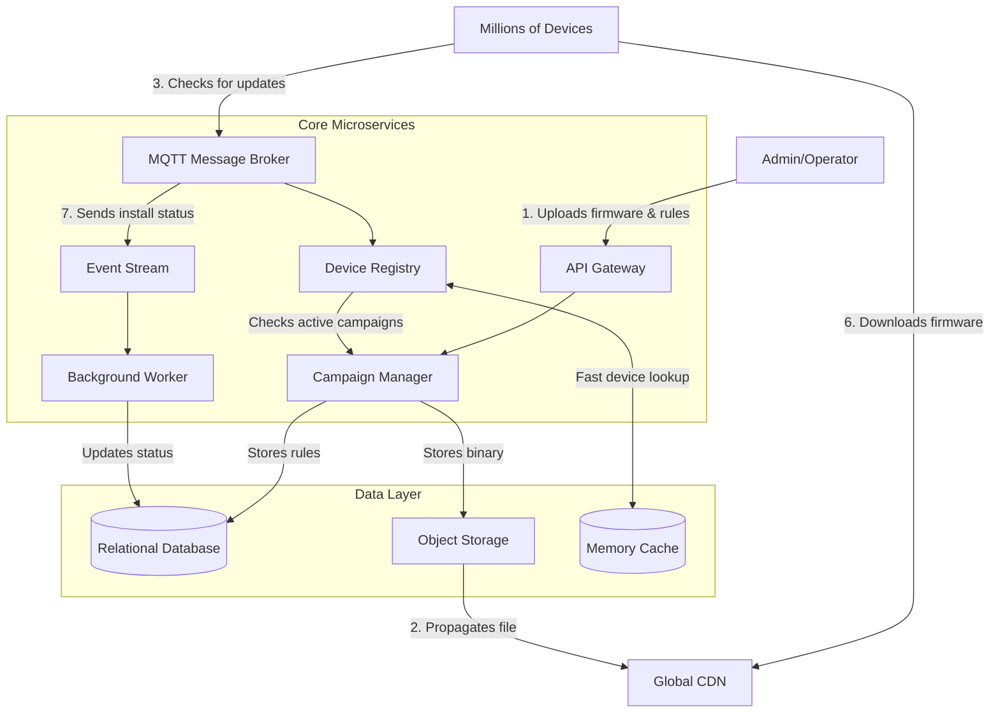

# Over-the-Air (OTA) Software Update Architecture for Mass-Scale Devices

## 1. Architecture Overview
This solution provides a way to safely update millions of connected devices—such as smart thermostats, sensors, or vehicles—over the internet. 

When you send a large software file to millions of devices at once, you risk crashing your servers or instantly breaking your entire fleet if the new software has a bug. To solve this, our design uses **phased rollouts**. This means we update a small percentage of devices first to verify the software is safe before sending it to everyone else. We also use **edge caching**, which places the heavy update files on servers geographically closer to the devices. This keeps downloads fast and prevents our main databases from being overwhelmed. We rely on independent, cloud-agnostic microservices so that if one part of the system fails, the rest keeps running smoothly.

## 2. Architecture Diagram

```mermaid
graph TD
    %% User and Edge interactions
    Admin[Admin/Operator] -->|1. Uploads firmware & rules| API[API Gateway]
    Device[Millions of Devices] -->|3. Checks for updates| MQTT[MQTT Message Broker]
    Device -->|6. Downloads firmware| CDN[Global CDN]
    
    %% Core Services
    subgraph Core Microservices
        API --> Campaign[Campaign Manager]
        MQTT --> Registry[Device Registry]
        Stream[Event Stream] --> Worker[Background Worker]
    end
    
    %% Data Storage
    subgraph Data Layer
        Campaign -->|Stores rules| DB[(Relational Database)]
        Campaign -->|Stores binary| Storage[Object Storage]
        Registry <-->|Fast device lookup| Cache[(Memory Cache)]
        Worker -->|Updates status| DB
    end
    
    %% Internal Routing
    Storage -->|2. Propagates file| CDN
    Registry -->|Checks active campaigns| Campaign
    MQTT -->|7. Sends install status| Stream
```

## 3. End-to-End System Flow
Here is how a software update moves from your engineering team to a device in the real world:

1. **Create the Campaign:** An engineer uploads a new software file and sets the rules (e.g. "Update only Model X devices in Canada"). The system saves the file in secure Object Storage and writes the rules into the Relational Database.
2. **Cache the File:** The large software file is automatically copied to a Content Delivery Network (CDN). We do this so devices download the file from a nearby local server, rather than forcing our main servers to handle millions of massive downloads.
3. **Device Check-In:** Devices wake up and send a tiny message to the MQTT Broker asking if an update is available. We use MQTT because it is lightweight, saves device battery life, and works well even on spotty internet connections.
4. **Eligibility Check:** The Device Registry checks a high-speed Memory Cache to see if the device matches any active update rules. Using a cache instead of a standard database ensures the system can handle thousands of checks per second.
5. **Secure Handoff:** If an update is ready, the system generates a temporary, secure download link (a pre-signed URL) and sends it back to the device.
6. **Download and Install:** The device uses that temporary link to download the file from the nearest CDN location. The device checks a digital signature to prove the file is authentic, then installs it.
7. **Report Status:** After installing, the device tells the MQTT Broker whether it succeeded or failed. This status message is placed onto an Event Stream to be processed in the background. This ensures a sudden flood of "success" messages doesn't crash our database.

## 4. Well-Architected Framework Analysis

### 4.1 Operational Excellence
- **Automated Safety Checks:** Because device status updates flow through a background stream, the system can automatically halt an update campaign if it detects too many "failed install" messages. 
- **Easy Updates:** Using microservices allows developers to update the Campaign Manager without needing to shut down the MQTT broker, ensuring devices can always connect.

### 4.2 Security
- **Temporary Access:** Devices download files using temporary links that expire quickly. This prevents hackers from finding a permanent link and stealing your proprietary software.
- **Digital Signatures:** Every file is cryptographically signed. If a hacker intercepts the download and changes the file, the device will reject it.
- **Strict Authentication:** Devices must use secure certificates to talk to the MQTT broker, ensuring unauthorized devices cannot join the network.

### 4.3 Reliability
- **Traffic Absorption:** The Event Stream acts as a shock absorber. If millions of devices report their status at the exact same time, the stream holds the messages safely in a queue until the database is ready to save them.
- **Blast Radius Containment:** Phased rollouts ensure that if a fatal bug makes it to production, it only impacts a small fraction of devices before the system catches it and stops the rollout.

### 4.4 Performance Efficiency
- **Offloading Heavy Lifting:** By moving the massive file downloads to a global CDN, our core application servers only have to process tiny text messages. 
- **High-Speed Lookups:** Storing device groups in a Memory Cache (like Redis) makes checking for updates extremely fast, preventing bottlenecks when devices wake up.

### 4.5 Cost Optimization
- **Reduced Bandwidth Bills:** Serving large files from a CDN is significantly cheaper than paying for data to leave your primary cloud servers.
- **Scale on Demand:** The Background Workers that process status messages can scale down to zero when no updates are running, ensuring you do not pay for idle servers.

### 4.6 Sustainability
- **Energy Efficient Devices:** The MQTT protocol requires very little computing power. This means the physical devices use less electricity and their batteries last longer.
- **Efficient Cloud Usage:** Because the architecture absorbs traffic spikes gracefully with queues and caches, we do not need to keep massive, power-hungry servers running 24/7 just to wait for peak loads.

## 5. Technical Glossary
- **Microservices:** Building software as a collection of small, independent pieces that talk to each other, rather than one giant, fragile program.
- **MQTT (Message Queuing Telemetry Transport):** A simple, lightweight messaging protocol created specifically for devices with low power and poor internet connections.
- **CDN (Content Delivery Network):** A global network of servers that stores copies of your files. It sends files to users from whichever server is closest to them, making downloads much faster.
- **Object Storage:** A scalable way to store large files (like software binaries or images) safely in the cloud, rather than storing them on a standard hard drive.
- **Event Stream:** A digital conveyor belt (like Apache Kafka) that catches thousands of incoming messages per second and holds them safely in a queue until the system can process them.
- **Pre-signed URL:** A unique web link that grants temporary permission to download a file. Once the time limit expires, the link stops working.
- **Memory Cache:** A tool (like Redis) that stores data in a computer's temporary memory (RAM) so it can be retrieved almost instantly, avoiding the slower process of searching a full database.
