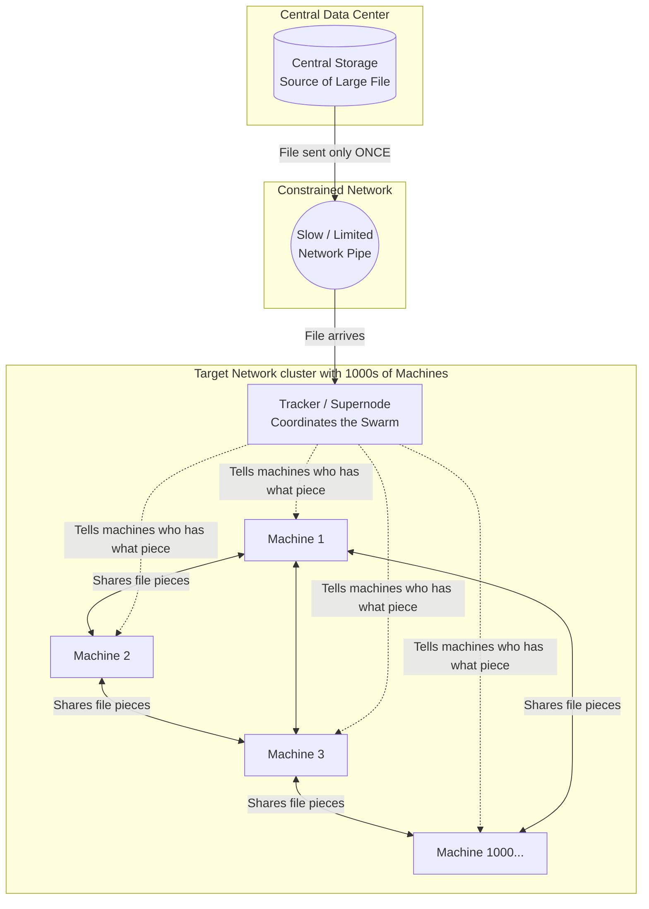

# Peer-to-Peer Large File Distribution Architecture

## 1. Architecture Overview
When you need to send a massive file—like a 50GB artificial intelligence model—to thousands of machines over a slow or limited network connection, traditional methods fail. If every machine tries to download the file directly from the central server at the same time, the network link will instantly become clogged, causing the system to crash or take days to finish. 

To solve this, we use a **Peer-to-Peer (P2P) distribution architecture** (similar to tools like BitTorrent or enterprise solutions like Dragonfly). Instead of every machine downloading the whole file from the source, one "Supernode" pulls the file across the slow link exactly once. It then chops the file into tiny pieces (chunks). The thousands of machines download different chunks and immediately start sharing those chunks with each other over their fast, local network. 

**Why we chose this:** It protects the slow network link from being overwhelmed and drastically speeds up the download process. Because every machine helps distribute the file, the system actually gets faster as more machines join.

## 2. Architecture Diagram

## 3. End-to-End System Flow
1. **The Request:** The system is triggered to deploy a new large file (like an updated AI model) to 1,000 machines.
2. **The Single Pull (Bypassing the Bottleneck):** Instead of 1,000 machines reaching out, a single coordinator (the Supernode/Tracker) inside the target network pulls the file across the slow network link just once. 
3. **Chunking:** The Supernode breaks the large file down into hundreds of tiny, manageable pieces called "chunks."
4. **The Swarm (Peer Exchange):** The 1,000 machines ask the Supernode for pieces of the file. Machine 1 gets piece A, Machine 2 gets piece B. 
5. **Local Sharing:** Because the local network connecting the 1,000 machines is fast, Machine 1 and Machine 2 swap their pieces directly. They do not use the slow network link for this.
6. **Assembly & Verification:** Once a machine collects all the pieces, it glues them back together. It then checks a digital signature (checksum) to guarantee the file wasn't corrupted or tampered with during the transfer.

## 4. Well-Architected Framework Analysis

### 4.1 Operational Excellence
By using a P2P tool designed for container and file distribution, we automate the deployment process. Administrators only need to update the file in one central location. The P2P network automatically detects the new file version and manages the complex task of distributing it, eliminating the need for manual, staggered rollouts.

### 4.2 Security
All file pieces transferred between machines are encrypted using standard TLS protocols, preventing anyone from snooping on the network. Additionally, every file piece is verified with a mathematical fingerprint (checksum). If a piece is altered or corrupted, the machine throws it away and asks another peer for a fresh copy.

### 4.3 Reliability
This architecture is highly resilient. In a traditional setup, if the central server goes down during the download, everything stops. In this P2P setup, if the central server or even the Supernode goes down after the file pieces are in the swarm, the machines can still finish sharing the pieces they have with each other. 

### 4.4 Performance Efficiency
This is where the architecture shines. Traditional downloads get slower when more machines participate because they fight for bandwidth. P2P networks get *faster* when more machines participate because there are more peers available to upload file pieces to each other. The constrained network link is only used once, entirely eliminating the performance bottleneck.

### 4.5 Cost Optimization
Data transferred over constrained links (especially between different cloud regions or out to physical edge locations) is often charged by the gigabyte (egress fees). By sending a 50GB file across that link only once instead of 1,000 times, we save the cost of transferring 49,950 GBs of data, dramatically reducing monthly cloud bills.

### 4.6 Sustainability
Faster downloads and vastly reduced network congestion mean network routers, switches, and central servers spend less time working at maximum capacity. This reduces the overall electricity required to move data from point A to point B, lowering the carbon footprint of your infrastructure.

## 5. Technical Glossary
* **Peer-to-Peer (P2P):** A network setup where computers share resources directly with each other, rather than all relying on a single central server.
* **Supernode / Tracker:** A specialized server in a P2P network that keeps a map of which machines have which pieces of a file, helping them find each other.
* **Model Weights:** The mathematical data that makes up a trained Artificial Intelligence. These files are typically very large (often tens or hundreds of gigabytes).
* **Chunking:** The process of taking a massive file and splitting it into much smaller, equal-sized pieces for easier transmission.
* **Checksum:** A unique string of letters and numbers generated by a mathematical formula (like a digital fingerprint). It is used to prove that a file has not been damaged or changed.
* **Egress Fees:** The money cloud providers charge you for moving data out of their network.
