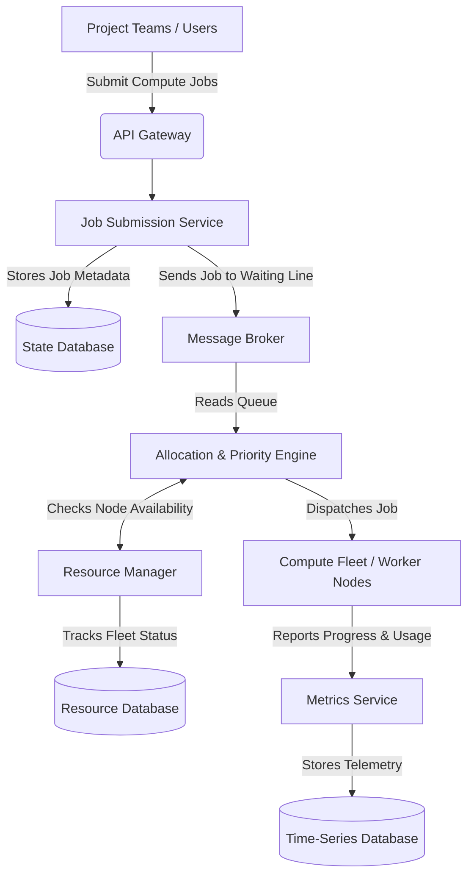

# Distributed Compute Resource Allocation Architecture

## 1. Architecture Overview
Organizations often have multiple teams fighting for the same high-powered compute resources, like large CPU grids or specialized GPUs. This architecture solves that traffic jam. It acts as an intelligent traffic controller that collects job requests from different projects, ranks them based on priority and business rules, and assigns them to available compute resources fairly. 

By using cloud-agnostic microservices, we ensure the system is highly flexible, does not lock your organization into a single cloud provider, and can scale specific parts of the system automatically as demand grows.

## 2. Architecture Diagram

## 3. End-to-End System Flow
1. **Submission:** A project team submits a request to run a complex task through the **API Gateway**. The gateway checks their identity to make sure they are allowed to use the system.
2. **Queuing:** The **Job Submission Service** takes the request, saves the details in our State Database, and places the job in a secure waiting line called a **Message Broker**.
3. **Evaluation:** The **Allocation & Priority Engine** constantly watches this waiting line. It looks at the job's requirements, the project's priority tier, and how long the job has been waiting.
4. **Matching:** Before assigning the work, the engine talks to the **Resource Manager** to find out exactly which servers (nodes) are currently healthy and sitting idle.
5. **Execution:** Once a match is found, the engine sends the job to a specific worker node within the **Compute Fleet**. The node begins crunching the numbers.
6. **Monitoring:** While the job is running, the worker node continuously sends updates about its progress and how much CPU/memory it is using to the **Metrics Service**. This allows the business to track costs and ensure the system is running smoothly.

## 4. Well-Architected Framework Analysis

### 4.1 Operational Excellence
We deploy this system using automated pipelines. This means developers can release updates safely and frequently without breaking the system. We also use centralized logging, which allows our operations team to spot and fix errors fast without having to guess where the problem started.

### 4.2 Security
The API Gateway requires secure access tokens, ensuring only authorized projects can submit jobs. Additionally, all data is encrypted while it travels between our microservices and while it rests in our databases, keeping proprietary project data safe from internal and external threats.

### 4.3 Reliability
If a compute node suddenly crashes in the middle of processing a job, the Resource Manager will immediately notice the node has stopped responding. It will then push the unfinished job back into the Message Broker so another healthy node can pick it up. No work gets permanently lost.

### 4.4 Performance Efficiency
Because we split the system into independent microservices, we can scale them separately. If thousands of jobs are submitted at once, we can automatically spin up more Job Submission Services to handle the traffic spike without needing to pay for more Allocation Engines or Resource Managers.

### 4.5 Cost Optimization
By tracking exactly which project uses what compute resources via the Metrics Service, the organization can accurately bill departments for their usage (chargebacks). This creates financial accountability and helps identify teams that might be wasting expensive compute power.

### 4.6 Sustainability
The system is designed to scale down. The Resource Manager will automatically shut down or pause compute nodes when the waiting line is empty. This prevents servers from running hot while doing nothing, which significantly reduces the organization's carbon footprint and energy cooling costs.

## 5. Technical Glossary
* **API Gateway:** A digital front door that receives all incoming requests from users and routes them securely to the right service inside the system.
* **Microservices:** A way of building software where a large application is broken down into smaller, independent pieces that talk to each other.
* **Message Broker:** A digital post office that holds messages (or compute jobs) safely in a queue until the next service is ready to process them.
* **Compute Fleet (Worker Nodes):** The group of actual servers or machines that do the heavy lifting and run the mathematical or processing jobs.
* **State Database:** A standard database used to record the current status of jobs (e.g. Pending, Running, Completed, Failed).
* **Time-Series Database:** A highly specialized database designed specifically to track data points over time, making it perfect for monitoring system metrics like CPU usage minute-by-minute.
