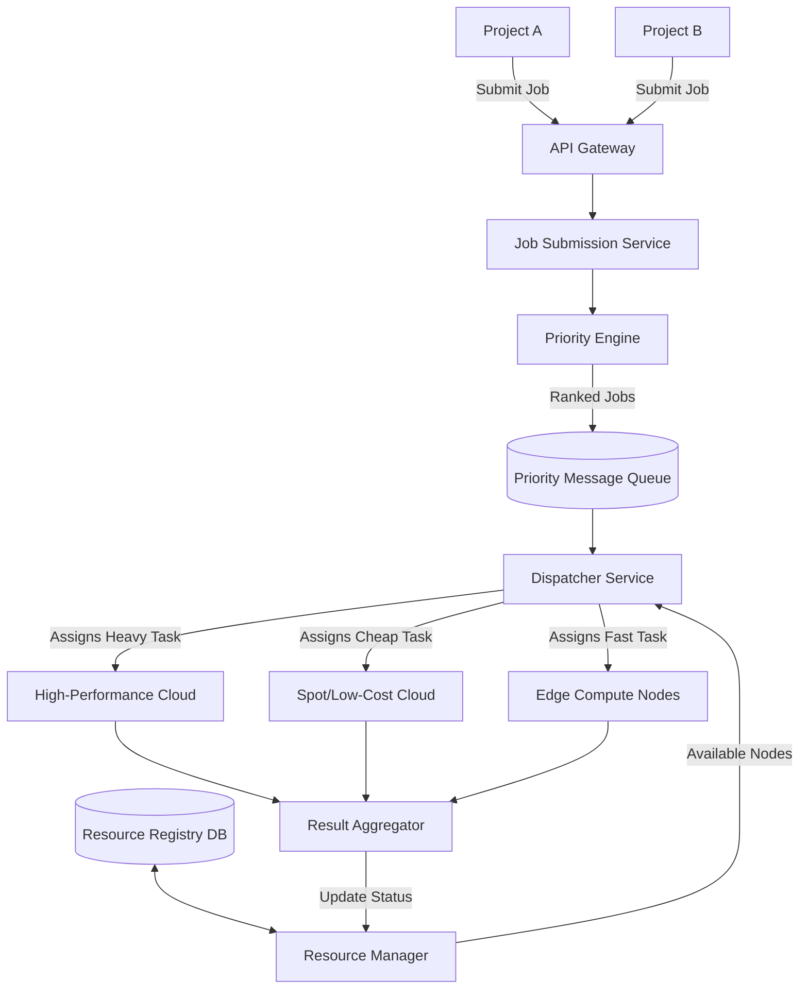

# Distributed Compute Allocation and Prioritization Engine

## 1. Architecture Overview
When multiple engineering projects compete for the same computing hardware, you need a system that acts like a smart traffic controller. This architecture provides a centralized, cloud-agnostic platform to receive computing tasks, rank them by business urgency, and automatically assign them to the most appropriate hardware. 

Instead of a chaotic "first-come, first-served" model that might delay critical workloads, this microservices-based solution places jobs in a priority waiting line. It constantly monitors your available cloud servers and edge devices, ensuring the most important work gets processed fastest while utilizing your hardware efficiently.

## 2. Architecture Diagram

## 3. End-to-End System Flow
1. **Job Submission:** A developer or automated system sends a request to the **API Gateway** to run a specific task (like processing data or training an AI model). 
2. **Scoring and Prioritization:** The **Priority Engine** evaluates the request against business rules (e.g. "Project A is a live production issue," or "Project B is a weekly background report"). It assigns a priority score so the system knows what matters most.
3. **Queuing:** The job enters a **Priority Message Queue**. High-priority jobs instantly skip to the front of the line, while lower-priority tasks wait their turn.
4. **Resource Monitoring:** The **Resource Manager** continuously checks the **Resource Registry DB** to see which servers or edge devices are currently idle and healthy.
5. **Dispatching:** The **Dispatcher Service** pulls the most important job from the queue. It matches the job's needs with available hardware—sending massive tasks to the cloud and quick, low-latency tasks to edge devices.
6. **Completion:** Once the hardware finishes the job, it sends the output to the **Result Aggregator**. The system marks the hardware as "free" again, ready for the next task in the queue.

## 4. Well-Architected Framework Analysis

### 4.1 Operational Excellence
- **Independent Updates:** Because the system is built with separate microservices, your team can upgrade the Priority Engine without taking the Dispatcher or the whole system offline. 
- **Centralized Tracking:** Every job gets a unique ID tag. This makes it easy for support teams to trace exactly where a job is and quickly figure out why it might have failed.

### 4.2 Security
- **Strict Access Control:** The API Gateway verifies the identity of every incoming request. This prevents unauthorized applications from stealing expensive compute time.
- **Isolated Workloads:** Jobs run in separate, secure containers on the servers. This ensures that sensitive data from one project cannot be seen or accidentally altered by another project's code.

### 4.3 Reliability
- **Automated Retries:** If a cloud server crashes in the middle of a job, the Dispatcher instantly notices and puts the job back in the queue to be handled by a healthy server.
- **Traffic Buffering:** If a sudden flood of 10,000 jobs arrives at once, the Message Queue safely holds them. This prevents the core system from getting overwhelmed and crashing.

### 4.4 Performance Efficiency
